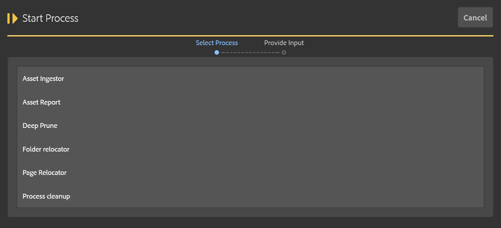
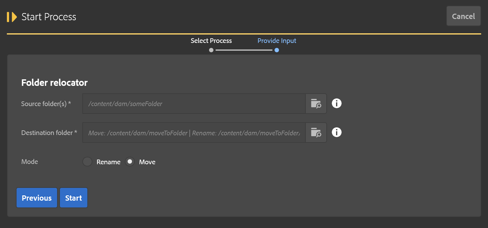
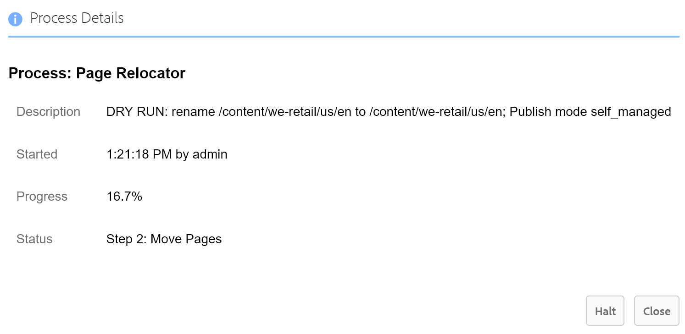
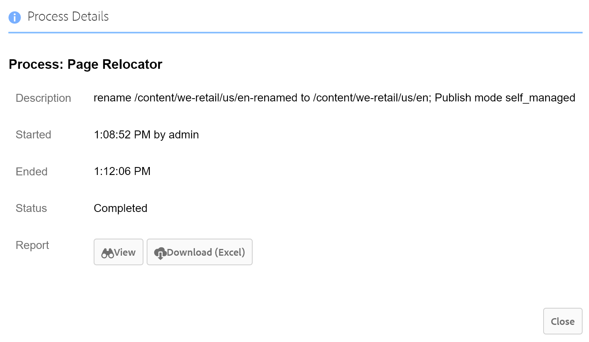

[<< back to MCP Table of Contents](index.html)

## Main view
To access this utility, open the main AEM menu from the link in the upper-left and select _Tools_ >> _ACS AEM Commons_ >> _**Manage Controlled Processes**_.

The process manager lists all processes that have been started or completed.  This list is the same for every user, and you are able to see live progress updates on running processes as well.  Running processes show a progress bar instead of a completion time.  If a date/time column only shows time, then it means it is from today.

If the list becomes cluttered with old processes, see the section on maintenance on how to clean the list of older items.

## Starting a process
From the process manager screen, click the blue "Start Process" button in the top-right.

Select the process you wish to start.  The next screen will prompt you for the inputs required to start the process.  In this example, the "Folder Relocator" process was selected.

After providing required inputs, the process may be started with the "Start" button at the bottom of the form.  If you selected the wrong process you can click "Previous" and go back to choose another process.  More information about these sample processes can be found in the Tools section of this documentation.

Once the process has started you will see it in the process manager with a status indicated by a blue progress bar.

You can close the browser window while a process is running with no consequence.  The page can be refreshed or closed without disrupting active work.

_(**Note:** It is possible, but uncommon, for your browser to lose connection with the server.  If this happens the status of running processes will not refresh automatically.  To recover from this, reload the page and the view will return to normal.  Likewise, if someone starts a process from another browser, you won't see it until you refresh this page.)_

## Process dialog
For any process listed in the process manager, you can click on it to bring up a dialog with additional information.

This dialog lets you know who started the process and when they started it.  If the process is still running you get a percent completion estimate.  If the process has finished or was terminated for any reason (such as user abort, or server restart) then you will see the time it completed or was terminated.

If the process generated a report then you can access that from here as well.  This is explained below.

### Warning about halt

For running processes it is possible to halt them such that they terminate immediately.  It is extremely important that you do not do this unless you fully understand the implications of this action.  For some processes such as "Deep Prune" this is not going to result in any unexpected behavior.  But the folder and page relocation tools, on the other hand, could possibly be in the middle of moving content at the time of the halt and therefore leave content or assets half-moved, some in the old location and some in the new.  Therefore, if you are not sure this is a good idea, do not confirm when then prompt shows up asking if you are sure you want to halt the operation.

## Viewing a report

Once a reporting process has completed, it stores any reporting information generated.  From the process dialog you are presented with two options:

- *View:* Opens the report in a new browser tab.  You can copy data from here and paste into other applications if desired.
- *Download (Excel):* This generates the report as an Excel document and is downloaded to your computer's Downloads folder.  You can open this up in your spreadsheet tool of choice and further maniuplate the data as needed.

More information about generated reports is provided in the Tools section with the corresponding process that generates that report.  If the buttons do not appear then either the process was terminated abnormally, it is still running, or it was not a process that generates a report.