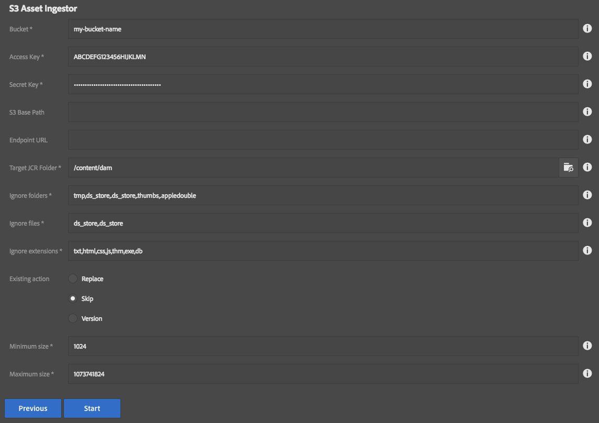

These are the process definitions provided with MCP, but these are by no means the upward limit of what can be built with this framework.

[<< back to MCP Table of Contents](../index.html)

## Page Relocator
Page relocator assists the author in moving a tree of assets to a new location or renaming a page.  All references are updated to reflect the changed page structure following this activity.  Publish options are also presented.  This process generates a report listing all affected pages, their new locations, number of references, and durations of move, unpublish, republish times (in milliseconds.)

* Source page: The page being moved or renamed
* Destination: If moving, this is the parent that will contain the page being moved.  If renaming this is the full path that source page should have at the end of the operation, including its new name.  The parent of this page must exist first!
* Max references: The maximum number of references to evaluate per page.  -1 defaults to all (recommended)
* Reference search root: The starting path of references to search for when looking for page references.  Recommended is to leave the default value `/` as-is.
* Mode: Rename or Move (as described above)
* Create versions: If checked a page being republished will create a new version.
* Update status: If checked, a page's metadata for last published will be updated when published.
* Extensive ACL Checks: If checked, every child node is evaluated during step 1 (this can get very expensive for large trees!).  If unchecked, only pages are evaluated.  Recommended: Leave it unchecked.
* Dry Run: If checked, no page moves or publish operations happen but the report is generated, and ACL checks are performed.  This lets you see what will be affected by this operation.

The steps of this operation are:

1. Validate ACLs.  If the user does not have the ability to update a given page in this operation then the process will terminate at this step and the report will show what pages were missing the required ACLs.
2. Move pages.  This moves each page to its new location, updates references, and captures a list of all affected pages that require re-publishing as a result of this operation.
3. Unpublish.  This unpublishes pages that were removed or changed.
4. Publish.  This publishes pages that were moved or changed as a result of these operations.

## Folder Relocator
This tool is used to move or rename folders of assets.  **Note:** At the present time, this tool does not update references if pages are affected by these moves.  This was primarily intended for assets customers that do not use Sites.  This is subject to change in the future, or a new tool might be released to address this gap as needed.

* Source folder: Folder being moved or renamed.
* Destination folder: Parent folder (if moving) or new folder path including new name (if renaming.) The parent path must exist!
* Mode: Move/Rename (as described above)

The steps of this operation are:

1. Validate ACLs.  This checks the user has permission to perform all the move operations associated with this process.  If there are any failues they are recorded as errors for debugging purposes.
2. Build target folders.  This duplicates the folder structure of the source folder, copying over metadata as needed.
3. Move assets.  This moves assets in groups from the old locations to the new.
4. Remove old folder.  This removes the old folder structure.  This does not happen if there were any errors during the asset moves, that way no data is inadvertently removed.

## Asset Reporting
This reporting process identifies how much space is being used in a folder and its subfolders across all assets.

* Folder: Base path to start the report from
* Levels: Number of levels to report.

It is worth noting that levels only dictates how granular the report will be, but all folders will be scanned regardless.  The report indicates for a folder, how much cumulative space is used by the assets in that folder as well as all subfolders from that level.  So even if it isn't indicated in the report, the roll-up behavior means it should capture everything regardless.

## Asset Ingestor
This is an example of a high-speed parallel asset ingestor utility.  You can load a directory of assets into AEM very easily with this tool.  Because of the ability to overload a server with assets, this tool only appears for the "admin" user right now.

* Source: Location in the local filesystem.  This can be a mapped/mounted network drive too.
* Target JCR Folder: Where to store the assets in AEM
* Ignore folders: Comma-delimited list of folders to skip, useful for bypassing thumnail folders and such
* Ignore files: Comma-delimited list of files to skip, also useful for bypassing additional metadata files which might not be useful in a DAM setting.
* Ignore extensions: Comma-delimited list of file extensions to skip.
* Existing action: Decide what should happen if the DAM contains a target file already, such as if the ingestion is resumed after a previous abort
    * Replace: Replace the asset already in AEM (this can slow things down compared to skip)
    * Skip: Skip the asset
    * Version: Create a version of the asset and upload a fresh copy.  This is the safest, but slowest, option.
* Minimum size: The minimum file size (in bytes) that is required for importing a file.  Anything smaller is ignored. (0 = no minimum)
* Maximum size: The maximum file size allowed (in bytes); anything larger is skipped. (-1 = no maximum -- NOT RECOMMENDED!)

This process has two steps:
1. Create folder structure
2. Import assets

## S3 Asset Ingestor (Since 3.11.0)
This is essentially the same as the File Asset Ingestor, but pulls files from an Amazon S3 bucket instead of the local filesystem.  You can load a directory of assets into AEM very easily with this tool.  Because of the ability to overload a server with assets, this tool only appears for the "admin" user right now.

This process depends upon the presence of the S3 SDK bundle. If you are using the S3 DataStore, this is already present. For other installations (e.g. using the FileDataStore), you should follow the instructions to install the OSGi bundles in the S3 DataStore Feature Pack, but do *not* install the configurations. Instructions for downloading the S3 DataStore Feature Pack can be found at the following links: [for AEM 6.2](https://helpx.adobe.com/experience-manager/6-2/sites/deploying/using/data-store-config.html#AmazonS3DataStore), [for AEM 6.3](https://docs.adobe.com/docs/en/aem/6-3/deploy/platform/data-store-config.html#Amazon%20S3%20Data%20Store)

* Bucket: Name of the S3 bucket which contains the files.
* Access Key: Amazon Web Services Access Key 
* Secret Key: Amazon Web Services Secret Key
* S3 Base Path: Optional prefix for files in the S3 bucket.
* Endpoint URL: Optional URL if your bucket is in a non-standard location.
* Target JCR Folder: Where to store the assets in AEM
* Ignore folders: Comma-delimited list of folders to skip, useful for bypassing thumnail folders and such
* Ignore files: Comma-delimited list of files to skip, also useful for bypassing additional metadata files which might not be useful in a DAM setting.
* Ignore extensions: Comma-delimited list of file extensions to skip.
* Existing action: Decide what should happen if the DAM contains a target file already, such as if the ingestion is resumed after a previous abort
    * Replace: Replace the asset already in AEM (this can slow things down compared to skip)
    * Skip: Skip the asset
    * Version: Create a version of the asset and upload a fresh copy.  This is the safest, but slowest, option.
* Minimum size: The minimum file size (in bytes) that is required for importing a file.  Anything smaller is ignored. (0 = no minimum)
* Maximum size: The maximum file size allowed (in bytes); anything larger is skipped. (-1 = no maximum -- NOT RECOMMENDED!)

This process has two steps:
1. Create folder structure
2. Import assets

## Deep Prune
This is a maintenance tool that only appears for the "admin" user.  It allows you to recursively delete things from AEM such as content, workflow instances, running jobs, etc.

* Starting folder: Base folder where deletes will occur
* Minimum purge level: Only remove things this many levels down from the starting folder.  For example if the starting folder is /content/mySite and the minimum level is 3, then only folders like /content/mySite/page1/page2/page3 will be touched.  A setting of 0 means to delete everything under a folder, including the folder itself.  1 means all the immediate folders under the base folder, etc.
* Passes: Number of times to repeat this process.  Some nodes don't like being deleted and errors might occur.  This retries the deletion a specified number of times.
* Ignore: If the node has any of these names it is ignored (as well as its children!)
* Batch size: Number of items to delete at a time (can speed things up in most cases)
* Retries: Number of retries before giving up and going to the next batch of items to delete (this is not the same as passes, this is more granular within each pass)
* Retry delay: Number of milliseconds to wait between retries if an error occurs.
* Delete folders: Rule for folder deletion
    * All: Deletes all folders under the specified miniumum purge level
    * Numeric: Only deletes folders if the names are purely numeric
    * None: Don't delete any folders, just the non-folder child nodes
    * Hexadecimal: Only deletes folders if the names are hexadecimal.  Useful for purging jobs
* Stop job queues: If checked, the sling job queues will be stopped before deleting items and then restarted when done.  This is only necessary if you are deleting stuff under /var/eventing or possibly running workflow instances.  Otherwise it is unnecessary and not recommended to use this option outside of those use cases.

The number of steps varies depending on the passes specified, but otherwise the only other steps are to stop/restart job queues (if that option was checked.)  This tool is otherwise a 1-click headshot to AEM content, so please use it with extreme caution.

**Note about folder types:** Right now this tool only understands the following as folders: nt:folder, sling:Folder, sling:OrderedFolder.  Any other types will be treated as child nodes and not iterated. This means it also doesn't walk cq:Page trees right now.