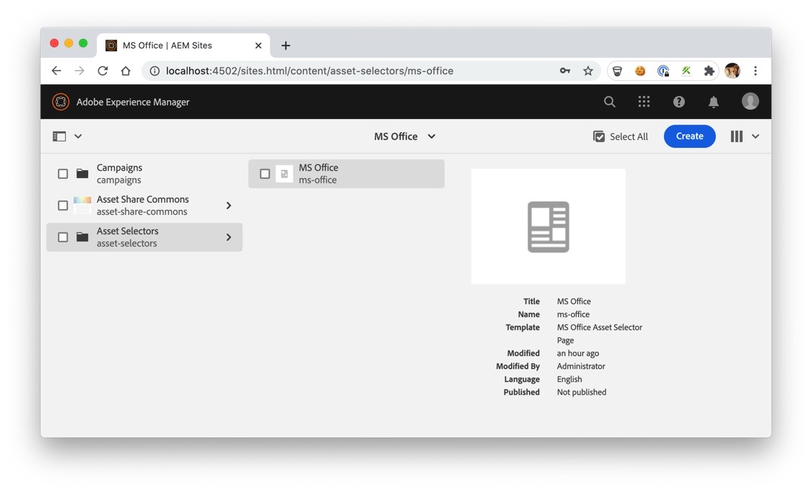

The AEM Asset Selector Office Add-in allows a company to make available an 
add-in to the Task Pane in Microsoft Office applications to insert images from
their AEM Assets instance into these applications directly. Use of this add-in
will require an active and accessible AEM Assets and AEM Sites instance and
Office 365.

Provided are two sample manifest files, one for Microsoft Word and one
for Microsoft Powerpoint. These can be used as templates for adding the
plugin for other Office 365 applications.

+ <a href="../ms-office-asset-selector/downloads/word_manifest.xml" download>Download Microsoft Word configuration</a>
+ <a href="../ms-office-asset-selector/downloads/powerpoint_manifest.xml" download>Download Microsoft Powerpoint configuration</a>

## Setup Instructions

There is some setup necessary before the add-in can be used. This is because
it must be configured to direct users to the correct AEM Assets instance and
a method for distributing the add-in to users easily.

### AEM Configuration

Cerate a new page that will act as the end-point for the MS Office Add-in interact with.

Use ACS Commons' MS Office Asset Selector static template, which is configured to be available under the path `/content/asset-selectors`

For the mot part this is all that is neccessary to begin using this add-in. 
However, you may want to review the information about [managing access](#managing_access)
for more information on how access to content can be controlled and managed.

To ensure the neccessary page is available and working simply navigate to
`/content/asset-selectrors/ms-office.html' in your web browser.

### Office Add-in Configuration

The primary step necessary for the add-in to work is to update the manifest
files to direct users to your AEM instance. Two [manifest files](#sample_files)
are available as part of this package. Simply download these files and edit them
to point to the correct URL. There are two lines which will need to be editted:

+ Line 19: SourceLocation
+ Line 71: Taskpane.Url

Update the URL in the DefaultValue on these two lines to the AEM Sites instance to be used.

### Distributing the Add-in

There are 3 ways to add this add-in to Microsoft Office. The first method,
Network Share Catalog, is intended only for testing purposes. The other methods
are suitable for distributing the add-in internally within your company.

#### Network Share Catalog

For development and testing purposes a network share can be setup, usually on
the computer you are testing on, to load the add-in. This is generally to confirm
the add-in manifest file works and that it points to the correct server and
path for the asset selector page.

Microsoft has provided detailed instructions for this:

+ [https://docs.microsoft.com/en-us/office/dev/add-ins/testing/test-debug-office-add-ins](https://docs.microsoft.com/en-us/office/dev/add-ins/testing/test-debug-office-add-ins)

#### Centralized Deployment

Centralized deployment allows distribution of the add-in within your company in a secure and managed
way. Through this method the add-in manifest is made available through Microsoft's servers by a
Microsoft Office Admin within the company. The admin can control what users have access to this add-in
as well. This method requires little technical experience from users as it will simply appear in their
list of Admin Managed plugins in their Office Applications.

Microsoft has provided detailed instructions for this:

[https://docs.microsoft.com/en-us/office/dev/add-ins/publish/centralized-deployment](https://docs.microsoft.com/en-us/office/dev/add-ins/publish/centralized-deployment)

#### Sharepoint Catalog

Use of a Sharepoint Catalog is very similar to the use of Centralized Deployment. However,
instead of storing the manifest files on Microsoft's Servers they are stored on a company
Sharepoint space. This allows you to keep these files within servers which are managed
by your company.

Microsoft has provided detailed directions for this:

[https://docs.microsoft.com/en-us/office/dev/add-ins/publish/publish-task-pane-and-content-add-ins-to-an-add-in-catalog](https://docs.microsoft.com/en-us/office/dev/add-ins/publish/publish-task-pane-and-content-add-ins-to-an-add-in-catalog)

<h2 id="managing_access">Managing Access</h2>

There are a number of ways to manage which assets a users will be able to access when using the add-in.
The first is through the use of permissions and is the recommended method. The second is through creation of
additional asset selector pages configured to allow access to subtrees within the AEM Assets folders.

### User Permissions (Recommended)

Using this method, only one asset selector page is needed. This page may still point to the root of the
AEM Assets content. However by assigning users to specific groups within AEM and adjusting which folders
within AEM Assets users in those groups may access this will determine which assets they can access when
using the add-in as well. When the add-in loads it will require that the user log into AEM and apply
the permissions for the logged in user.

### Page Specific Permissions

By creating additional pages using the Asset Selector template or by copying the existing Asset
Selector page the component on this page may be editted to point to an alternate path within AEM
Assets. This will become the root path that the Asset Selector will use and only assets in this
folder or any subfolders of it will be accessible.

This is not the generally recommended method but can allow creating different add-ins for
different groups, each pointing to a different path and limiting their available assets if this is
necessary. However, it would still be recommended to simply use one add-in and use group permissions
within AEM to manage their access.

