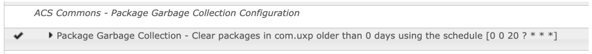

## Purpose
When you use Adobe Cloud Manager to deploy new code to your environments on Adobe Managed Service instances, it will generate a unique version number for your package, based on the configuration in the pom.xml file. 

The downside of this approach, is that over time, multiple versions of the packages are building up in the /etc/packages part of the repository. Eventually, this leads to the exhaustion of the storage, and in the worst case scenario, left unchecked; repository corruption. In particular, test environments that usually have less storage available than staging or production environments are more susceptible to this problem. 

Now, Adobe Managed Services has all the appropriate monitoring in place to ensure that worst case scenario doesn't happen, but even if it doesn't get that far, clearing up the installed packages is a chore that frequently takes up time with consultants. 

This is also not a issue with AEM as a Cloud Service, because a new image is generated for each deployment.

## Configuration
By default, the service will do absolutely nothing. In order to have the job run, OSGI configuration needs to be created:
- **scheduler:** 
This is a cron expression that gives great flexibility in when and how frequently the garbage collection is run. By default, an empty value here will cause the job to run at 02:30 every day.
- **groupName:** 
This is the group name of the packages that you want to remove.
- **maxAgeInDays:**
Packages matching the group name that were installed more than this number of days ago will be removed.

```xml
<?xml version="1.0" encoding="UTF-8"?>
<jcr:root xmlns:sling="http://sling.apache.org/jcr/sling/1.0" xmlns:jcr="http://www.jcp.org/jcr/1.0"
          jcr:primaryType="sling:OsgiConfig"
          scheduler="0 30 2 ? * * *"
          maxAgeInDays="30"
          groupName="com.uxp"/>
```
Once it has been configured, the following configuration will be visible in the Felix Console



## Logging
The job has INFO and DEBUG level logging so the removal of packages can be monitored.
```text
*INFO* [CM Event Dispatcher (Fire ConfigurationEvent: pid=com.adobe.acs.commons.packagegarbagecollector.PackageGarbageCollectionScheduler.bf74b5ab-3568-4829-b696-6080a0f1d2ff)] com.adobe.acs.commons.packagegarbagecollector.PackageGarbageCollectionScheduler Next scheduled run at Tue Aug 23 20:00:00 BST 2022
*INFO* [JcrInstaller.3] org.apache.sling.installer.provider.jcr.impl.JcrInstaller Registering resource with OSGi installer: [InstallableResource, priority=200, id=/apps/system/config/com.adobe.acs.commons.packagegarbagecollector.PackageGarbageCollectionScheduler.bf74b5ab-3568-4829-b696-6080a0f1d2ff.config]
*INFO* [sling-threadpool-7496dc61-b4e5-43e8-b36e-326f40b2697d-(apache-sling-job-thread-pool)-11-<main queue>(com/adobe/acs/commons/PackageGarbageCollectionJob)] org.apache.jackrabbit.vault.packaging.impl.ActivityLog com.uxp:uxp.all:6.0.0-SNAPSHOT: REMOVE
*INFO* [sling-threadpool-7496dc61-b4e5-43e8-b36e-326f40b2697d-(apache-sling-job-thread-pool)-11-<main queue>(com/adobe/acs/commons/PackageGarbageCollectionJob)] com.adobe.acs.commons.packagegarbagecollector.PackageGarbageCollectionJob Deleted package /etc/packages/com.uxp/uxp.all-6.0.0-SNAPSHOT.zip
*INFO* [sling-threadpool-7496dc61-b4e5-43e8-b36e-326f40b2697d-(apache-sling-job-thread-pool)-11-<main queue>(com/adobe/acs/commons/PackageGarbageCollectionJob)] org.apache.jackrabbit.vault.packaging.impl.ActivityLog com.uxp:uxp.ui.apps:6.0.0-SNAPSHOT: REMOVE
*INFO* [sling-threadpool-7496dc61-b4e5-43e8-b36e-326f40b2697d-(apache-sling-job-thread-pool)-11-<main queue>(com/adobe/acs/commons/PackageGarbageCollectionJob)] com.adobe.acs.commons.packagegarbagecollector.PackageGarbageCollectionJob Deleted package /etc/packages/com.uxp/uxp.ui.apps-6.0.0-SNAPSHOT.zip
*INFO* [sling-threadpool-7496dc61-b4e5-43e8-b36e-326f40b2697d-(apache-sling-job-thread-pool)-11-<main queue>(com/adobe/acs/commons/PackageGarbageCollectionJob)] org.apache.jackrabbit.vault.packaging.impl.ActivityLog com.uxp:uxp.ui.content:6.0.0-SNAPSHOT: REMOVE
*INFO* [sling-threadpool-7496dc61-b4e5-43e8-b36e-326f40b2697d-(apache-sling-job-thread-pool)-11-<main queue>(com/adobe/acs/commons/PackageGarbageCollectionJob)] com.adobe.acs.commons.packagegarbagecollector.PackageGarbageCollectionJob Deleted package /etc/packages/com.uxp/uxp.ui.content-6.0.0-SNAPSHOT.zip
*INFO* [sling-threadpool-7496dc61-b4e5-43e8-b36e-326f40b2697d-(apache-sling-job-thread-pool)-11-<main queue>(com/adobe/acs/commons/PackageGarbageCollectionJob)] com.adobe.acs.commons.packagegarbagecollector.PackageGarbageCollectionJob Package Garbage Collector job finished
```