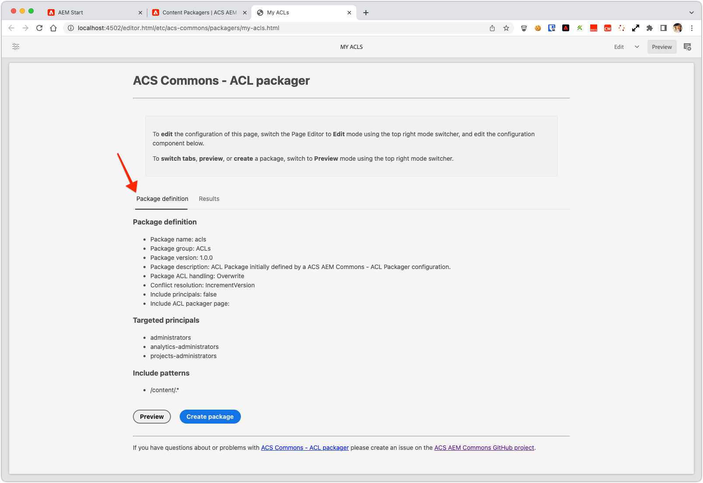

# Purpose

Frequently, access control entries need to be copied from one environment to another *without* copying the actual content itself, just the access control entries. This user interface allows you to define and build packages containing access control entries for particular paths and/or particular principals.

# How to Use

* Log in to AEM Author
* Navigate to the Classic UI Tools Console (from the Touch UI, this is Tools:Operations:Configuration)
* Under the `acs-commmons` folder, create a folder named `packagers` (NOTE: As of 1.6.0, this folder is created automatically)
* Under the `packagers` folder, create a new Page of Template type "ACL Packager"

* Use the Edit dialog to configure the package rules and configuration

* The Preview button output a list of the access control entries which will be packaged.

* The Create Package button (cut off in the above screenshot!)... creates the package

* Now that the Package definition has been created, go to CRX Package Manager by clicking on one of the links in the result message, Build and Download the package. 

## Using the ACL Packagers on AEM Publish

Because the ACS Commons Packagers are built using the ClassicUI dialogs, the configuration dialogs are automatically force-disabled on AEM Publish.

In order to use Packages on AEM Publish, you must define the Package configuration on AEM Author, replicate the Packager page to AEM publish, and then Create the package on AEM Publish based on that replicated configuration.

## Bug Fixes

* Version 1.8.0 excludes `.tokens` nodes when packaging principals that caused problems when installing on AEM6/Oak repositories.
