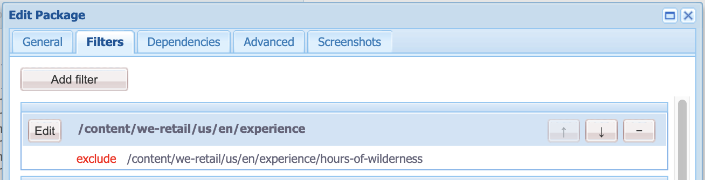

# Purpose

The Asset Packager lets you create a content package that is given a specific page path and will
iterate over the content of that package to add all referenced assets into the package as well,
giving you exactly what you need for a single page with all images.

Helps a developer looking to:
* Replicate an issue specific to content on a remote server
* Not bloat your local instance unnecessarily
* Still get enough content to replicate the issue (and not have broken images)

or just a developer looking to get set up with some local content and want some but _not all_ of the
DAM.

# How to Use

* Log in to AEM Author
* Navigate to the Classic UI Tools Console (from the Touch UI, this is Tools:Operations:Configuration)
* Under the `acs-commmons` folder, create a folder named `packagers` (NOTE: As of 1.6.0, this folder
is created automatically)
* Under the `packagers` folder, create a new Page of Template type "Asset Packager"

* Open the newly created page and use the Edit dialog to configure the package rules and configuration
 (details [below](#dialog-usage))

* The Preview button will output a list of all the content to be included in the package.

* If satisfied with the previewed filters, create the package using the 'Create Package' button.
* Follow the link provided to view/build/download your new content package.

# Dialog Usage

Outside of the standard content packager features shared between the packagers, below is a list of
 the Asset Packager specific fields and what they control.

### Basic Configuration

**1.** Page path to search for assets. This path will be included in the content package by default.

**2.** The option to exclude the pages (i.e. the page path specified above) from the package definition.
 This will result in a package with only assets.

### Advanced Configuration

**1.** A prefix for that assets have to have in order to be added to the content package. If you
provide `/content/dam/<project>` then only project specific assets will be added. By default any
asset in /content/dam will be added.

**2.** Page patterns to exclude. This accepts full paths to a page - this will exclude the page and
 any pages beneath it - as well as regex patterns. If a page is excluded (and pages should be added
 to the package) it will show up as an exclude in the filter definition for the page.

**3.** Asset patterns to exclude. This accepts full paths to assets or folders as well as regex
patterns. If an asset is excluded it will not show up as a filter.

## Using the Asset Packager on AEM Publish

Because the ACS Commons Packagers are built using the ClassicUI dialogs, the configuration dialogs
are automatically force-disabled on AEM Publish.

In order to use Packages on AEM Publish, you must define the Package configuration on AEM Author,
replicate the Packager page to AEM publish, and then Create the package on AEM Publish based on that
 replicated configuration.

