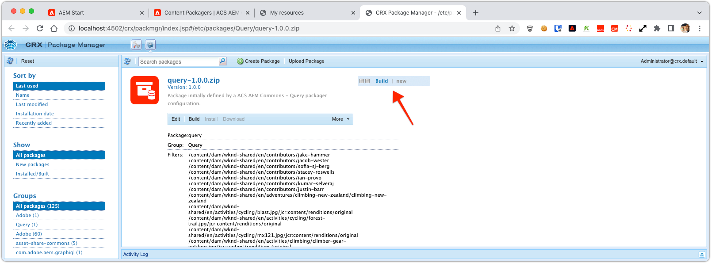

# Purpose

ACS AEM Commons Query Packager facilitates the creation of CQ Packages based on XPath, JCR-SQL, JCR-SQL2, or QueryBuilder query results.

# How to Use

* Log in to AEM Author
* Navigate to the Classic UI Tools Console (from the Touch UI, this is Tools:Operations:Configuration)
* Under the `acs-commmons` folder, create a folder named `packagers`
* Under the `packagers` folder, create a new Page of Template type "Query Packager"

* Use the Edit dialog to configure the package rules and configuration

* The Preview button output a list of the package filter entries which will be included.

* The Create Package button (cut off in the above screenshot!)... creates the package

* Now that the Package definition has been created, go to CRX Package Manager by clicking on one of the links in the result message, Build and Download the package.

## Using Query Packagers on AEM Publish

Because the ACS Commons Packagers are built using the ClassicUI dialogs, the configuration dialogs are automatically force-disabled on AEM Publish.

In order to use Packages on AEM Publish, you must define the Package configuration on AEM Author, replicate the Packager page to AEM publish, and then Create the package on AEM Publish based on that replicated configuration.
