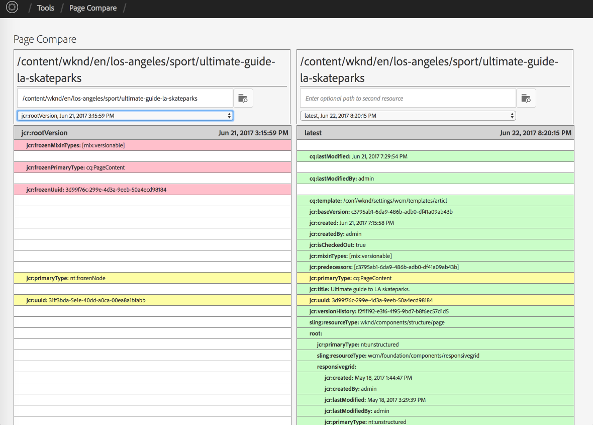

## Purpose

Page Compare is a tool for comparing two different pages or page versions side-by-side. It's similar to the ACS AEM Commons [Version Compare](/acs-aem-commons/features/version-compare/index.html) tool from which it is originated.

Motivations for creating this tool were:

* Version Compare with huge pages and many versions is difficult
* Loading time and html markup increases and handling in the browser is getting difficult
* The ability to compare two different pages (Multi-site manager)

## How to Use

1. Navigate to [Tools > ACS AEM Commons > Page Compare](http://localhost:4502/etc/acs-commons/page-compare.html)
2. In the left column, use the pathfield and select a page to compare.
3. By default, the right column will populate with the page selected in the left column, but with the current version.
4. Optionally, in the right column select a different page to compare
5. Once the desired pages are selected in the left and right columns, adjust the versions of each page to compare

