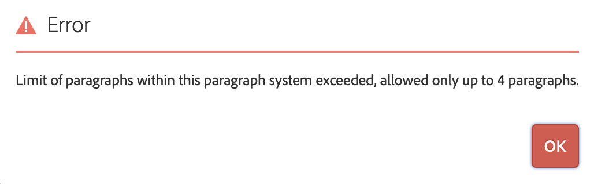

## Purpose

Allow to set limits on parsys for the number of contained paragraphs. In case a newly inserted paragraph exceeds that limit an error message is being emitted.

## How to Use

### Touch UI
Add a wrapper client library which embeds category `acs-commons.cq-authoring.add-ons.touchui-limit-parsys` to your project with category
`cq.authoring.editor.hook`. That category gets automatically loaded in the Touch UI's editor frame.

> Prior to version 4.0, the client library is automatically included.

Then define limits via the parsys' design or content policy property `acsComponentsLimit` (as Integer value).

### Classic UI
Add a wrapper client library which embeds category `acs-commons.cq-widgets.add-ons.classicui-limit-parsys` to your project with category
`cq.widgets`. That category gets automatically loaded for every wcmmode but Disabled.

> Prior to version 4.0, the client library is automatically included.

Then define limits via the parsys' design property `acsComponentsLimit` (as Integer value).

### Inheritance

The property `acsComponentsLimit` is also inherited from parent container's content policies/design cells (in case it is not set locally).

## Limitations

- The Classic UI implementation only supports leveraging design properties but not content policies
