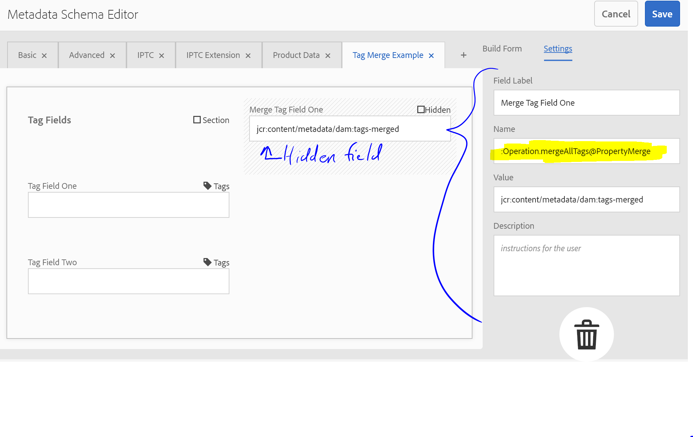

## Purpose

Collect data from multiple dialog inputs and combine them into a single property.

This is great for creating multiple Dialog inputs, say for tags, restricting each input specifically to that Tags use case, but storing the data to the common `cq:tags` property. 

While pointing multiple dialog fields to a single property and combining the values is supported, OOTB, each dialog field will display the combined set of values.

## How to Use

Add the following POST parameters

    :<sourceProp1>@PropertyMerge=<destinationProp>
    :<sourceProp2>@PropertyMerge=<destinationProp>

    :<destinationProp>@PropertyMerge.AllowDuplicates=true|false
    :<destinationProp>@PropertyMerge.TypeHint=String|Date|Long|Double|Boolean

Example

    :aTags@PropertyMerge=abcTags
    :bTags@PropertyMerge=abcTags
    :cTags@PropertyMerge=abcTags
    :abcTags@PropertyMerge.AllowDuplicates=true
    :abcTags@PropertyMerge.TypeHint=String

    :dTags@PropertyMerge=deTags
    :eTags@PropertyMerge=deTags
    :deTags@PropertyMerge.AllowDuplicates=false
    :deTags@PropertyMerge.TypeHint=String
        
Adding the above as request params will merge aTags, bTags, cTags into abcTags and dTags, eTags into deTags

Note the `:` prefix to ensure these params are ignored by the OOTB Sling POST Servlet, and not written to the underlying resource.

### Special case: Merging all tags

You can also specify a special value for source property `Operation.mergeAllTags` which will enable a mode wherein the processor evaluates all incoming data for values that look like tags, and merge all of them to the designated property.

Example

    :Operation.mergeAllTags@PropertyMerge=allTags

## TouchUI Asset editing support

As of ACS Commons 3.13.0, this feature now supports the asset schema metadata forms.  You can merge invidual fields, or use the new `merge-all-tags` feature as well.  You must take great care to exercise some constraints, for example all your metadata properties should begin with `jcr:content/metadata/` -- note that there is no beginning slash.

This example shows how to use `Operation.mergeAllTags` from an asset schema editor.  It is possible to also merge specific fields by name, but you will have to add one hidden field for each, with names for each field like so:

    :jcr:content/metadata/dam:tag-field1@PropertyMerge
    :jcr:content/metadata/dam:tag-field2@PropertyMerge
    ... etc

## Caution about field visibility

If you are combining tags, it is a good idea to make sure that the target propery is not visible or otherwise part of the form (not even a hidden field.)  This is because the sling post processor will re-instate all of the old values each time, making it impossible to for removed tags to get cleaned out.  However, if the merged tag propert is not shown or part of the form, then the underlying values should be correct.  You can verify this by looking at the node properties in CRX DE Lite.

#### Example of ExtJS Dialog XML
    

<?xml version="1.0" encoding="UTF-8"?>
<jcr:root xmlns:sling="http://sling.apache.org/jcr/sling/1.0" xmlns:cq="http://www.day.com/jcr/cq/1.0" xmlns:jcr="http://www.jcp.org/jcr/1.0" xmlns:nt="http://www.jcp.org/jcr/nt/1.0"
    jcr:primaryType="cq:Dialog"
    activeTab="0"
    xtype="tabpanel">
    <items jcr:primaryType="cq:WidgetCollection">
        <tab1
            jcr:primaryType="cq:Widget"
            xtype="panel">
            <items jcr:primaryType="cq:WidgetCollection">
                <animal-tags
                    jcr:primaryType="cq:Widget"
                    fieldLabel="Animal Tags"
                    name="./animalTags"
                    xtype="tags"/>
                <plant-tags
                    jcr:primaryType="cq:Widget"
                    fieldLabel="Plant Tags"
                    name="./plantTags"
                    xtype="tags"/>        
                <cq-tags
                    jcr:primaryType="cq:Widget"
                    fieldLabel="Merged Tags"
                    name="./cq:tags"
                    readonly="{Boolean}true"
                    xtype="tags"/>
                <animal-tags-property-merge
                    jcr:primaryType="cq:Widget"
                    ignoreData="{Boolean}true"
                    name=":animalTags@PropertyMerge"
                    value="cq:tags"
                    xtype="hidden"/> 
                <plant-tags-property-merge
                    jcr:primaryType="cq:Widget"
                    ignoreData="{Boolean}true"
                    name=":plantTags@PropertyMerge"
                    value="cq:tags"
                    xtype="hidden"/>             
                <cq-tags-property-merge-allow-duplicates
                    jcr:primaryType="cq:Widget"
                    ignoreData="{Boolean}true"
                    name=":cq:tags@PropertyMerge.AllowDuplicates"
                    value="false"
                    xtype="hidden"/>                         
                <cq-tags-property-merge-type-hint
                    jcr:primaryType="cq:Widget"
                    ignoreData="{Boolean}true"
                    name=":cq:tags@PropertyMerge.TypeHint"
                    value="String"
                    xtype="hidden"/>                         
                </items>
            </tab1>
        </items>
</jcr:root>
