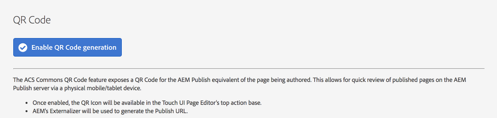
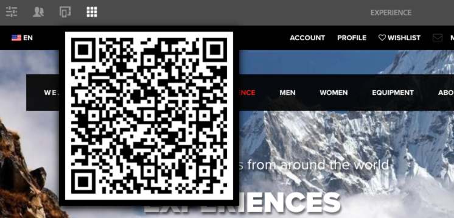

## Purpose

The QR Code Page Editor plug-in exposes a QR Code image to the corresponding page on AEM Publish (using AEM's Externalizer) so that 
its easy to review any published page in AEM on a **REAL** mobile device. 

Simply load up your devices QR Code app (plenty of good free ones out there), point your phone at the exposes QR code, and let your mobile device load the corresponding page on AEM Publish! Could it be any easier?!

This feature can be particularly helpful for QA teams so they can quickly review many pages without keying in long URLs or navigating through the Publish site on their mobile devices.
 
## How to Use

### Enable the QR Code

* Make sure AEM Author's Externalizer OSGi service is properly configured for `publish` via the [Adobe Web Console](http://localhost:4502/system/console/configMgr/com.day.cq.commons.impl.ExternalizerImpl)

* Navigate to AEM > Tools > ACS AEM Commons > QR Code
* Tap on the "Enable QR Code Generation" to enable
  * To disable tap the "Disable QR Code Generation" button
  
  
  
### Accessing the QR Code in the AEM Sites Page Editor

* Once the QR Code Generation is enabled, open up any AEM Sites page in the Page Editor.
* In the top action bar; locate and tap on the the grid icon (we couldn't find a nice Coral QR Code icon :() 

  
