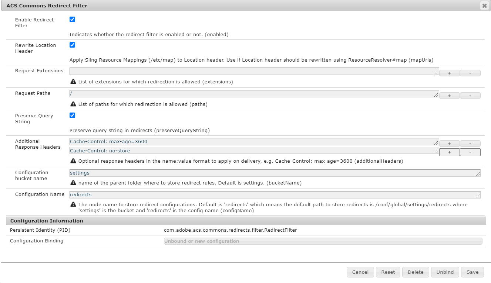

## Advanced Configuration

| Source        | Default | Description |
| ------------- |-------------|-------------|
| Enable Redirect Filter | false | Whether redirects are enabled |
| Rewrite Location Header | false | Apply Sling Resource Mappings to Location header. Set ti true if Location header should be rewritten using ResourceResolver#map |
| Request Extensions |  | List of extensions for which redirection is allowed. Default is empty which means any.  |
| Request Paths | /content | List of paths for which redirection is allowed. Set to the root (`/`) if you need to redirect vanity urls, e.g. `http://localhost:4502/vanityUrl => http://localhost:4502/en/page`  |
| Preserve Query String | true | Preserve query string in redirects  |
| Additional Response Headers|  | Optional response headers in the name:value format to apply on delivery, e.g. Cache-Control: max-age=3600 (additionalHeaders)  |
| Configuration bucket name | settings | name of the parent folder where to store redirect rules, see [Context Aware Redirect Configurations](./caconfig.md)  |
| Configuration Name | redirects |The node name to store redirect configurations. Default is 'redirects' which means the default path to store redirects is /conf/global/settings/redirects where 'settings' is the bucket and 'redirects' is the config name, see [Context Aware Redirect Configurations](./caconfig.md)  |
