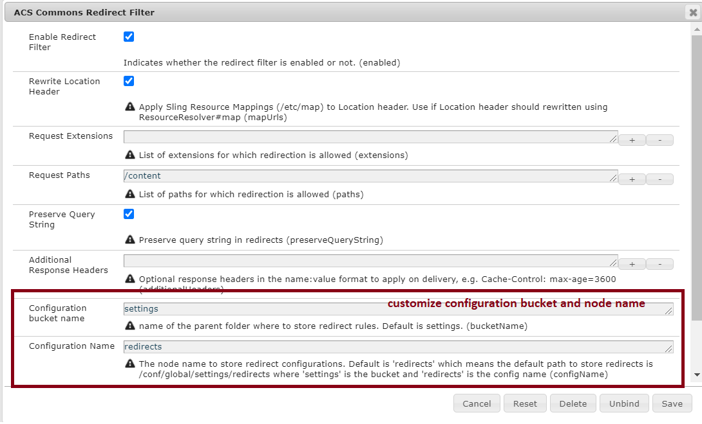

## Context Aware Redirect Configurations

ACS Commons Redirect Manager supports context aware configurations. Out of the box it comes with a default global
configuration (_/conf/global/_) which is a good start to put your redirection rules:

```text
/conf/global
    + settings
      + redirects
        + rule-1
            - source = "/content/we-retail/page1"
            - target = "/content/we-retail/page2"
            - statusCode = 302
        + rule-2
            - source = "/content/wknd/page1"
            - target = "/content/wknd/page2"
            - statusCode = 302
````
This requires zero configuration in your content sites. Just put your redirects in the global list, replicate them to publish and they will work!

However, there can be cases where you want to have different configurations for each site, for example, _we-retail_ and _wknd_ would have
their own tables of redirects, any other site will fallback to _/conf/global_ :

### Redirects for _/content/we-retail_
```text
/content/we-retail
    + jcr:content
      - cq:conf = "/conf/we-retail"

/conf/we-retail
    + settings
      + redirects
        + rule-1
            - source = "/content/we-retail/page1"
            - target = "/content/we-retail/page2"
            - statusCode = 302
````

### Redirects for _/content/wknd_
```text
/content/wknd
    + jcr:content
      - cq:conf = "/conf/wknd"

/conf/we-retail
    + settings
      + redirects
        + rule-1
            - source = "/content/wknd/page1"
            - target = "/content/wknd/page2"
            - statusCode = 302
````

### Redirects for other sites
```text
# sites that don't have cq:conf will fallback to this configuration
/conf/global
    + settings
      + redirects
        + rule-1
            - source = "/content/geometrixx/page1"
            - target = "/content/geometrixx/page2"
            - statusCode = 302
````


### Configuration Resolution
AEM performs a lookup based on the content and it’s contextual _cq:conf_ property to find the appropriate configuration.
If _cq:conf_ is not set then _/conf/global_ is used as a fallback.

Example:
1. User requests _/content/we-retail/page1_
2. AEM goes up the content tree until a resource with the _cq:conf_property is found: _/content/we-retail/jcr:content@cq:conf_
3. Check if a configuration resource exists at the path the property points to: _/conf/we-retail_
4. Check if the redirect configuration exists below the configuration resource: _/conf/we-retail/settings/redirects_
5. Use _/conf/global_ as fallback pat

### Customizing storage path
The default configuration bucket and node name are _settings_ and _redirects_ respectively which means that
redirect configurations will be stored in a _settings/redirects_ node relative to its /conf parent, e.g
```text
/conf/global/settings/redirects
/conf/we-retail/settings/redirects
/conf/wknd/settings/redirects
...
```
Notice that all of these configurations end with _settings/redirects_.  This can be changed in the OSGi configuration of _com.adobe.acs.commons.redirects.filter.RedirectFilter_




