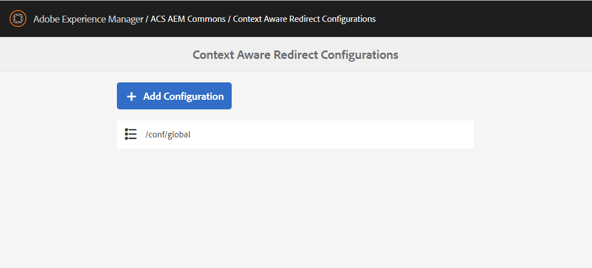

## Purpose

Redirect Manager allows content authors to  maintain and publish redirect configurations from AEM. 
Support for redirects is implemented as a servlet filter  which evaluates redirect configurations and issues a 302 or 301 
respectively in case of a matching incoming request url. 

## Features
* AEM as a Cloud Service  compatible
* Support for regular expressions including back-references
* Support for context-aware configurations
* Support for Sling Mappings to rewrite Location header
* Export redirect rules into a spreadsheet, edit them offline and import back

## Table of Contents

* [Getting Started](#getting-started-with-redirect-manager)
* [Managing Redirects](./subpages/manage.html)
* [Context Aware Configuration](./subpages/caconfig.html)
* [Rewriting Location header](./subpages/mappings.html)
* [Advanced Configuration](./subpages/advanced.html)

## Getting Started with Redirect Manager

### Configuration
Redirect Manager is a opt-in feature and requires an OSGi configuration before it gets active.
To enable redirects create a configuration for PID `com.adobe.acs.commons.redirects.filter.RedirectFilter`, e.g.
```text
/apps/my-app/config/com.adobe.acs.commons.redirects.filter.RedirectFilter
```
```xml
<?xml version="1.0" encoding="UTF-8"?>
<jcr:root xmlns:sling="http://sling.apache.org/jcr/sling/1.0" xmlns:jcr="http://www.jcp.org/jcr/1.0"
          jcr:primaryType="sling:OsgiConfig"
          enabled="{Boolean}true"/>
```

###  Create Redirects

To access  Redirect Manager, open the main AEM menu from the link in the upper-left and select Tools » ACS AEM Commons » Manage Redirects
or navigate to http://localhost:4502/apps/acs-commons/content/redirect-manager/redirects.html

You will see a list of available redirect configurations. The default global configuration (`/conf/global`) is created 
automatically by ACS Commons and it is a good start to put your redirects.


See [Context Aware Configuration](./caconfig.html) how to maintain different redirect configuration per context

Click on `/conf/global` to start managing redirect configurations


Click the _"+ Redirect Configuration"_ button to add a redirect rule, e.g. 

| Source        | Target           | Status Code |
| ------------- |-------------|-------------|
| /content/geometrixx/us/en/about-us | /content/we-retail/us/en/about-us | 302 |


Redirects are supported for pages and assets. You can match by exact path or by a regular expression.
It is also possible to evaluate the source based on the request URI. This can be configured for each redirect configuration separately.
Enabling this allows evaluation of request specific data (ie. suffix). 

Target can include back-references ($N) to the regex pattern which will be replaced by the contents of the Nth group of
the regex match.

See [Manage Redirects](./manage.html) for more information.

### Replicate 

On the "Manage Redirects" page switch to the *Publish* tab and click the 'Publish Redirect Configurations' button 
to replicate your redirects to the publish instances.


### Testing 

Navigate to http://localhost:4503/content/geometrixx/us/en/about-us.html which should return 
a 302 redirect to http://localhost:4503/content/we-retail/us/en/about-us.html : 

```shell
$ curl -I http://localhost:4503/content/geometrixx/us/en/about-us.html
HTTP/1.1 302 Found
Location: /content/we-retail/us/en/about-us.html
```

 
