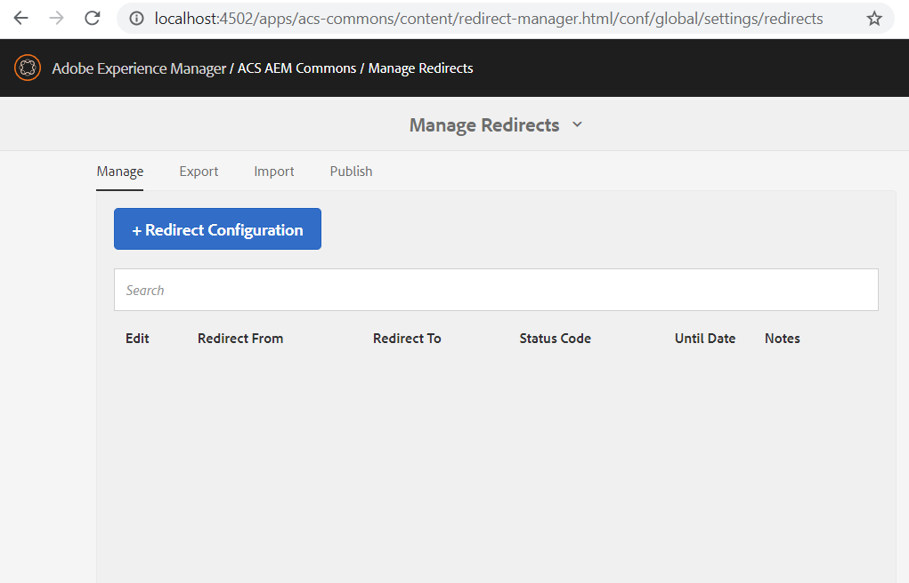
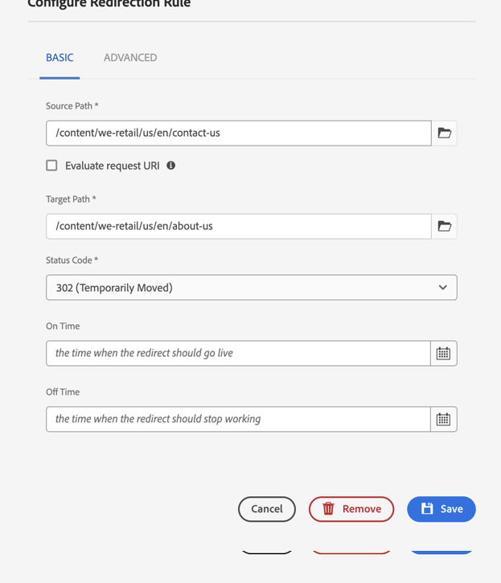
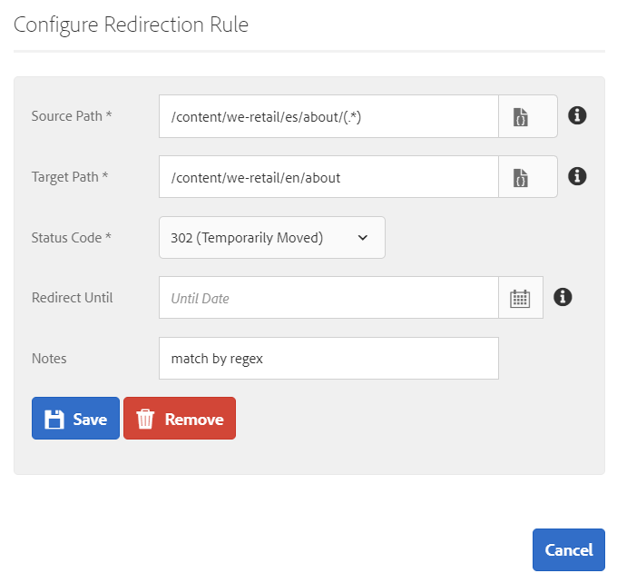
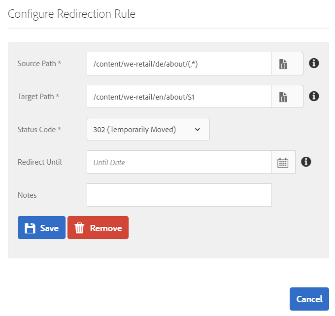
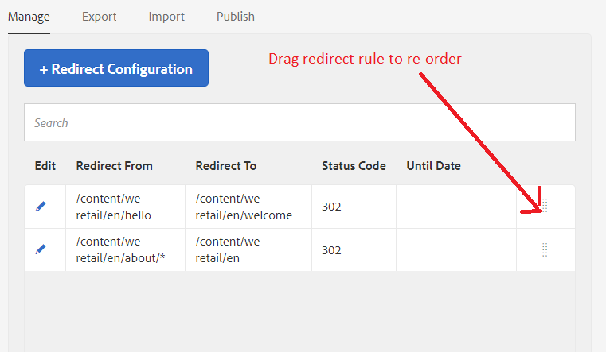
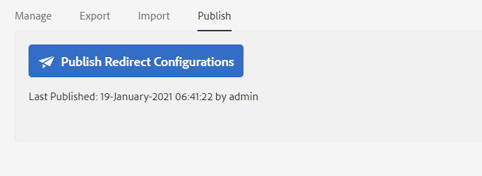
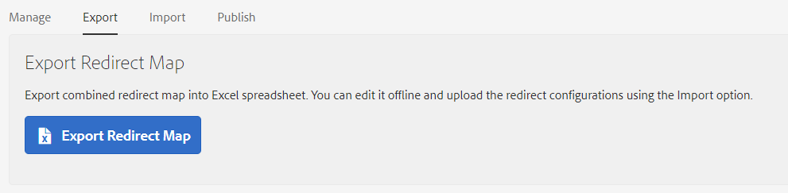
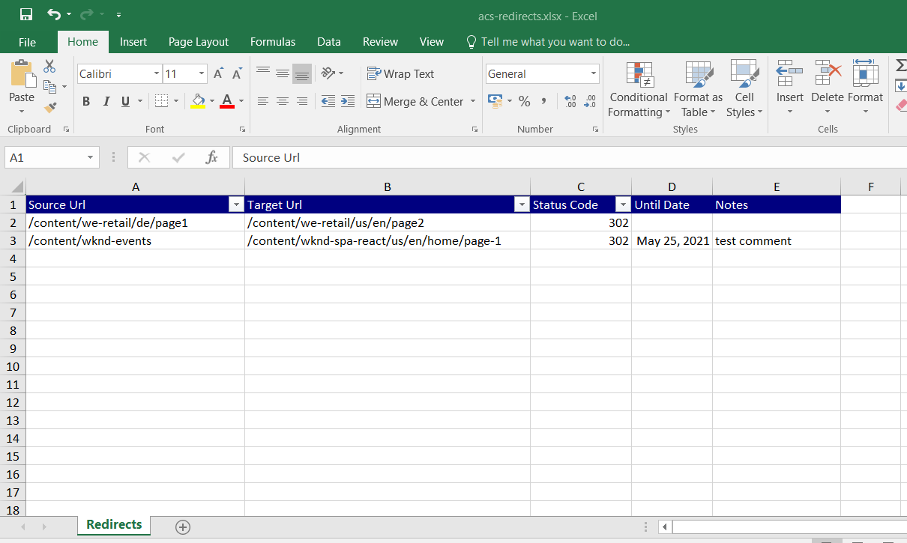
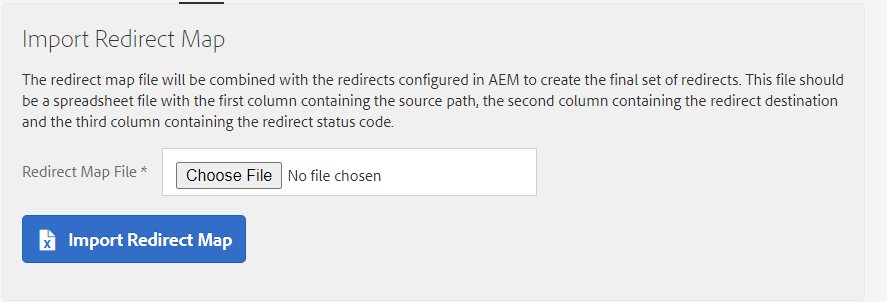
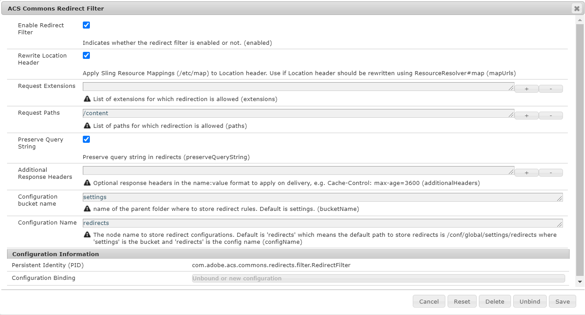

## Purpose

This tool allows content authors to  maintain and publish redirect configurations. Support for redirects is implemented as a servlet filter  which evaluates redirect configurations and issues a 302 or 301 respectively in case of a matching incoming request url. 

## Setting Up Redirect Manager

To create a Redirect configuration:

1. Navigate to [/apps/acs-commons/content/redirect-manager.html](http://localhost:4502//apps/acs-commons/content/redirect-manager.html)


2. Configure one or more Redirect Configurations. 


### Form Inputs

| Input        | Required          | Description          |
| ------------- |-------------|-------------|
| Source Path | Yes | Where to redirect from. Can be a AEM path or a regular expression. See below |
| Target Path | Yes | Where to redirect to. Can be a path in AEM or an external URL |
| Status Code | Yes | 301 or 302 :warning: The HTTP 301 status code is cached in browsers with no expiry date and cannot be reverted, i.e. once 301 is applied, it is forever |
| Redirect Until | No | If the field has a value, the page redirection would work till that date and after that date, the redirection would stop for that entry, If the field has no value, the page redirection would work without any end date (as is)|


Redirects are supported for pages and assets. You can use trailing wildcard (*) or regular expressions with matching groups.
Examples:

| Source        | Target           |
| ------------- |-------------|
| /content/dam/we-retail/hello.pdf | /content/dam/we-retail/welcome.pdf |
| /content/we-retail/de/about/* | /content//we-retail/en/about |
| /content/we-retail/es/about/(.*) | /content/we-retail/en/about |
| /content/we-retail/de/about/(.*) | /content/we-retail/en/about/$1 |
| /content/we-retail/(pt-br\|de)/(.+)/speakers/(.*) | /content/we-retail/en/$1/speakers/$2 |
| /content/geometrixx/de/* | https://www.geometrixx.de/welcome |






Note that ordering matters for overlapping regex matches.
Rules are evaluated in the order they are defined in the tool and so far that was the order the rules were created.

Assuming you created three overlapping rules, the first one will greedily match all the requests and #2 and #3 will never be used.

```
/content/we-retail/(.+)/about -> target1
/content/we-retail/en/(.+)/about -> target2
/content/we-retail/en/na/contact-us/(.+)/about -> target3
```

You can re-order rules by dragging them in the UI:





3. Switch to the *Publish* tab and click the 'Publish Redirect Configurations' button to replicate redirects to the publish instances.




4. Testing Redirects in AEM Author

Redirects in Author are disabled in EDIT, PREVIEW and DESIGN WCM Modes. To test on author you need to disable WCM mode and append ?wcmmode=disabled to the query string, e.g.
http://localhost:4502/content/we-retail/en/contact-us.html?wcmmode=disabled

## Redirect Map Manager Features

### Export and Import

 You can export redirects into a spreadsheet, edit of offline and then import the rules back in AEM. 
 





The redirect map file will be combined with the redirects configured in AEM to create the final set of redirects. T

### OSGi Configuration

Advanced settings can be configured in the OSGi configuration


ACS Redirect Manager supports the following attributes:

1. Enabled Redirect Filter - global flag to enable/disable redirects
2. Rewrite Location Headers - whether the Location header should be ResourceResolver#map'd 
3. Request Extensions - optional list of extension for which redirection is allowed. Default is empty which means any extensions are allowed.
4. Preserve Query String. Whether  query string, e.g.
http://localhost:4502/content/we-retail/en/contact-us.html? from the source url should be appended to the Location header
5. Storage path. Where to store redirect configurations. Default is /var/acs-commons/redirects
6. On Delivery Headers. Optional HTTP headers in the _name:value_ format to apply on delivery
 
### Extending Functionality

There can be cases clients would want to apply custom logic to rewrite the Location header before delivery. Redirect Manager provides a hook into the functionality which allows to register a class to rewrite urls:

```java
package com.adobe.acs.commons.redirects;

import org.apache.commons.lang3.StringUtils;
import org.apache.sling.api.SlingHttpServletRequest;
import org.osgi.service.component.annotations.Component;

@Component
public class MyLocationAdjuster implements LocationHeaderAdjuster{
    @Override
    public String adjust(SlingHttpServletRequest request, String location) {

        if(location.startsWith("/content/we-retail/de/")){
            String loc = StringUtils.substringAfter(location,"/content/we-retail/de/");
            return "https://www.we-retail.de/" + loc;
        }
        return location;
    }
}
```
