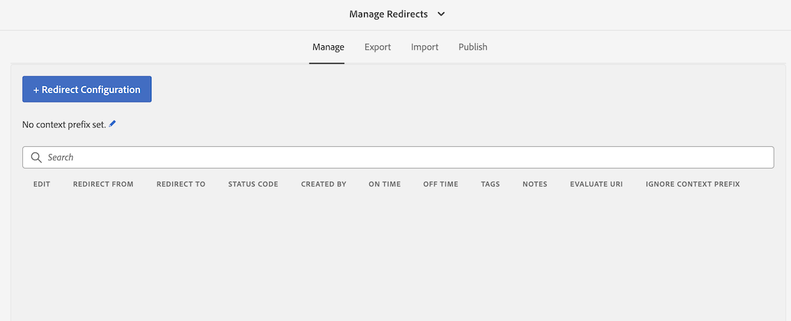

## Purpose

This tool allows content administrators, system administrators and Search Engine Optimization teams to easily maintain and publish [Apache httpd Redirect Map](https://httpd.apache.org/docs/2.4/rewrite/rewritemap.html) files without requiring an Apache restart. These files can manage large lists of redirects and rewrites in the Apache httpd / AEM Dispatcher.

## Setting Up Redirect Manager

### Configuring Redirects

To create a Redirect configuration:

1. Navigate to [/apps/acs-commons/content/redirect-manager.html](http://localhost:4502//apps/acs-commons/content/redirect-manager.html)


2. Configure one or more Redirect Configurations. 
    

You can use trailing wildcard (*) or regular expressions with matching groups.
Examples:

```
# trailing wildcard
/content/we-retail/de/about/* -> /content//we-retail/en/about
# regex equivalent to trailing wildcard
/content/we-retail/es/about/(.*) -> /content/we-retail/en/about
```


Redirect target can contain backreferences to regex groups.
```
/content/we-retail/de/about/(.*) -> /content/we-retail/en/about/$1
/content//we-retail/(pt-br|de)/(.+)/speakers/(.*) -> /content//we-retail/en/$1/speakers/$2
```

Invalid backreferences fallback to empty string, e.g.

Note that ordering matters for overlapping regex matches.
Rules are evaluated in the order they are defined in the tool and so far that was the order the rules were created.

Assuming you created three overlapping rules, the first one will greedily match all the requests and #2 and #3 will never be used.

```
/content/we-retail/(.+)/about -> target1
/content/we-retail/en/(.+)/about -> target2
/content/we-retail/en/na/contact-us/(.+)/about -> target3
```
3. Switch to the *Publish* tab and click the 'Publish Redirect Configurations' button to replicate redirects to the publish instances.
    


## Redirect Map Manager Features

### Export and Import

 You can export redirects into a spreadsheet, edit of offline and then import the rules back in AEM. 
 


TThe redirect map file will be combined with the redirects configured in AEM to create the final set of redirects. T

### OSGi Configuration


 
