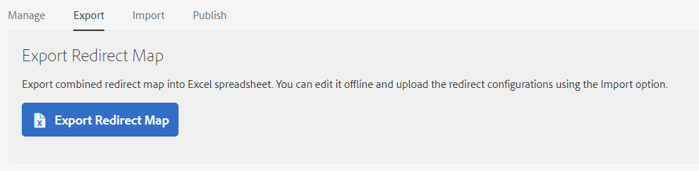

##  Redirect Manager UI

[Redirect Manager](http://localhost:4502/apps/acs-commons/content/redirect-manager.html/conf/global/settings/redirects) 
is a dashboard where you can create, update, delete and publish your redirect configurations. 


Click the _"+ Add Configuration"_ button to configure one or more Redirect Configurations, e.g.


### Form Inputs

| Input        | Required          | Description          |
| ------------- |-------------|-------------|
| Source Path | Yes | Where to redirect from. Can be a path in AEM or a regular expression |
| Target Path | Yes | Where to redirect to. Can be a path in AEM or an external URL |
| Status Code | Yes | 301 or 302 **Warning:** The HTTP 301 status code is cached in browsers with no expiry date and cannot be reverted, i.e. once 301 is applied, it is forever |
| Redirect Until | No | If the field has a value, the page redirection would work till that date and after that date, the redirection would stop for that entry, If the field has no value, the page redirection would work without any end date (as is)|
| Notes | No | Optional notes. Roughly equivalent to a comment near a redirect in an Apache HTTPD conf file |

Redirects are supported for pages and assets. You can match by exact path or by a regular expression.
Target can include back-references ($N) to the regex pattern which will be replaced by the contents of the Nth group of 
the regex match.

Redirect target can be a full JCR path ( `/content/we-retail/en/about` ) or a shortened path (`/en/about`) compatible with 
your Dispatcher mod_rewrite rules or an external url (https://www.we-retail.com/en/about). 
You can use [Sling Mappings](./mappings.md) or a [custom class](./extend.md) to rewrite Location header.

### Examples:

| Source        | Target           | Description |
| ------------- |-------------|-------------|
| /content/we-retail/hello | /content/we-retail/welcome | Match a page by path. Redirect `/content/we-retail/hello` to `/content/we-retail/welcome` |
| /content/dam/we-retail/hello.pdf | /content/dam/we-retail/welcome.pdf | Match an asset by path. Redirect `/content/dam/we-retail/hello.pdf` to `/content/dam/we-retail/welcome.pdf` |
| /content/we-retail/de/about/* | /content/we-retail/en/about | Wildcard Match.  Redirect all pages that start with `/content/we-retail/de/about/*` to `/content/we-retail/en/about`|
| /content/we-retail/es/about/(.*) | /content/we-retail/en/about | Regex Match equivalent to `/content/we-retail/de/about/*`.  Redirect all pages that match `/content/we-retail/de/about/(.*)` to `/content/we-retail/en/about` |
| /content/we-retail/de/about/(.*) | /content/we-retail/en/about/$1 | Use a back-reference to redirect german pages (de) to  their english versions (en), e.g. `/content/we-retail/de/about/team => /content/we-retail/en/about/team` |
| /content/we-retail/(pt-br\|de)/(.+)/speakers/(.*) | /content/we-retail/en/$1/conference/$2 | An example with two back references.  |
| /content/we-retail/hello | /en/welcome | Return a shortened url (`/en/welcome`) instead of `/content/we-retail/en/welcome` . This will work assuming your dispatcher configuration rewrites `/en/welcome` into `/content/we-retail/en/welcome` |
| /content/geometrixx/de/* | https://www.geometrixx.de/welcome | Redirect to an external domain |


### Ordering 
Note that ordering matters for overlapping regex matches.
Rules are evaluated in the order they are defined in the tool and so far that was the order the rules were created.

Assuming you created three overlapping rules, the first one will greedily match all the requests and #2 and #3 will never be used.

```
/content/we-retail/(.+)/about -> target1
/content/we-retail/en/(.+)/about -> target2
/content/we-retail/en/na/contact-us/(.+)/about -> target3
```

You can re-order rules by dragging them in the UI:


### Export and Import

 You can export redirects into a spreadsheet, edit of offline and then import the rules back in AEM. 
 


The redirect map file will be combined with the redirects configured in AEM to create the final set of redirects. 
