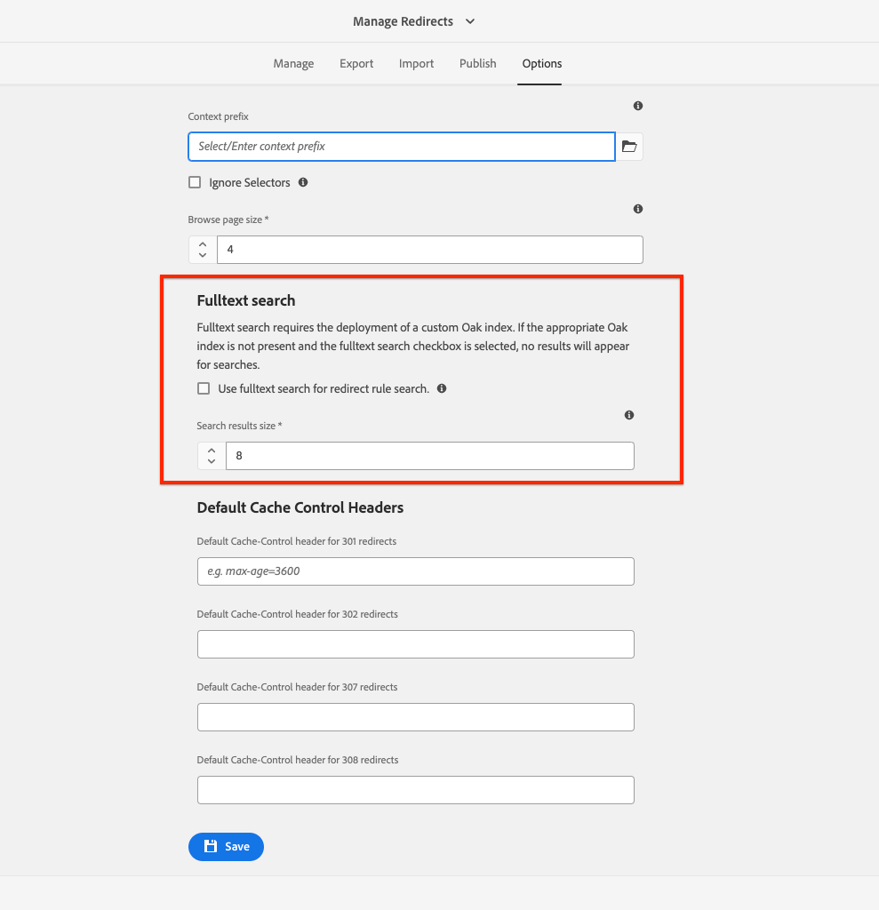

## Searching over Redirects

Since ACS AEM Commons v6.6.0, Redirect Manager supports the fulltext search of redirect data. When fulltext search is not enabled, only the current page of results is searched over.

__Make sure to deploy an [Oak index](#oak-index-definition) to support the fulltext search of the Redirect Manager data, otherwise no search results will display.__



### Oak index definition

For fulltext search of redirects to work, you must deploy an Oak index to support the fulltext search of the redirect manager data. The following is an example of an Oak index definition that you can deploy to support the fulltext search of the redirect manager data.

Here is an example Oak Index definition you can use:

```json
{
    "compatVersion": 2,
    "async": "async",
    "queryPaths": [
        "/conf"
    ],
    "includedPaths": [
        "/conf"
    ],
    "jcr:primaryType": "oak:QueryIndexDefinition",
    "evaluatePathRestrictions": true,
    "type": "lucene",
    "indexRules": {
        "jcr:primaryType": "nt:unstructured",
        "nt:unstructured": {
            "jcr:primaryType": "nt:unstructured",
            "properties": {
                "jcr:primaryType": "nt:unstructured",
                "cacheControlHeader": {
                    "name": "cacheControlHeader",
                    "analyzed": true,
                    "jcr:primaryType": "nt:unstructured"
                },
                "note": {
                    "name": "note",
                    "analyzed": true,
                    "jcr:primaryType": "nt:unstructured"
                },
                "createdBy": {
                    "name": "jcr:createdBy",
                    "analyzed": true,
                    "jcr:primaryType": "nt:unstructured"
                },
               "statusCode": {
                    "name": "statusCode",
                    "analyzed": true,
                    "jcr:primaryType": "nt:unstructured"
                },
                "tags": {
                    "name": "cq:tags",
                    "analyzed": true,
                    "jcr:primaryType": "nt:unstructured"
                },
                "source": {
                    "name": "source",
                    "analyzed": true,
                    "jcr:primaryType": "nt:unstructured"
                },
                "resourceType": {
                    "name": "sling:resourceType",
                    "propertyIndex": true,
                    "jcr:primaryType": "nt:unstructured"
                },
                "target": {
                    "name": "target",
                    "analyzed": true,
                    "jcr:primaryType": "nt:unstructured"
                },
                "statusCode": {
                    "name": "statusCode",
                    "analyzed": true,
                    "jcr:primaryType": "nt:unstructured"
                }
            }
        }
    }
}
```

Default OakAnalyzer splits on /, so a path like /content/wknd/de/de gets broken into content, wknd, de. Full-text queries with slashes won’t match as expected.
If you need full-text queries to match values containing / or - (e.g. repository paths - /content/wknd/de/de), extend the Lucene index with a [custom analyzer](https://jackrabbit.apache.org/oak/docs/query/lucene.html#analyzers).

```json
{
    "analyzers": {
        "jcr:primaryType": "nt:unstructured",
        "default": {
            "jcr:primaryType": "nt:unstructured",
            "tokenizer": {
                "jcr:primaryType": "nt:unstructured",
                "name": "Keyword"
            },
            "filters": {
                "jcr:primaryType": "nt:unstructured", 
                "LowerCase": {
                  "jcr:primaryType": "nt:unstructured"
                }
            }
        }
    }
}
```