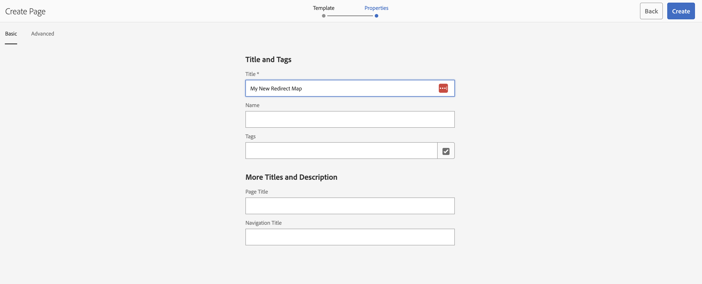
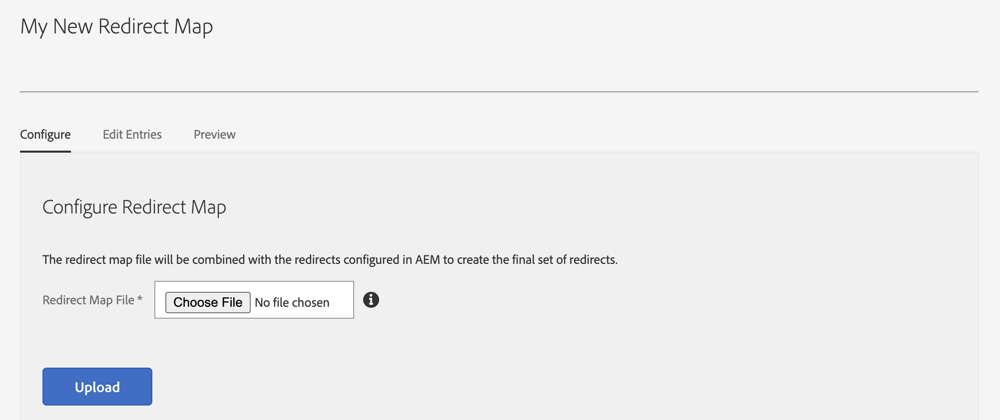
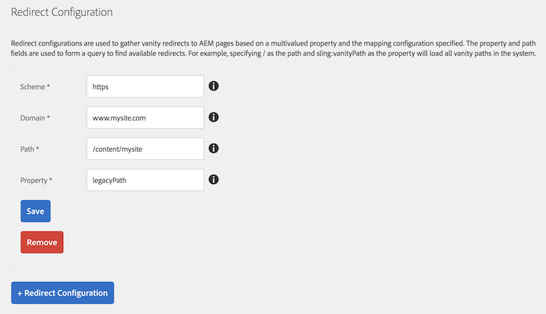
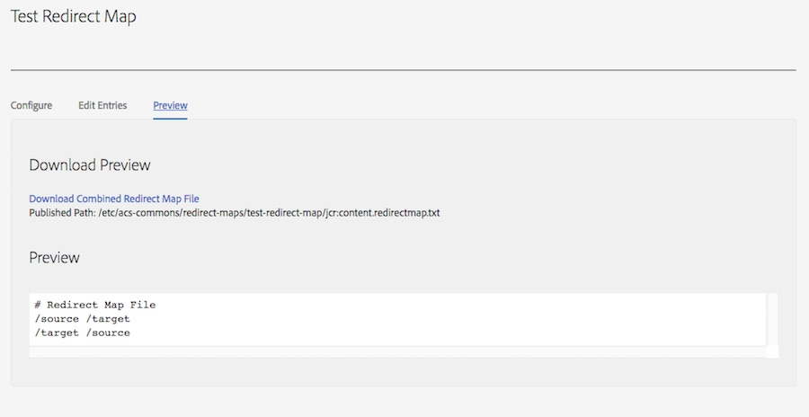
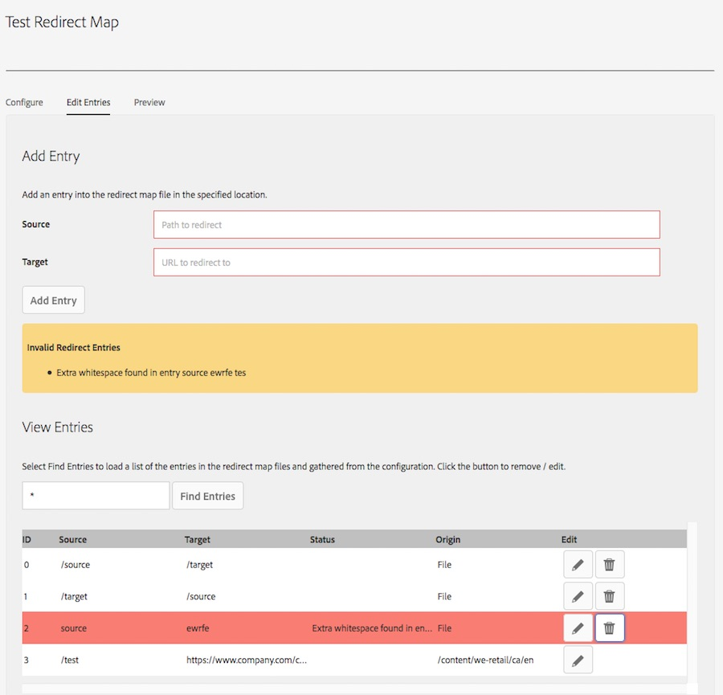
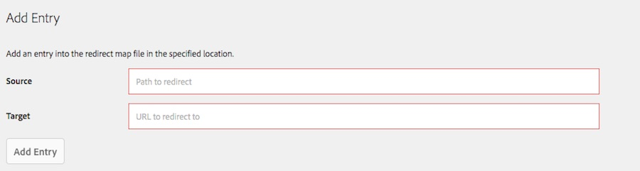
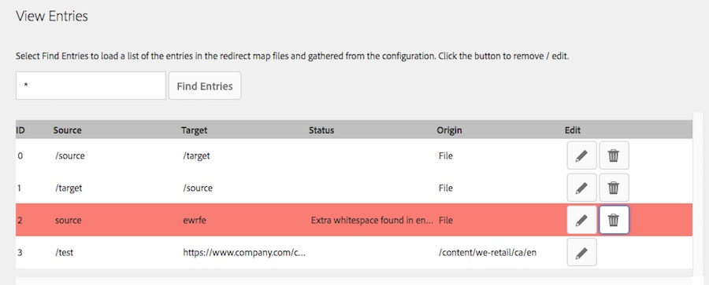

## Purpose

This tool allows content administrators, system administrators and Search Engine Optimization teams to easily maintain and publish [Apache httpd Redirect Map](https://httpd.apache.org/docs/2.4/rewrite/rewritemap.html) files without requiring an Apache restart. These files can manage large lists of redirects and rewrites in the Apache httpd / AEM Dispatcher.

## Setting Up Redirect Map Manager

### Configuring a Redirect Map

To create a Redirect Map configuration:

1. Navigate to `AEM Author > Tools > Redirect Maps`
2. From the top right corner select `Create > Page`
2. On the *Create Page*, select `Redirect Map Configuration > Next`
3. Enter the Title / Name of your Redirect Map and Click *Create*
    
4. Upload a Redirect Map base file \(optional\). If specificed, this file will be combined with the values from the AEM repository to generate the final Redirect Map file. This can be useful for specifying miscellaneous or external redirects which aren't found for pages in the AEM repository. For example, redirecting a particular URL to an external application.
    
5. Configure one or more Redirect Configurations. These configurations are properties which will be queried for in the AEM repositository to generate the redirect map. Every page or asset under the specified path with the property will be included in the redirect map in the format `[property value] [scheme][domain][paget/asset mapped path]`. The Redirect Map generaton servlet uses [Sling Mappings](https://sling.apache.org/documentation/the-sling-engine/mappings-for-resource-resolution.html) to automatically externalize the URL for the page/asset.
    
6. Switch to the *Preview* tab and validate your configuration.
    

Once you are happy with your Redirect Map file, activate the configuration page and the redirects will be in place the next time your cron job updated the file.

### Configuring Apache

Before using the Redirect Map Manager, you need to configure Apache to retrieve the file from the AEM Publisher and update it's Redirect Map DB. To set this up you should:

1. Configure Apache to use a redirect map at your intended path. For example, if I wanted to use a Redirect Map DB stored at `/etc/httpd/conf/redirectmap.map`, I could add the following into my site's conf file:
    ```
        # Rewrite rules
        RewriteMap map.legacy dbm:/etc/httpd/conf/redirectmap.map
        RewriteCond ${map.legacy:$1} !=""
        RewriteRule ^(.*)$         ${map.legacy:$1|/} [L,R=301]
    ```
2. Add a cron task to pull the Redirect Map from the publisher and convert it into a DB File. For example, I could add the following script into `/etc/cron.hourly`:
    ```
        #!/bin/bash
        
        # Configuration values
        PUBLISHER_IP=127.0.0.1
        LOG_DIR=/var/log/httpd
        MAPS=(
            "site-vanities"
            "site-legacy-redirects"
        )
        
        # Update the redirect maps
        for MAP_FILE in "${MAPS[@]}"
        do
                        :
            rm /tmp/${MAP_FILE}.txt
            wget http://${PUBLISHER_IP}:4503/etc/acs-commons/redirect-maps/${MAP_FILE}/jcr:content.redirectmap.txt -O /tmp/${MAP_FILE}.txt >> ${LOG_DIR}/update-redirect-map.log 2>&1
            httxt2dbm -i /tmp/${MAP_FILE}.txt -o /etc/httpd/conf/tmp-${MAP_FILE}.map >> ${LOG_DIR}/update-redirect-map.log 2>&1
            mv /etc/httpd/conf/tmp-${MAP_FILE}.map.dir /etc/httpd/conf/${MAP_FILE}.map.dir
            mv /etc/httpd/conf/tmp-${MAP_FILE}.map.pag /etc/httpd/conf/${MAP_FILE}.map.pag
        done
    ```
    You can get the path to your Redirect Map file from the Preview tab of the Redirect Map editor page.

Once you restart Apache, this will automatically pull changes from the Redirect Map Manager every hour into Apache.

## Redirect Map Manager Features

### Configure Redirect Map

This allows uploading redirect map file will be combined with the redirects configured in AEM to create the final set of redirects.


### Redirect Configuration

Redirect configurations are used to gather vanity redirects to AEM pages based on a multi-valued property and the mapping configuration specified. The property and path fields are used to form a query to find available redirects. For example, if you had the following configuration:

 - Scheme = https
 - Domain = www.company.com
 - Path = / 
 - Property = sling:vanityPath 
 
 The Redirect Map generator would gather all of the pages and assets in the property with the property `jcr:content/sling:vanityPath` set and for each value for the property create a mapping to the page / asset using the Sling Mapping for https://www.company.com to rewrite the path.
 
 
 
#### Fields
 
- Scheme - The request scheme, e.g. http or https, used to map the paths into published URLs
- Domain - The domain name for the requests, used to map the paths into published URLs
- Path - The path this configuration will look under in AEM to find cq:Page and dam:Assets with a non-null value for the redirect property
- Property - Any non-null value will be treated as multi-valued and used as the redirect source for redirecting to the page / asset

### Updating Entries

Each entry in the redirect map can be edited. Switch to the *Edit Entries* tab to edit individual entries.



The Redirect Map Manager will display a list of invalid entries, including entries with duplicate sources and entries with extra white space. Please note that this does not check for logical errors such as circular redirects.

#### Adding an Entry

From the *Edit Entries* tab, you can add an entry using the *Add Entry* form:



Simply fill out the *Source* with a source path and the *Target* with the target url to redirect the user to and click *Add Entry* the entry will then be automatically added to the redirect map file.

#### Updating / Removing Entries

To see entries in the table under *View Entries*, you need to add a search term. To view all entries enter `*` or enter a string into the search field and select *Find Entries*. Each entry (including Errors and Origin) will be searched for this term and the matching entries will be displayed.



Once the search is performed, you can edit or remove individual entries. To edit an entry click on the pencil button next to the entry. If this entry is from the file, this will open an modal allowing you to edit the entry, if this entry came from a Page / Asset it will open the editor for that resource. To delete an entry click the trash can next to the entry for File entries or click the pencil for File / Asset entries and then remove the entry from the Page / Asset properties.

### Preview

Allows for previewing, downloading the generated Redirect Map file in the current instance and displays the path to the Redirect Map file for configuring Apache httpd. 

