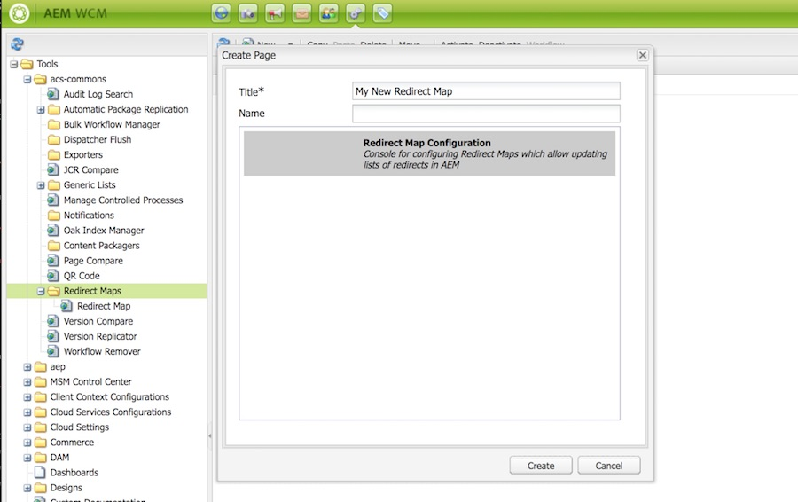

## Purpose

This tool allows content administrators, system administrators and Search Engine Optimization teams to easily maintain and publish [Apache httpd Redirect Map](https://httpd.apache.org/docs/2.4/rewrite/rewritemap.html) files without requiring an Apache restart. These files can manage large lists of redirects and rewrites in the Apache httpd / AEM Dispatcher.

## Configuring a Redirect Map

To create a Redirect Map configuration:

1. Navigate to [/miscadmin#/etc/acs-commons/redirect-maps](http://localhost:4502/miscadmin#/etc/acs-commons/redirect-maps)
2. Select `New...` > `New Page...`
3. Enter the Title / Name of your Redirect Map and Click `Create`
    
    


## Setting Up Redirect Map Manager in Apache

Before using the Redirect Map Manager, you need to configure Apache to retrieve the file from the AEM Publisher and update it's Redirect Map DB. To set this up you should:

1. Configure Apache to use a redirect map at your intended path. For example if I wanted to use a Redirect Map DB stored at `/etc/httpd/conf/redirectmap.map`, I could add the following into my site's conf file:
    ```
        # Rewrite rules
        RewriteMap map.legacy dbm:/etc/httpd/conf/redirectmap.map
        RewriteCond ${map.legacy:$1} !=""
        RewriteRule ^(.*)$ 		${map.legacy:$1}|/} [L,R=301]
    ```
2. Add a cron task to pull the Redirect Map from the publisher and convert it into a DB File. For example, I could add the following script into `/etc/cron.hourly`:
    ```
        #!/bin/bash
        wget http://[PUBLISHER_IP]:4503 /etc/acs-commons/redirect-maps/[redirect-map-name]/jcr:content.redirectmap.txt -O /tmp/redirectmap.txt >> /var/log/update-redirect-map.log 2>&1
        httxt2dbm -i /tmp/redirectmap.txt -o /etc/httpd/conf/redirectmap.map >> /var/log/update-redirect-map.log 2>&1
    ```

Once you restart Apache, this will automatically pull changes from the Redirect Map Manager every hour into Apache.

## Schedules or Event Triggers

To use the Automatic Package Replication feature:

1. Create and configure an AEM Package in the [Package Manager](https://docs.adobe.com/docs/en/aem/6-3/administer/content/package-manager.html), including the filters for the package
2. Navigate to [/miscadmin#/etc/acs-commons/automatic-package-replication](http://localhost:4502/miscadmin#/etc/acs-commons/automatic-package-replication) on your environment. 
3. Create a new page of the type `Automatic Package Replication Configuration`
4. Open and configure the Automatic Package Replication configuration


### Configuration Fields

The following fields are supported for configuring the Automatic Package Replication instance:

 - **Title** *Required* - The jcr:title of the page
 - **Package Path** *Required* - The path of the package to build and replicate. This will display a list of the currently available packages.
 - **Trigger** *Required* - The trigger for this Automatic Package Replication configuration, may be one of:
   - *Cron* - Triggers on a schedule
   - *Sling Event* - Triggers on a Sling Event topic
 - **Cron Trigger** *Required if Cron* - The [Quartz Cron Trigger expression](http://www.quartz-scheduler.org/documentation/quartz-2.x/tutorials/crontrigger.html) for the schedule on which to invoke this configuration
 - **Event Topic** *Required if Sling Event* - The [Sling OSGi Event topic](http://felix.apache.org/documentation/subprojects/apache-felix-event-admin.html) name to invoke this configuration. You can view and trigger events from the OSGi Console at [/system/console/events](http://localhost:4502/system/console/events)
 - **Event Filter** - A LDAP expression for filtering the events on which the configuration should be invoked.

## Workflow Process

To invoke the Automatic Package Replication feature from a workflow, add a `Process Step` into your workflow and configure it as such:

 - **Process** - `Build and Replicate Package`
 - **Arguments** - The path to the package to build and replicate

