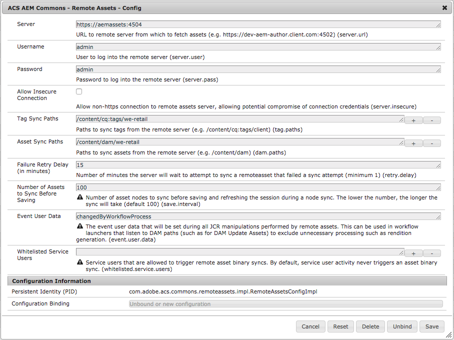
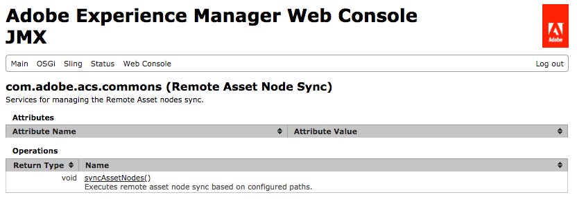

## Purpose

**(RECOMMENDED FOR NON-PRODUCTION USE ONLY)**

Remote Assets allows you to configure an AEM server to automatically sync in the assets from another, remote AEM server,
on an-needed basis.  Remote Assets does not require anything to be installed on the remote AEM server.

For a quick overview of this feature, read this
[Blog Post on Remote Assets](https://blogs.adobe.com/contentmanagement/2018/04/19/brett-birschbach-aemrockstar-2018/)
or watch this
[video demonstration of Remote Assets](https://s3.amazonaws.com/HS2Presentations/AEMPublic/2019-ACS-AEM-Commons-Remote-Assets-Demo-Bounteous.mp4).

### Why do I need Remote Assets?
Pulling down a copy of the production site _pages_ to a local or otherwise non-production server is simple. But, pulling
down all of the assets associated with that site? Not so much. A simplistic, brute-force solution might be to use
AEM's package manager to bundle up the entire DAM, copy it down to your server, and call it a day, right?  Not exactly.
Copying the entire DAM can be problematic in terms of disk space, network transfer, and package size.
How can this be done in a way that leaves behind assets that are not applicable to the site?
And even if you can do it manually, how do you keep up to date when assets on the remote server change?

In short, you need a solution that achieves all of the following objectives:
- Access to all remote AEM Assets from another AEM Sites instance
- Remote AEM Assets nodes stored locally in AEM Sites for seamless authoring w/OOTB features
- Copies of just the _required_ remote AEM Assets binary files, not binaries for the entire DAM
- All accomplished in an automated fashion

### How does Remote Assets Work?

The mentality of Remote Assets is "sync what you need, when you need it."  To accomplish this goal, Remote Assets
sync's assets from the remote system in a two-step process to optimize sync time and disk usage on the local server.

The first step for sync'ing assets is a "node sync," where the full node trees for assets (and tags) configured by
an admin or developer are sync'd to the local server.  When the
node sync takes place, the binary files of sync'd assets are replaced with placeholder binary files that are much
smaller than typical "real" assets.  This allows the entire set of assets to be sync'd to the local server at a
fraction of the disk space and sync time needed if instead the entire set of assets were transferred as a content
package.  Having the entire node structure present on the local server allows assets to be searched and accessed
as if they are fully present on the local server, supporting all OOTB functionalities.

The second step for sync'ing assets is a "binary sync," which occurs on an indivudal asset basis.  This sync is
triggered whenever a non-admin user references a "remote" asset in any way.  Here are just a few events that can
trigger a binary sync:
- Author executes an asset search where a remote asset is in the search results
- Author opens a folder in the DAM, revealing remote assets within
- Author views remote assets via the asset finder on the page editor interface
- End user views a page where a remote asset is referenced

When any of these (or similar) actions take place by a non-admin user, the system detects that the requested asset is
a "remote" asset that doesn't yet have it's binary files sync'd from the remote server, and in real time while the
current request is processing, sync's the binary files into the local DAM "just in time."

Once an asset has completed sync of it's binary files to the local server, it is no longer considered a "remote" asset,
and from that point forward there is no performance penalty in accessing the asset as it is now a "real" asset the
same as if it were uploaded directly to the server.  A "real" asset can once again become a "remote" asset during
a subsequent node sync, but only if it has been updated on the remote server since the last node sync.

### Use Cases

- Keeping Dev/QA/Stage servers and websites (author and/or publish) up to date with Production assets
- Dynamically pulling assets as-needed to localhost servers used for development or other business purposes

### Disclaimers/Warnings

The Remote Assets feature should be considered a **beta** feature **for non-production use only**.  It's a very useful
feature, but does come with some potential pitfalls that should be understood before using this feature.
We look forward to future pull requests that help put more "guard rails" around this feature.

- DAM workflow launchers can be triggered by Remote Assets, resulting in poor performance and possibly even server
crashes. This is avoided by following Step 1 in the "How to Use" section.
- There is no limit to how many assets a single request can trigger a binary sync for.  Binary sync is, however,
disbled for the admin user and for all service users to help avoid unintended sync's of large numbers of assets.
- There is no size limit on assets that can trigger a binary sync.  If you have extremely large assets in a certain
part of your DAM, you may wish to avoid sync'ing that part of the DAM.
- Sync of binaries is executed as a synchronous operation to provide the "magical" experience of assets being present
on first request. In most cases, this results in the best user experience. However, a request involving remote assets
may take signficant time to complete if the connection between the local and remote server is slow, the requested
assets are large, and/or the number of requested assets is very high. A high speed connection between the local and
remote server will help mitigate this issue, and once remote asset binary files are sync'd for a set of assets there
is no longer a delay in requesting those assets again.
- A server configured with remote assets will likely grow in size over time as more and more asset binary files are
sync'd from the remote server.  You may wish to manually purge assets from time to time.
- For use cases where the DAM is using a shared document store (e.g. Amazon S3) for the binaries, the benefits of
Remote Assets would be limited.  As such, Remote Assets does not currently support this use case.

PLEASE USE REMOTE ASSETS WITH CARE

## How to Use

1. **(VERY IMPORTANT)** Configure DAM Workflow Launchers to Ignore Remote Assets Updates
1. Enable and Configure the Remote Assets Feature
1. Manually Trigger or Schedule an Asset Node Sync
1. Experience On-Demand Asset Binary Syncs

### Configure DAM Workflow Launchers to Ignore Remote Assets Updates

By default, and on most AEM installations, there are numerous workflows that execute for creates and updates of assets
under the `/content/dam` path.  Since Remote Assets will likely be sync'ing assets to this path, it is **extremely
important** that you configure these workflows to ignore activity from the Remote Assets feature, otherwise asset sync
activities may trigger numerous workflows.  These unnecessary workflow executions can significantly slow the local
AEM server down, and in extreme situations can even crash the local AEM server.

Preventing workflow issues is as simple as updating all workflow launchers that execute on paths below `/content/dam`.
To do this...

1. Navigate to AEM Workflow Launchers at <http://localhost:4502/libs/cq/workflow/admin/console/content/launchers.html>
1. Open up Properties for each workflow with a path that starts with `/content/dam`
1. Ensure the `Exclude List` field contains the value `event-user-data:changedByWorkflowProcess`
    - NOTE #1: Some launchers will already have other values inside `Exclude List`. In those cases, be sure to add a `,`
    before `event-user-data:changedByWorkflowProcess`.
    - NOTE #2: Some launchers will already have `event-user-data:changedByWorkflowProcess` in place.  For those
    launchers, no update is needed.

### Enable and Configure the Remote Assets Feature

Remote Assets requires two OSGi service configurations to be fully enabled.

The first required OSGi service configuration is simply a blank OSGi configuration file for the
`RemoteAssetDecorator` service, which is responsible for sync'ing a remote asset's binary file the first time it is
requsted by a non-admin user.

This is done via the Felix console or by deploying a blank OSGi configuration file from your project deployment.

`/apps/mysite/config/com.adobe.acs.commons.remoteassets.impl.RemoteAssetDecorator.xml`


<?xml version="1.0" encoding="UTF-8"?>
<jcr:root xmlns:sling="http://sling.apache.org/jcr/sling/1.0" xmlns:jcr="http://www.jcp.org/jcr/1.0"
    jcr:primaryType="sling:OsgiConfig"/>


The second required OSGi service configuration involves all of the main configuration values for the Remote Assets
feature, which are configured within the `RemoteAssetsConfigImpl` service.

`server.url`
- Fully qualified URL to the remote AEM server from which to sync assets
- Should be `https`, but `http` supported if `server.insecure` is set to `true` (see applicable warnings)

`server.user`
- Username for logging into the remote AEM server
- This can be any user that has permissions to view assets and tags on the remote server - write permissions are not
required

`server.pass`
- Password for logging into the remote AEM server

`server.insecure`
- Whether or not to allow `server.url` to use the unsecure `http` protocol, potentially exposing the authentication
traffic with the remote AEM server
- It is recommended to only set `server.insecure` to `true` for traffic within a private network, where risk of
exposing login credentials for the remote AEM server is reduced

`tag.paths`
- Array of JCR paths for which to recursively sync tags from the remote server to the local server

`dam.paths`
- Array of JCR paths for which to recursively sync assets from the remote server to the local server

`retry.delay`
- Number of minutes to wait to sync the binaries for a remote asset in the case of a failed attempt
- It is recommended to use a higher value in cases where the local server does not have regular network access to the
the remote server (e.g. local developer server that requires VPN to access the remote server)

`save.interval`
- Number of asset nodes to sync before saving and refreshing the session during a node sync (default: 100)
- The lower the number, the longer the sync will take

`event.user.data`
- The event user data string that will be set during all JCR manipulations performed by remote assets
(default: changedByWorkflowProcess)
- This is used in the `Exclude List` of workflow launchers that listen to DAM paths (e.g. DAM Update Assets) to avoid
unnecessary asset workflow processing

`whitelisted.service.users`
- Array of service user names (default: empty) that are allowed to trigger remote asset binary syncs
- By default, service user activity never triggers an asset binary sync

Example Remote Assets configuration:

`/apps/mysite/config/com.adobe.acs.commons.remoteassets.impl.RemoteAssetsConfigImpl.xml`

<?xml version="1.0" encoding="UTF-8"?>
<jcr:root xmlns:sling="http://sling.apache.org/jcr/sling/1.0" xmlns:jcr="http://www.jcp.org/jcr/1.0"
    jcr:primaryType="sling:OsgiConfig"
    server.url="https://aemassets:4504"
    server.user="admin"
    server.pass="admin"
    server.insecure="{Boolean}false"
    tag.paths="[/content/cq:tags/we-retail]"
    dam.paths="[/content/dam/we-retail]"
    retry.delay="{Long}15"/>


### Manually Trigger or Schedule an Asset Node Sync

Once Remote Assets is configured, you'll then need to execute a node sync.  You can either execute the sync manually,
or schedule the node sync to happen on a regular schedule.

#### Manual node sync

To execute a manual node sync, go to the JMX console at <http://localhost:4502/system/console/jmx>
and open the Remote Asset Node Sync service.

Simply click the `syncAssetNodes()` function and `Invoke` it.  Depending on how big the folders you have configured to
sync are, this process can take anywhere from a few seconds to a few hours.  Assuming the return value of the function
is `null` the sync has completed successfully.

Note that executing a manual node sync will not automatically trigger future node sync's,
so you may wish to periodically execute the sync to keep up to date with new assets and tags.

#### Scheduled node sync

To schedule a node sync to happen on a regular basis, you can configure the `RemoteAssetsNodeSyncScheduler` service
via the Felix console or by deploying an OSGi configuration file with a cron scheduler string from your project
deployment.

Example config for scheduling a Remote Assets node sync once per week, on Tuesday nights starting at 8:00PM:

`/apps/mysite/config/com.adobe.acs.commons.remoteassets.impl.RemoteAssetsNodeSyncScheduler.xml`

<?xml version="1.0" encoding="UTF-8"?>
<jcr:root xmlns:sling="http://sling.apache.org/jcr/sling/1.0" xmlns:jcr="http://www.jcp.org/jcr/1.0"
    jcr:primaryType="sling:OsgiConfig"
    scheduler.expression="0 0 20 ? * TUE *"/>


### Experience On-Demand Asset Binary Syncs

Once you've completed configuration of Remote Assets and executed your first node sync you can now experience Remote
Assets by accessing assets in AEM as any user other than `admin`.  If Remote Assets is working correctly, and you're
logged in as someone other than `admin`, you should
never see an asset's "temporary" binary (often stamped with the words "REMOTE ASSET") but rather should see assets in
their "true" form.

Refer to the
[video demonstration of Remote Assets](https://s3.amazonaws.com/HS2Presentations/AEMPublic/2019-ACS-AEM-Commons-Remote-Assets-Demo-Bounteous.mp4)
for what you _should_ be experiencing with Remote Assets, and if you aren't then refer to the Troubleshooting section
below.

## Troubleshooting

As this feature is meant for non-production use, and involves important activities to have full visiblity of, it is
recommended that you set the log level of the `com.adobe.acs.commons.remoteassets` package at all times to DEBUG.
This is a good first step in debugging any issues.

If you are unable to diagnose your problem with increased logging or the help of the scenarios outlined below,
please feel free to reach out to the author of the original feature at <mailto:brett.birschbach@bounteous.com>.

### Slow node sync
If executing a node sync is going slower than 100+ assets per minute...
- Double check that you've configured all DAM asset workflows to ignore remote asset activities - see Step 1 in
"How to Use"
- Verify that you have a fast network connection between the local and remote servers.

### Asset sync is missing tags
If an asset node sync is not setting tags on the sync'd assets, ensure you've configured the appropriate tag paths to
sync from the remote server. Tags must be present on the local server in order for the node sync to apply them to
sync'd assets.

### Asset binary files not sync'ing, assets showing as "REMOTE ASSET"
If you've executed a node sync successfully, but all assets in the DAM are showing up up with the temporary binary
files denoting "REMOTE ASSET," this can be caused by a few different scenarios:
- You are logged in as the `admin` user.  Because the `admin` user is used for some back end process in AEM, remote
assets does not sync asset binary files for the `admin` user.  To resolve, log in as a non-admin user.
- Your browser has cached temporary binary file versions of these assets from viewing them as the `admin` user.
This is a very easy "gotcha" and resolved with a simple browser cache clear.
- The `RemoteAssetDecorator` service is not configured. This service is configured with a simple blank OSGi config file,
as covered in the "How to Use" section.
- Connection from the local server to the remote AEM server is failing.  If a binary asset sync experiences a network
failure, the asset will load with the temporary binary.
- A previous sync of the asset's binary files failed, and the configured "Failure Retry Delay" has not yet expired. In
this situation, ensure your local server is able to connect to the remote AEM server, and once the "Failure Retry Delay"
has expired the binary sync should work on the next request for that asset.
