[&lt; Back to Report Builder](index.html) 

# Configuring Reports

Each report can be configured to find different results, format and display the results differently or add additional parameters to the results.

## Adding a Report

To add a report, navigate to the report screen. Enter the title for the report into the **Title** field and select **+ Report**. This will create a new report, which can be subsequently edited.

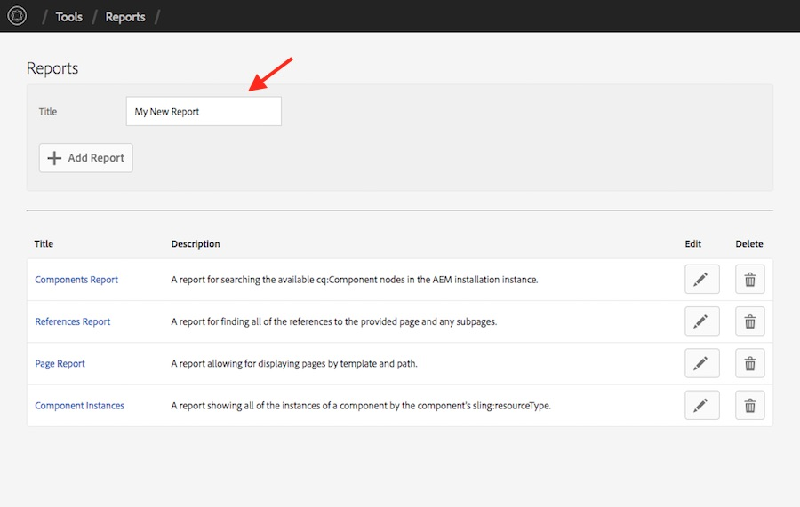

## Editing a Report

To edit a existing report, navigate to the report screen and click the pencil next to a report you want to edit. This will open the report editor, which allows you to configure the report through the AEM drag and drop interface.

There are three sections to configure for each report:

 * **Configuration** -- The configuration for the report executor, at least one should be configured
 * **Search Parameters** -- Display form fields for users to specify the parameters for the report executor
 * **Result Columns** -- called for every row in the results to display the result cell to the user

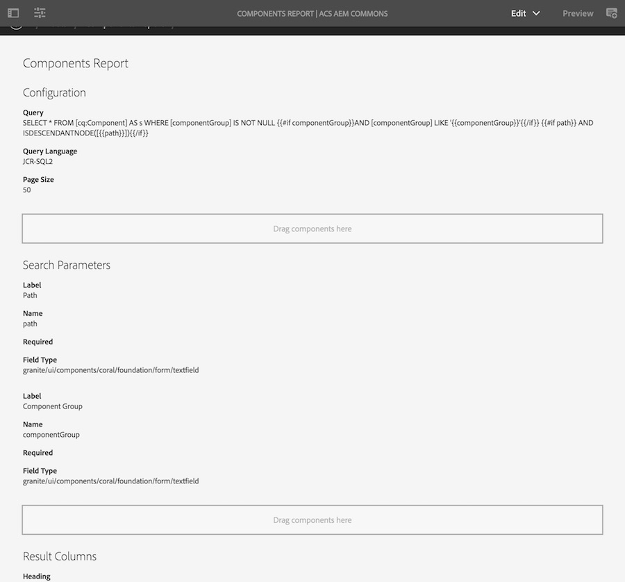

### JCR Query Report Configuration

This configuration allows for reports based on JCR Queries and returns results of the type [Resource](https://sling.apache.org/apidocs/sling9/org/apache/sling/api/resource/Resource.html).

This configuration has the following fields:

 * **Query** - The query to execute, make sure it is properly formatted based on the query language. This query is evaluated against the parameter values from for the report as a [Handlebars template](http://handlebarsjs.com/expressions.html), so you can use basic logic
 * **Query Language** - The query language to use for executing the query
 * **Page Size** - The number of results to retrieve per page

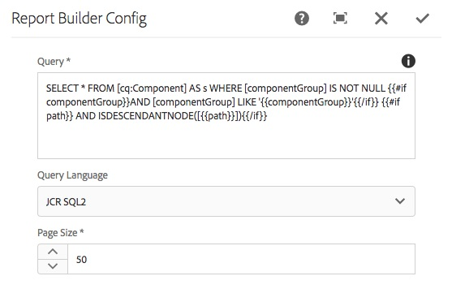

## Parameters

### Report Basic Parameter

These parameters allow report users to configure Text, Number and Date parameters when executing a report.

This parameter has the following fields:

 * **Label** - The label to be displayed to the user
 * **Name** - The the name of the parameter, must match the value used in the Report Configuration query
 * **Required** - If checked, this parameter must be set by the user for the report to execute
 * **Field Type** - The type of field to generate, this should match the type of the property being queried
 
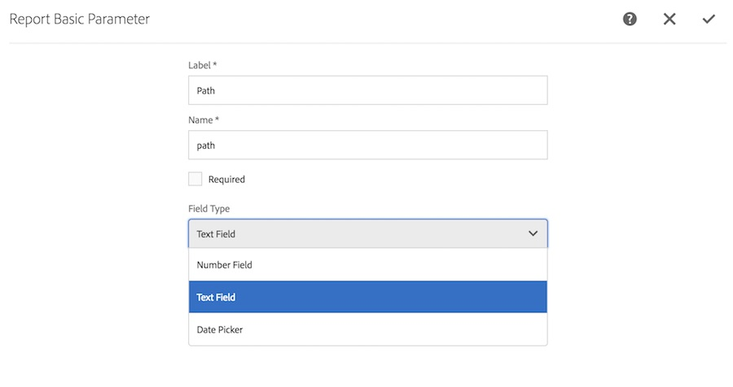

### Report Select Parameter

These parameters allow report users to configure Select parameters when executing a report.

This parameter has the following fields:

 * **Label** - The label to be displayed to the user
 * **Name** - The the name of the parameter, must match the value used in the Report Configuration query
 * **Options** - The options to select from
 
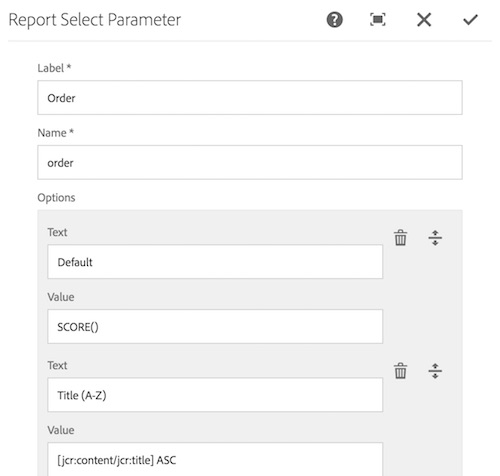

## Result Columns

### Containing Page Column

**Expected Result Type: [Resource](https://sling.apache.org/apidocs/sling9/org/apache/sling/api/resource/Resource.html)**

This column allow report users to show the page which contains the resulting resource.

This column has the following fields:

 * **Heading** - The column header to be displayed to the user
 
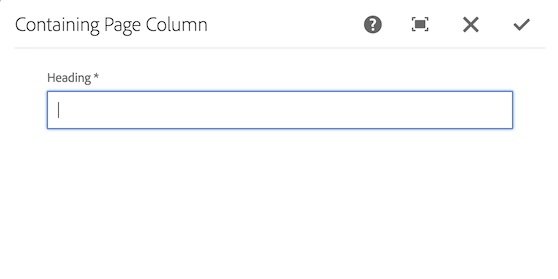

### Date Column

**Expected Result Type: [Resource](https://sling.apache.org/apidocs/sling9/org/apache/sling/api/resource/Resource.html)**

This column shows a formatted date. 

This column has the following fields:

 * **Heading** - The column header to be displayed to the user
 * **Property** - The path/name of the property to use for this column. This property must be a date type.
 * **Date Format** - (optional) The [SimpleDateFormat](https://docs.oracle.com/javase/9/docs/api/java/text/SimpleDateFormat.html) expression for formatting the date. If not specified, the medium local date/time format will be used
 
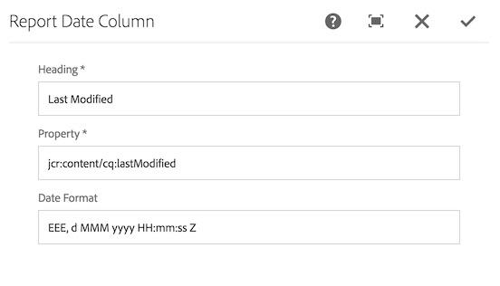

### Editor Column

**Expected Result Type: [Resource](https://sling.apache.org/apidocs/sling9/org/apache/sling/api/resource/Resource.html)**

This column shows a button to link from the report row to an editor of the user's choosing. This can include links to other reports.

This column has the following fields:

 * **Heading** - The column header to be displayed to the user
 * **Editor** - The editor to open when the user selects this button. One of:
    * *CRX DE* - Opens the result resource in CRX DE Lite
    * *Assets* - Opens the result resource in AEM's Asset Manager
    * *Experience Fragments* - Opens the result resource in AEM's Experience Fragments Editor
    * *Sites* - Opens the result resource in AEM's Sites Browser
    * *Tags* - Opens the result resource in AEM's Tag Browser
    * *Custom* - Opens the result resource an editor the user specifies below
 * **Use as Resource Type** - If true, the path of the result will be used as a resource type, removing the first URL segment. This can be useful for linking to reports which will use the resource type for querying
 * **Custom Editor** - Only applicable if the Editor is set to custom. This is the prefix for the url used to generate the link for the button.
 
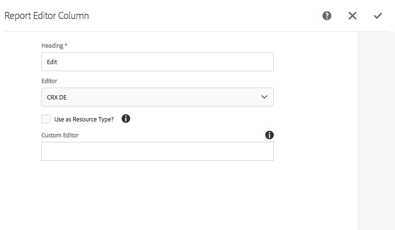

### Path Column

**Expected Result Type: [Resource](https://sling.apache.org/apidocs/sling9/org/apache/sling/api/resource/Resource.html)**

This column shows the path of the result resource. 

This column has the following fields:

 * **Heading** - The column header to be displayed to the user
 * **Include Link** - If checked, a link to the resource in CRXDE will be written out
 
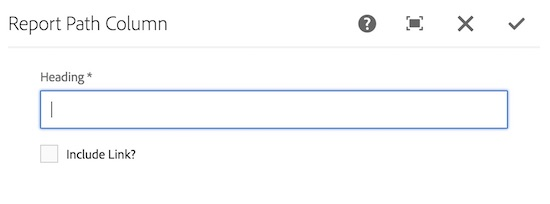

### Replication Status Column

**Expected Result Type: [Resource](https://sling.apache.org/apidocs/sling9/org/apache/sling/api/resource/Resource.html)**

This column shows the replication status of the result resource. 

This column has the following fields:

 * **Heading** - The column header to be displayed to the user
 
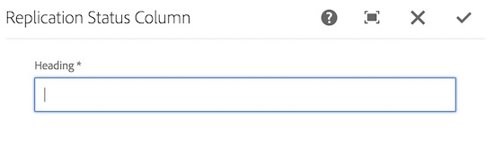

### Tags Column

**Expected Result Type: [Resource](https://sling.apache.org/apidocs/sling9/org/apache/sling/api/resource/Resource.html)**

This column shows a list of the tags of the result resource and a link to the tag in AEM's Tag Manager. 

This column has the following fields:

 * **Heading** - The column header to be displayed to the user
 * **Property** - The path/name of the property to use for this column. This property must be a tag type.
 
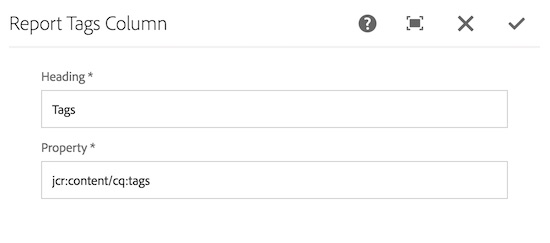

### Text Column

**Expected Result Type: [Resource](https://sling.apache.org/apidocs/sling9/org/apache/sling/api/resource/Resource.html)**

This column shows a text property of the result resource and has the following fields:

 * **Heading** - The column header to be displayed to the user
 * **Property** - The path/name of the property to use for this column
 
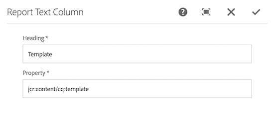
