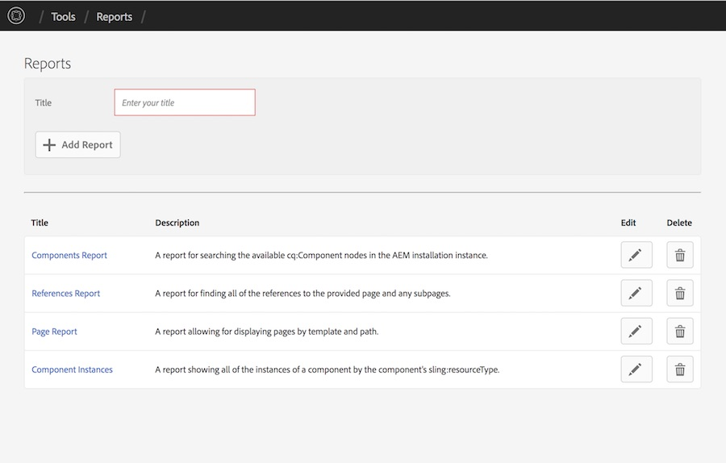
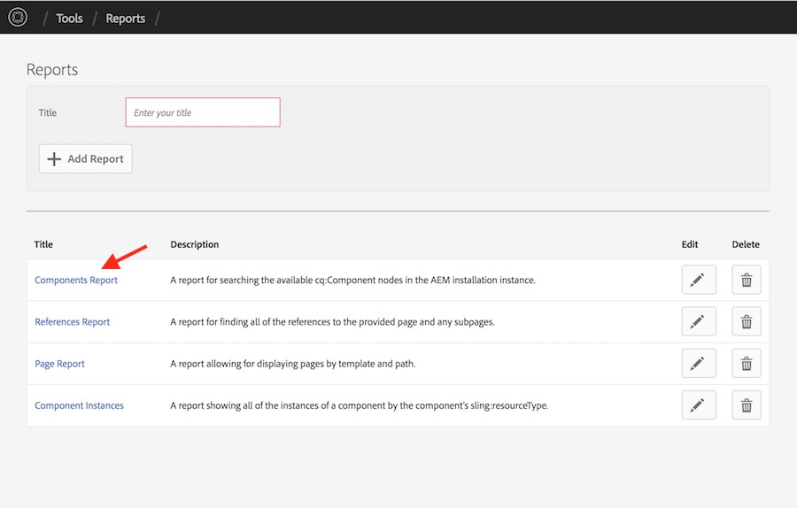
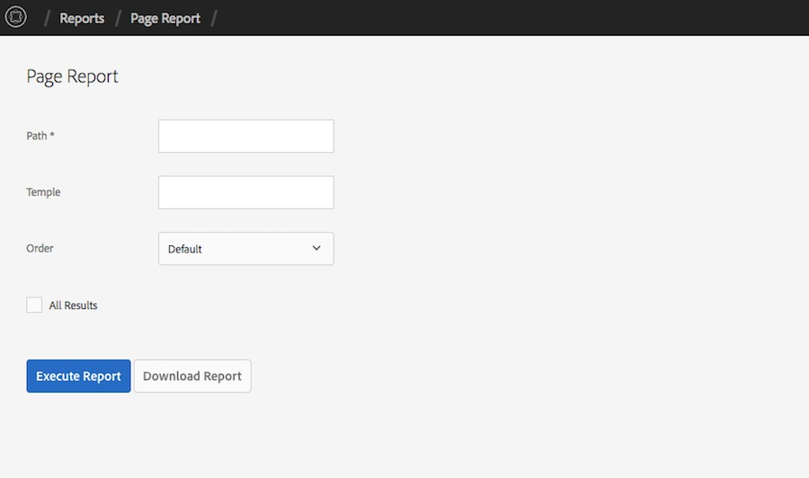
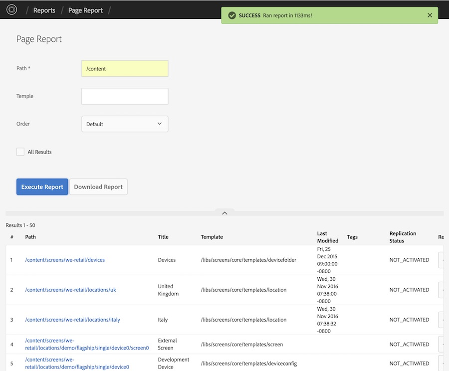
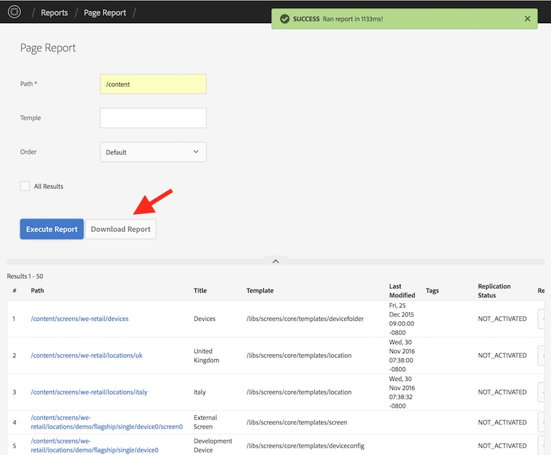

This feature only works on AEM 6.3 and above.

## Purpose

This tool allows AEM Administrators and advanced users to create, execute and download reports based on the contents of the AEM repository. 

## Viewing Reports

To view the available reports, navigate to the Report Landing Page at [http://SERVER:PORT/etc/acs-commons/reports.html](http://localhost:4502/etc/acs-commons/reports.html). This page will display a list of the avaialble reports as well as links to view, edit and delete each report. 

### Viewing a Report

To view a report, click on the title of the report:

This will open the report screen. Some reports require parameters to be specified. These will be denoted with a *

Fill out all of the required parameters and any additional parameters you'd like and select the **Execute Report** button to execute the report:

Once the results are returned, you can page scroll down to see the current page of results or navigate between result pages by selecting the **Previous** and **Next** buttons at the bottom of the results.

When you execute a report, the page URL will be automatically updated with a URL to re-execute this report. You can share this URL with other users and to share the same report results.

### Downloading a Report as CSV

To download the results of the report as a Comma Separated Values file (CSV), execute the report and select the **Download Report** button. This will download a CSV with all of the results of the report.

## Advanced Usage

### [Configuring Reports](configuring.html)

Each report can be configured to find different results, format and display the results differently or add additional parameters to the results.

**[Read More](configuring.html)**

### [Extending Report Builder](extending.html)

The report builder can be customized to provide new [report executors](extending.html#creating-a-report-executor), [column types](extending.html#creating-a-report-column) and [parameter types](extending.html#creating-a-report-parameter). 

**[Read More](extending.html)**
