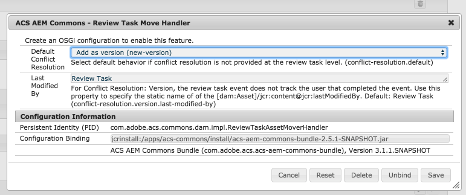
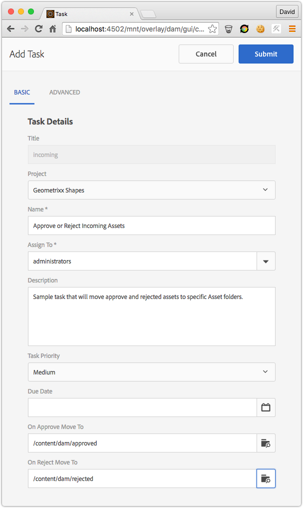
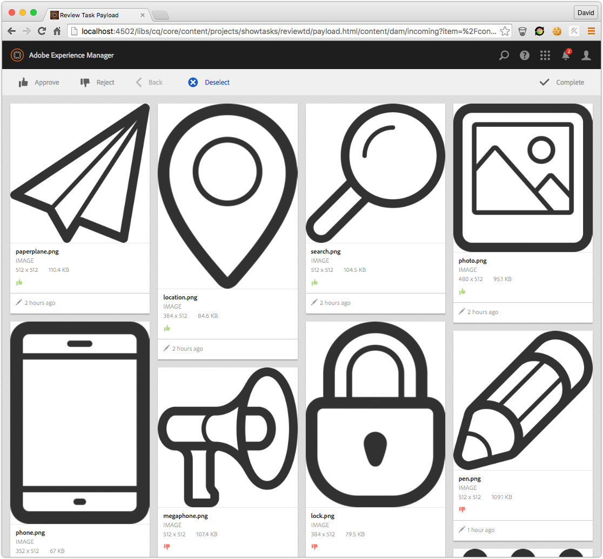
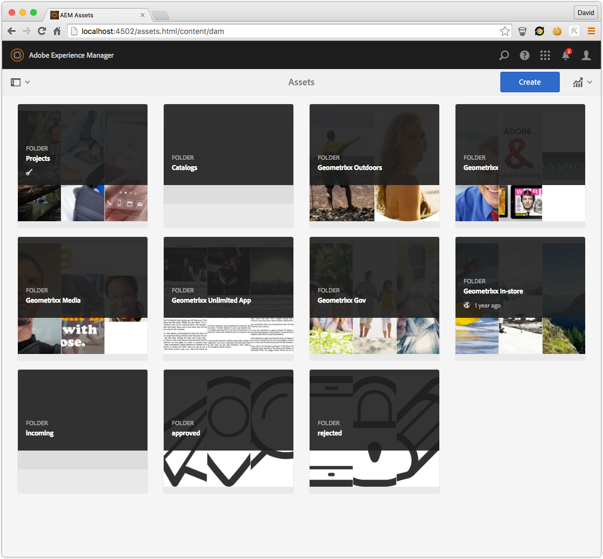
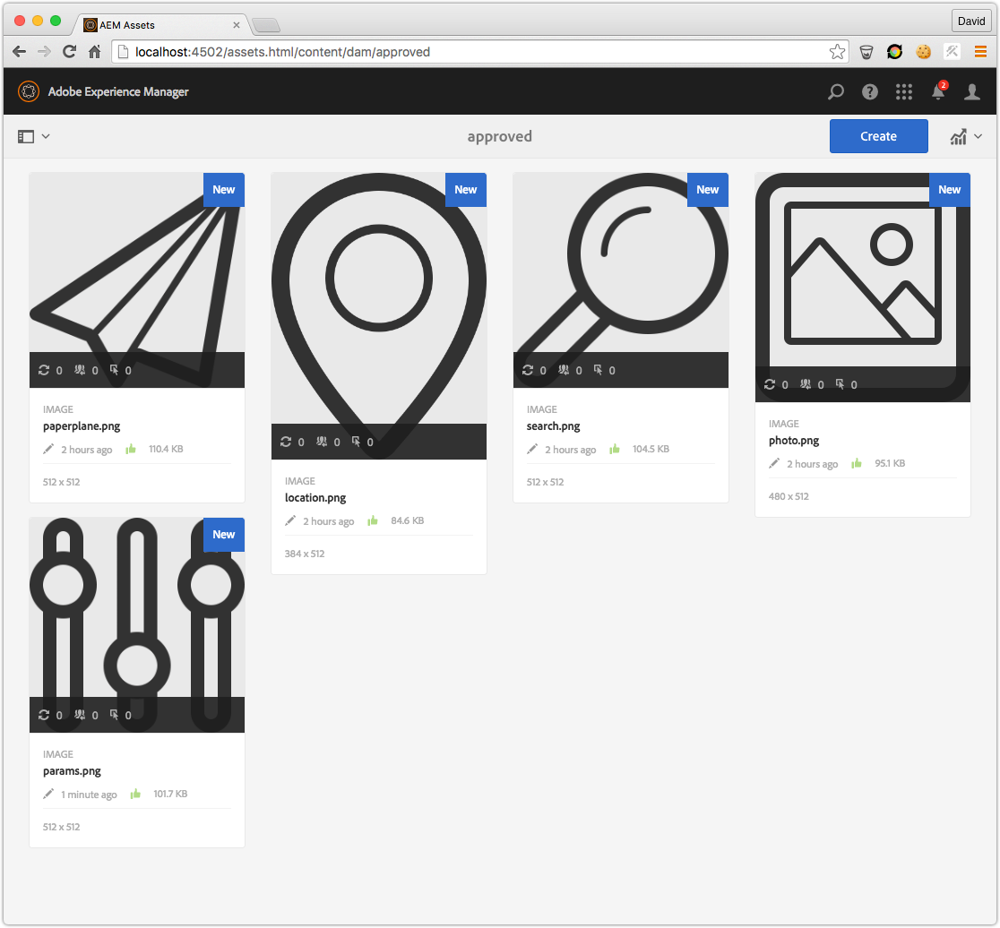

## Purpose

Automatically move approved and rejected assets from the Review Task view to configurable Asset folders.

## How to use

<iframe width="853" height="480" src="https://www.youtube.com/embed/xtGPc84ju2o" frameborder="0" allowfullscreen></iframe>

Enable the Sling Event Handler that listens for completed tasks and processes them accordingly.

Define a `sling:OsgiConfig` at `/apps/mysite/config/com.adobe.acs.commons.dam.impl.ReviewTaskAssetMoverHandler.xml`

[Download OSGi configuration as CQ Package](acs-aem-commons-review-task-osgi-config-2.0.0.zip)


<?xml version="1.0" encoding="UTF-8"?>
<jcr:root xmlns:sling="http://sling.apache.org/jcr/sling/1.0" xmlns:jcr="http://www.jcp.org/jcr/1.0"
    jcr:primaryType="sling:OsgiConfig"
    conflict-resolution.default="new-version"
    conflict-resolution.version.last-modified-by="Review Task"/>


Use a Sling Merge to add the following inputs to the Review Task creation wizard. The key elements are collection the paths in properties name `onApproveMoveTo` and `onRejectMoveTo`. Valid values are absolute paths to folders under `/content/dam`.

Since v2.6.0/3.2.0 the property `onReviewConflictResolution` has been added with valid values `new-version`, `new-asset`, `replace` and `skip` (See below for descriptions).

Examples for AEM 6.0/6.1 and AEM 6.2 are provided below.

### Asset Collision Support (Since v2.6.0/3.2.0)

Prior to v2.6.0/3.2.0 when a reviewed asset was moved into a folder with an asset with the same node name, and exception would occur. Now on a per-review task basis, the following collision resolution can be selected

* Create as new version (default)
  * Creates a new version of the conflicting asset in the accepted or rejected folder and then updates the renditions and metadata node trees with that of the reviewed asset. Asset in the review folder is removed.
  * Property value: `new-version`
* Create a new asset
  * Creates a brand new asset in the accepted/rejected folder with a uniquely prefixed node name (using today's date). Asset in the review folder is removed.
  * Property value: `new-asset`
* Replace
  * Removes any conflicting assets in the accepted/rejected folder and moves the reviewed asset over in its entirety. Asset in the review folder is removed.
  * Property value: `replace`
* Skip
  * Skips moving the reviewed asset if a conflict exists. Asset in the review folder is NOT removed.
  * Property value: `skip`

### AEM 6.0/6.1 Example

`/apps/dam/gui/content/projects/addtask`


<?xml version="1.0" encoding="UTF-8"?>
<jcr:root xmlns:sling="http://sling.apache.org/jcr/sling/1.0" xmlns:cq="http://www.day.com/jcr/cq/1.0" xmlns:jcr="http://www.jcp.org/jcr/1.0" xmlns:nt="http://www.jcp.org/jcr/nt/1.0"
    jcr:primaryType="cq:Page">
    <jcr:content
        jcr:primaryType="nt:unstructured">
        <content jcr:primaryType="nt:unstructured">
            <items jcr:primaryType="nt:unstructured">
                <createwizard jcr:primaryType="nt:unstructured">
                    <items jcr:primaryType="nt:unstructured">
                        <step1 jcr:primaryType="nt:unstructured">
                            <items jcr:primaryType="nt:unstructured">
                                <properties jcr:primaryType="nt:unstructured">
                                    <items jcr:primaryType="nt:unstructured">
                                        <on-approve
                                            jcr:primaryType="nt:unstructured"
                                            sling:resourceType="granite/ui/components/foundation/form/pathbrowser"
                                            fieldLabel="On Approve Move To"
                                            name="onApproveMoveTo"
                                            predicate="folder"
                                            rootPath="/content/dam"/>
                                        <on-reject
                                            jcr:primaryType="nt:unstructured"
                                            sling:resourceType="granite/ui/components/foundation/form/pathbrowser"
                                            fieldLabel="On Reject Move To"
                                            name="onRejectMoveTo"
                                            predicate="folder"
                                            rootPath="/content/dam"/>
                                            <on-review-conflict-resolution
                                                jcr:primaryType="nt:unstructured"
                                                sling:resourceType="granite/ui/components/foundation/form/select"
                                                fieldLabel="Review Conflict Resolution"
                                                name="onReviewConflictResolution">
                                                <items jcr:primaryType="nt:unstructured">
                                                    <new-version
                                                        jcr:primaryType="nt:unstructured"
                                                        text="Add as new version"
                                                        value="new-version"/>
                                                    <new-asset
                                                        jcr:primaryType="nt:unstructured"
                                                        text="Add as new asset"
                                                        value="new-asset"/>
                                                    <overwrite
                                                        jcr:primaryType="nt:unstructured"
                                                        text="Replace"
                                                        value="replace"/>
                                                    <skip
                                                        jcr:primaryType="nt:unstructured"
                                                        text="Skip"
                                                        value="skip"/>
                                                </items>
                                            </on-review-conflict-resolution>                                            
                                    </items>
                                </properties>
                            </items>
                        </step1>
                    </items>
                </createwizard>
            </items>
        </content>
    </jcr:content>
</jcr:root>



### AEM 6.2 Example

`/apps/dam/gui/content/projects/addtask`

[Download overlay as CQ Package](acs-aem-commons-review-task-overlay-2.0.1-AEM62.zip)


<?xml version="1.0" encoding="UTF-8"?>
<jcr:root xmlns:sling="http://sling.apache.org/jcr/sling/1.0" xmlns:cq="http://www.day.com/jcr/cq/1.0" xmlns:jcr="http://www.jcp.org/jcr/1.0" xmlns:nt="http://www.jcp.org/jcr/nt/1.0"
    jcr:primaryType="cq:Page">
    <jcr:content jcr:primaryType="nt:unstructured">
        <body jcr:primaryType="nt:unstructured">
            <items jcr:primaryType="nt:unstructured">
                <form jcr:primaryType="nt:unstructured">
                    <items jcr:primaryType="nt:unstructured">
                        <wizard jcr:primaryType="nt:unstructured">
                            <items jcr:primaryType="nt:unstructured">
                                <tabs jcr:primaryType="nt:unstructured">
                                    <items jcr:primaryType="nt:unstructured">
                                        <basic jcr:primaryType="nt:unstructured">
                                            <items jcr:primaryType="nt:unstructured">
                                                <singlecontainer jcr:primaryType="nt:unstructured">
                                                    <items jcr:primaryType="nt:unstructured">
                                                        <on-approve
                                                            jcr:primaryType="nt:unstructured"
                                                            fieldLabel="On Approve Move To"
                                                            sling:resourceType="granite/ui/components/foundation/form/pathbrowser"
                                                            name="onApproveMoveTo"
                                                            predicate="folder"
                                                            rootPath="/content/dam"/>
                                                        <on-reject
                                                            jcr:primaryType="nt:unstructured"
                                                            fieldLabel="On Reject Move To"
                                                            sling:resourceType="granite/ui/components/foundation/form/pathbrowser"
                                                            name="onRejectMoveTo"
                                                            predicate="folder"
                                                            rootPath="/content/dam"/>
                                                        <on-review-conflict-resolution
                                                            jcr:primaryType="nt:unstructured"
                                                            sling:resourceType="granite/ui/components/foundation/form/select"
                                                            fieldLabel="Review Conflict Resolution"
                                                            name="onReviewConflictResolution">
                                                            <items jcr:primaryType="nt:unstructured">
                                                                <new-version
                                                                    jcr:primaryType="nt:unstructured"
                                                                    text="Add as new version"
                                                                    value="new-version"/>
                                                                <new-asset
                                                                    jcr:primaryType="nt:unstructured"
                                                                    text="Add as new asset"
                                                                    value="new-asset"/>
                                                                <overwrite
                                                                    jcr:primaryType="nt:unstructured"
                                                                    text="Replace"
                                                                    value="replace"/>
                                                                <skip
                                                                    jcr:primaryType="nt:unstructured"
                                                                    text="Skip"
                                                                    value="skip"/>
                                                            </items>
                                                        </on-review-conflict-resolution>   
                                                    </items>
                                                </singlecontainer>
                                            </items>
                                        </basic>
                                    </items>
                                </tabs>
                            </items>
                        </wizard>
                    </items>
                </form>
            </items>
        </body>
    </jcr:content>
</jcr:root>



## Service User

On AEM 6.2 or above, this service uses a Service User for repository access. This user is configured with
the expected permissions required, but additional permissions may be required if your repository design
deviates from the expected structure.

User name: `acs-commons-review-task-asset-mover-service`

ACLs:

* `jcr:read`, `jcr:write` on `/content/dam`
