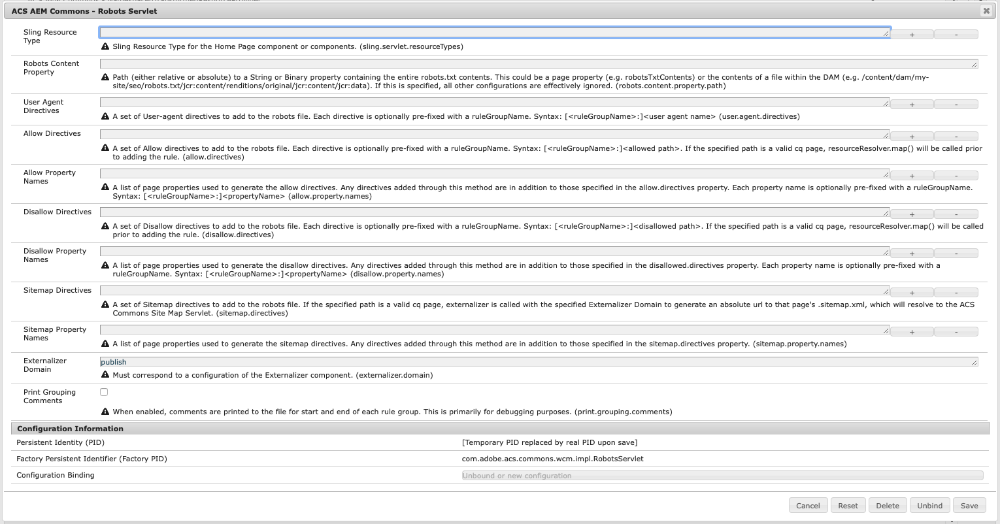

# Purpose

Generate robots.txt files for your site according to [https://developers.google.com/search/reference/robots_txt](https://developers.google.com/search/reference/robots_txt).

# How to Use

## Configuration

The robots servlet can operate in 2 modes, with significant differences in how the servlet is configured. The first step, regardless of which mode, is to register the servlet to the resource type of your home page component, e.g. `weretail/components/structure/page`.

### Retrieve Robots.txt Content From a Property

The simplest way to use the servlet (and probably the one most should use) is to read the entire contents of the robots.txt file from a property. The property specified must be typed String or Binary, and can be either absolute or relative to the requested page. In this mode, only the resource type and property path need to be configured, as all other osgi properties are effectively ignored. The example configuration below shows what the configuration might look like for using the jcr:data property of text file uploaded to the Assets.

`/apps/mysite/config.prod/com.adobe.acs.commons.wcm.impl.RobotsServlet-sample1.config`

sling.servlet.resourceTypes=["mysite/components/structure/page"]
robots.content.property.path="/content/dam/mysite/robots/robots_prod.txt/jcr:content/renditions/original/jcr:content/jcr:data"


### Specifying Robots.txt Directives as OSGI Configuration and/or Page Properties

For more complex scenarios, the robots.txt contents can be generated dynamically through a combination of osgi configuration properties and page properties.

* *User-agents (user.agent.directives)*: Specify the list of user agents to include in your robots.txt  
* *Allow (allow.directives & allow.property.names)*
    * allow.directives: Specify allow rules to include in your robots.txt. If any rule is a valid page path, `resourceResolver.map` is called prior to writing it to the file
    * allow.property.names: Specify property name(s) indicating which pages are allowed. These should be boolean properties indicating the pages that are allowed.
* *Disallow (disallow.directives & disallow.property.names)*
    * disallow.directives: Specify disallow rules to include in your robots.txt. If any rule is a valid page path, `resourceResolver.map` is called prior to writing it to the file
    * disallow.property.names: Specify property name(s) indicating which pages are disallowed. These should be boolean properties indicating the pages that are disallowed.
* *Sitemap (sitemap.directives & sitemap.property.names)*
    * sitemap.directives: Specify the sitemap rules to include in your robots.txt. If any rule is a valid page path, the page is externalized, and the value written points to .sitemap.xml for that page, under the assumption that that page represents a site map using the [ACS Commons Sitemap Servlet](../sitemap/index.html), though it could just as easily be a custom sitemap servlet registered to that selector & extension.
    * sitemap.property.names: Specify property name(s) indicating which pages are sitemaps. These should be boolean properties indicating the pages that are addressable as sitemaps.
* *Extenalizer (externalizer.domain)*: User for externalizing sitemap URLs must be absolute, as opposed to Allow/Disallow, which are relative. This must correspond to a valid configuration of the Externalizer component.
    
#### Grouping Directives 

The robots.txt format groups sets of allow and disallow directives to a set of user agents. If your requirements dictate more than one grouping, make sure that each user agent, allow, or disallow for the group is pre-fixed with a relevant group name. If you run into issues with this, you can turn on `print.grouping.comments`, which will print the start and end of each group. Below is an example configuration showing what that might look like followed by the resulting robots file.

`/apps/mysite/config.prod/com.adobe.acs.commons.wcm.impl.RobotsServlet-sample2.config`

sling.servlet.resourceTypes=["mysite/components/structure/page"]
user.agent.directives=["all:*","google:googlebot"]
allow.directives=["all:/"]
allow.property.names=["google:googlebotAllowed"]
disallow.directives=["all:/private/","google:/private/"]
disallow.property.names=["google:googlebotDisallowed"]
sitemap.directives=["http://www.mysite.com/sitemap.xml"]
sitemap.property.names=["cq:isLanguageRoot"]
externalizer.domain="publish"
print.grouping.comments=B"true"



# Start Group: all
User-agent: *
Allow: /
Disallow: /private/
# End Group: all
# Start Group: google
User-agent: googlebot
Disallow: /private/
# End Group: google
Sitemap: http://www.mysite.com/sitemap.xml
Sitemap: http://localhost:4503/content/mysite/us/en.sitemap.xml
Sitemap: http://localhost:4503/content/mysite/us/es.sitemap.xml
Sitemap: http://localhost:4503/content/mysite/ca/en.sitemap.xml
Sitemap: http://localhost:4503/content/mysite/ca/fr.sitemap.xml
Sitemap: http://localhost:4503/content/mysite/fr/fr.sitemap.xml
Sitemap: http://localhost:4503/content/mysite/de/de.sitemap.xml
Sitemap: http://localhost:4503/content/mysite/it/it.sitemap.xml
Sitemap: http://localhost:4503/content/mysite/es/es.sitemap.xml
Sitemap: http://localhost:4503/content/mysite/gb/en.sitemap.xml


## Addressing

After the servlet is configured, the servlet can be requested at `/content/mysite/home/_jcr_content.robots.txt`. However, per the robots.txt spec, this file must be served from the siteroot, which will require a rewrite rule similar to the following in your apache webserver.


RewriteRule ^/robots.txt$ /content/mysite/home/_jcr_content.robots.txt [PT,L]
   