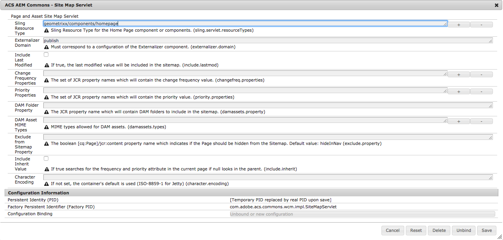

# Purpose

Generate a Sitemap XML file in the syntax defined by [http://www.sitemaps.org/](http://www.sitemaps.org/).

# How to Use

In order to use this feature, you must have a "home page" page component, e.g. `geometrixx/components/homepage`. Once you have determined the resource type for this page component, configure a new instance of the `com.adobe.acs.commons.wcm.impl.SiteMapServlet` servlet with the resource type and, optionally, a domain name configured in the Externalizer component.

> See [https://helpx.adobe.com/experience-manager/6-5/sites/developing/using/externalizer.html](https://helpx.adobe.com/experience-manager/6-5/sites/developing/using/externalizer.html) for more information on configuring the Externalizer.

Once this is configured, the site map can be generated by requesting a page of the configured resource type with the selector `sitemap` and the extension `xml`. The sitemap will contain the current page and all descendent pages, skipping pages which have the "Hide in Nav" flag enabled.

Typically, you will also want to use either Resource Resolver Mappings or mod_rewrite rules in Apache to make the sitemap available the path `sitemap.xml` at the root of your domain.

## OSGi Property Configurations

`/apps/mysite/config/com.adobe.acs.commons.wcm.impl.SiteMapServlet-sample.xml`


<?xml version="1.0" encoding="UTF-8"?>
<jcr:root xmlns:sling="http://sling.apache.org/jcr/sling/1.0" xmlns:cq="http://www.day.com/jcr/cq/1.0"
    xmlns:jcr="http://www.jcp.org/jcr/1.0" xmlns:nt="http://www.jcp.org/jcr/nt/1.0"
    jcr:primaryType="sling:OsgiConfig"
    sling.servlet.resourceTypes="[myapp/components/page/home-page]"
    externalizer.domain="publish"
    extensionless.urls="{Boolean}true"
    include.lastmod="{Boolean}false"
    changefreq.properties="[myChangeFreqProperties]"
    priority.properties="[myPriorityProperties]"
    damassets.property="myDAMFoldersProperty"
    damassets.types="[myDAMAllowedMIMETypes]"
    />
   

* *sling.servlet.resourceTypes* Sling Resource Type that should generate the site map. Usually the home page's sling:resourceType.

* *externalizer.domain* Must correspond to a configuration of the Externalizer component.

#### Since v2.1.0

* *include.lastmod* If true, the last modified value will be included in the sitemap. Defaults to `false`.

* *changefreq.properties* The set of JCR property names which will contain the change frequency value. Defaults to none.

* *priority.properties* The set of JCR property names which will contain the priority value. Defaults to none.

#### Since v2.3.0

* *damassets.property* The JCR property name which will contain DAM folders to include in the sitemap.

* *damassets.types* MIME types allowed for DAM assets included in the sitemap.

#### Since v2.7.0/3.3.0

* *exclude.property* The `[cq:Page]/jcr:content` property name which if evaluates to true, excludes the Page from the site map. Defaults to backwards compatible property name `hideInNav`, allowing the Hide In Navigation checkbox to control if the page is excluded from Site map.
  * To disregard all properties, set to a non-existent property: `exclude.property=null` as this will always evaluate to `false`

#### Since v2.11.0/3.8.0

* *character.encoding* The character encoding for the output from the servlet. If not specified, the container's default encoding for XML files is used (which is ISO-8859-1 for Jetty).

#### Since v3.14.0

* *extensionless.urls* This property controls whether page links included in sitemap should be generated with or without .html extension. If not specified or specified as false (default), page links will end with .html. If specified as true, path is included with a trailing slash, e.g. /content/geometrixx/en/
