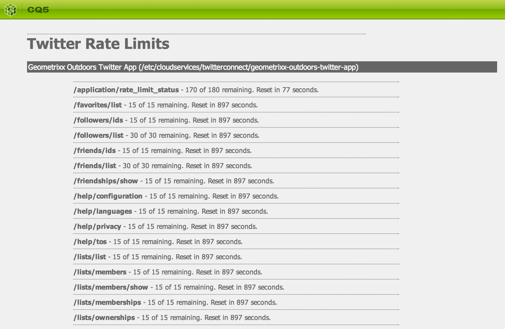
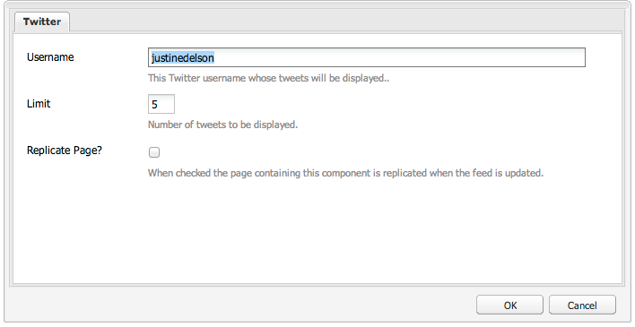

## Purpose

Provide easy access to the Twitter API using configuration defined in an AEM Cloud Service.

## Dependencies

This feature depends upon the [Twitter4J](http://twitter4j.org/) API, version 3.0.5 or higher. You can [download a content package](https://github.com/Adobe-Consulting-Services/com.adobe.acs.bundles.twitter4j/releases/tag/com.adobe.acs.bundles.twitter4j-1.0.0) with an OSGi bundle of this library.

### Special Requirement when using AEM 6.1+

On AEM 6.1, this feature requires enabling of the CQ Configuration Manager component, which is disabled by default. This is required for cross-compatibility with AEM 6.0 and AEM 6.1.

## How to Use

To use this library, configure a Twitter Cloud Service in AEM and associate it with your site. See [AEM Documentation](http://bit.ly/1i3px4i) for details.

> Note - this feature does **not** depend upon the use of AEM's Social Login features. The Twitter Connect cloud service is only used for configuration.

Once you've configured the Twitter application credentials and associated it with your site, you can obtain an instance of the Twitter4J client by adapting a `Page` to either the Twitter4J `Twitter` class or `com.adobe.acs.commons.twitter.TwitterClient`. The former allows access to the `Twitter` client object as well as the `com.day.cq.wcm.webservicesupport.Configuration` object from which the client was created.

> Note - The resulting client uses "Application-Only Authentication" which limits which API methods can be called, although the rate limit for the methods which *can* be called is must higher. See [Twitter's documentation](https://dev.twitter.com/docs/auth/application-only-auth) for more information.

For example:


Twitter twitter = currentPage.adaptTo(Twitter.class);


or

   
TwitterClient client = currentPage.adaptTo(Twitter.class);
Twitter twitter = client.getTwitter();


If you have an instance of the `com.day.cq.wcm.webservicesupport.Configuration`, you can adapt that as well.


Twitter twitter = adapterManager.getAdapter(configuration, Twitter.class);


## Rate Limit Checker

As both a useful utility and a demonstration of the use of the Twitter4J API, this feature also includes a page which outputs the current rate limit status for each configured Twitter Cloud Service Configuration. To view this, go to http://HOST:PORT/etc/acs-commons/twitter-rate-limit-checker.html.

## Twitter Feed Component (Since 1.6.0)

ACS AEM Commons also includes a component which displays a list of tweets from a particular user (their timeline).

### Setup

Before using the component, you must enable the scheduled job which refreshes timelines. The scheduled job's pid is `com.adobe.acs.commons.twitter.impl.TwitterFeedScheduler`. For example, to refresh every 15 minutes:

   
<?xml version="1.0" encoding="UTF-8"?>
<jcr:root xmlns:sling="http://sling.apache.org/jcr/sling/1.0" xmlns:jcr="http://www.jcp.org/jcr/1.0" xmlns:nt="http://www.jcp.org/jcr/nt/1.0"
    jcr:primaryType="sling:OsgiConfig"
    scheduler.expression="0 0/15 * * * ?"/>   


### Component Configuration

Per component instance, you can configure the username, the number of tweets to be displayed, as well as whether or not to activate the page when the feed is refreshed:

## Custom Components

The Twitter Feed Component provided by ACS AEM Commons is very simple -- it simply output a list of tweets. In many cases, it is desirable to provide a custom component. If you do this, you can add your component path to the list on `com.adobe.acs.commons.twitter.impl.TwitterFeedUpdaterImpl`:

   
<?xml version="1.0" encoding="UTF-8"?>
<jcr:root xmlns:sling="http://sling.apache.org/jcr/sling/1.0" xmlns:jcr="http://www.jcp.org/jcr/1.0" xmlns:nt="http://www.jcp.org/jcr/nt/1.0"
    jcr:primaryType="sling:OsgiConfig"
    twitter.component.paths="[acs-commons/components/content/twitter-feed,myapp/components/content/twitter-feed]"/>   


This will update instances of your component with a `tweets` multi-valued property when the scheduled job is run.

### Access to Raw JSON data (Since 2.3.0)

In addition, for more complex cases, you may want to access the raw JSON data from the Twitter API. This is stored as a multi-valued property named `tweetsJson`.

## Service User

On AEM 6.2 or above, this service uses a Service User for repository access. This user is configured with
the expected permissions required, but additional permissions may be required if your repository design
deviates from the expected structure.

User name: `acs-commons-twitter-updater-service`

ACLs:

* `jcr:read`, `jcr:modifyProperties`, and `crx:replicate` on `/content`
