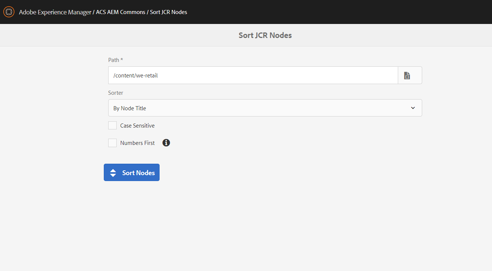
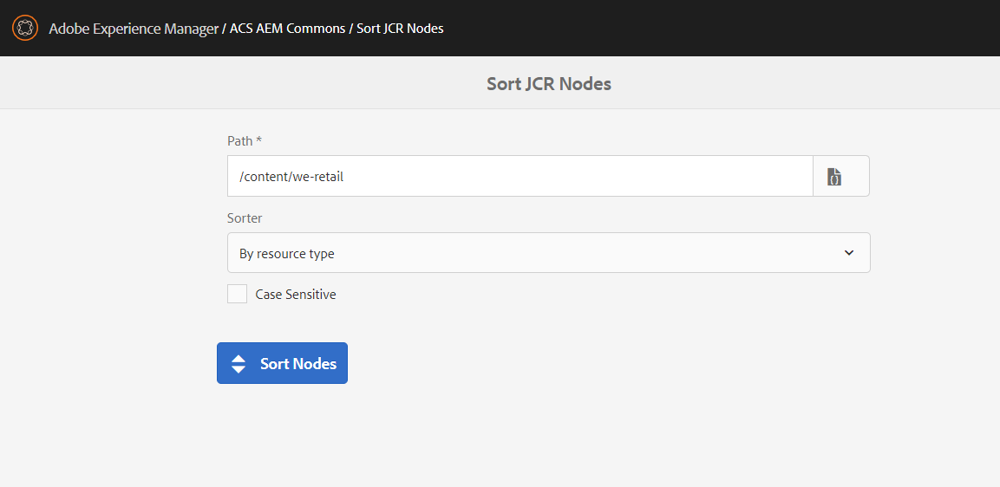

## Purpose

Sort Nodes is a tool to sort child nodes by node name or jcr:title, for example, to alphabetize pages or tags in Sites Admin .

## How to Use

### AEM GUI
In AEM, navigate to the Tools > ACS AEM Commons > Sort JCR Nodes

In the path field, enter the the target path to sort. You can choose whether to sort by node name (default) or by jcr:title and whether sort should be case-sensitive.



### HTTP POST

The code in ACS Commons extends the [Sling POST Servlet](https://sling.apache.org/documentation/bundles/manipulating-content-the-slingpostservlet-servlets-post.html) with the `acs-commons:sortNodes` operation which makes the sorting operation script-friendly. 

####  sort children of /content/someFolder by node name, case-insensitive (defaults)
```
curl -F":operation=acs-commons:sortNodes" http://localhost:4502/content/someFolder
```
####  sort children of /content/someFolder by jcr:title, case-sensitive 
```
curl -F":operation=acs-commons:sortNodes" \
-F":sorterName=byTitle" \
-F":caseSensitive=true" \
http://localhost:4502/content/someFolder
```


### Request Parameters
#### `:sorterName`
To select the actual sorter to execute, the `:sorterName` request parameter is used. Out of the box, the SortNodesOperation supports the following sorters:

| Sorter | Description |
| --------------- | --------------- | 
| `byName` | Sort nodes by node name |
| `byTitle` |Sort nodes by jcr:title. The code will use the value of the jcr:title property of the underlying node or of it's jcr:content child node if it exists or default to node name of jcr:title was not found |


#### `:caseSensitive`

Optional boolean parameter to control whether sort should be case sensitive (default: `false`), e.g.
```  
+  /content/someFolder
     -  a           
     -  A           
     -  b           
     -  B           
```
You can turn it off by setting the `-F":caseSensitive=true"` request parameter and the order will change to
```  
+  /content/someFolder
     -  A           
     -  B           
     -  a           
     -  b           
```

#### `:nonHierarchyFirst`

Optional boolean parameter to control whether sort should move non-hierarchy nodes to the top (default: `true`)

The default value is `true` which means jcr:content, rep:policy and such will be sorted first followed by other, hierarchy nodes like cq:Page, e.g. 
```  
+  /content/someFolder
     -  jcr:content // non-hierarchy
     -  rep:policy  // non-hierarchy
     -  a           // cq:Page
     -  b           // cq:Page
     -  c           // cq:Page
     -  p           // cq:Page
```

You can turn it off by setting the `-F":nonHierarchyFirst=false"` parameter
which will switch the mode to sort nodes regardless if they are `nt:hierarchyNode` or not
```  
+  /content/someFolder
     -  a           // cq:Page
     -  b           // cq:Page
     -  c           // cq:Page
     -  jcr:content // non-hierarchy
     -  p           // cq:Page
     -  rep:policy  // non-hierarchy
```

## Extending SortNodesOperation

OSGi services of the com.adobe.acs.commons.sorter.NodeSorter type can be used to implement new node sorters. For example, to register a sorter by _sling:resourceType_  deploy the service below:

```java
import com.adobe.acs.commons.sorter.NodeSorter;
import org.apache.jackrabbit.commons.JcrUtils;
import org.osgi.service.component.annotations.Component;

import javax.jcr.Node;
import javax.jcr.RepositoryException;
import javax.servlet.http.HttpServletRequest;
import java.util.Comparator;


@Component
public class ResourceTypeSorter implements NodeSorter {

    /**
     * A unique name which will be used to find the actual sorter by the
     * <code>:sorterName</code> request parameter
     */
    public String getName() {
        return "resourceType";
    }

    /**
     * The label that will appear in the 'Select Sorter' drop-down in UI
     */
    public String getLabel() {
        return "By resource type";
    }

    /**
     * Create a comparator to sort nodes.
     * Implementations can read additional parameters from request, e.g.
      * whether search should be case-sensitive, ascending/descending, etc.
    */
    @Override
    public Comparator<Node> createComparator(HttpServletRequest request) {

        return (n1, n2) -> {
            try {
                String val1 = JcrUtils.getStringProperty(n1, "jcr:content/sling:resourceType", "");
                String val2 = JcrUtils.getStringProperty(n2, "jcr:content/sling:resourceType", "");
                return val1.compareTo(val2);
            } catch (RepositoryException e) {
                return 0;
            }
        };
    }

}
```

Once the _ResourceTypeSorter_ service is deployed you should be able to select the new sorter in the UI: 



or pass it as `-F":sorterName=resourceType"` request parameter in curl:

```
curl -F":operation=acs-commons:sortNodes" -F":sorterName=resourceType" \
   http://localhost:4502/content/we-retail
```
