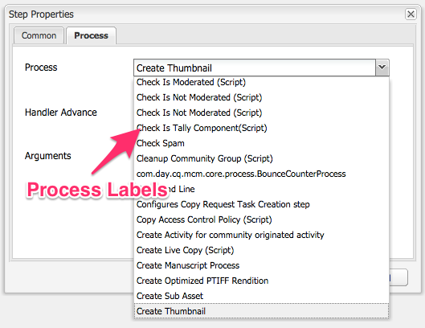
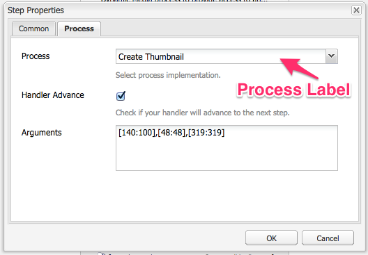
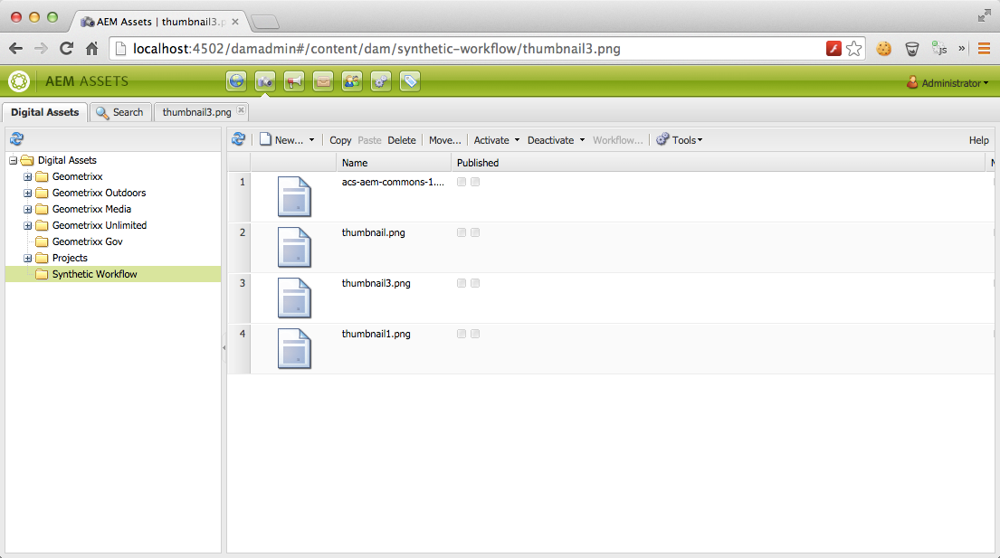
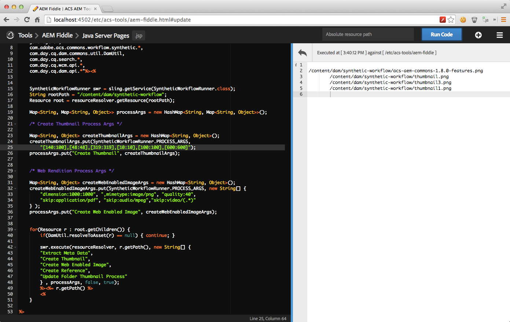
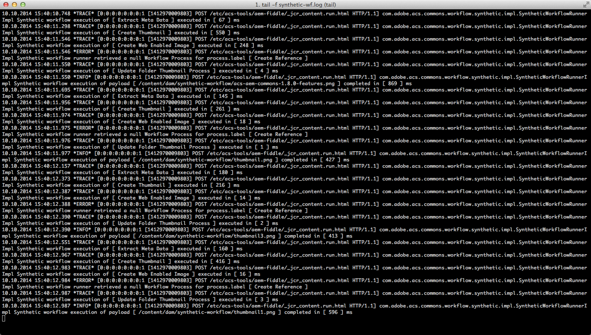
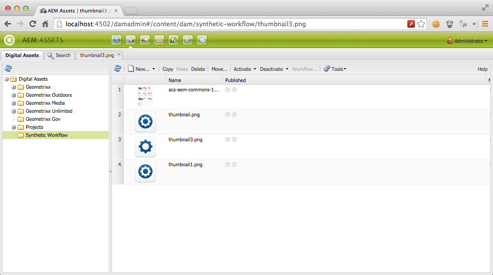
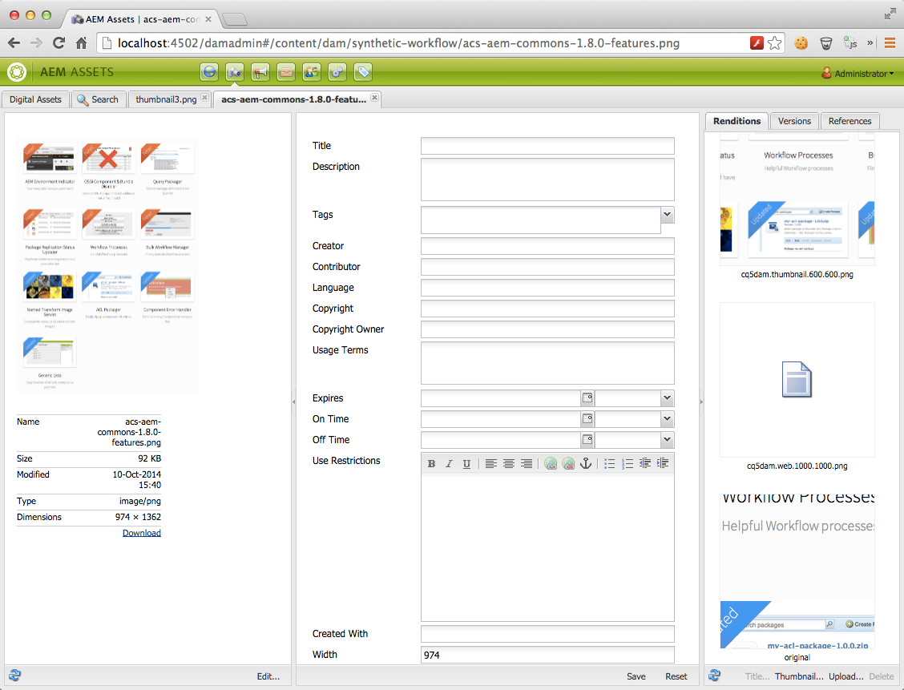

## Purpose

Content processing at scale can be challenging, especially when business processes are encapsulated by Workflow. Applying process by Workflow can require careful orchestration of Workflow creation, execution and clean-up to ensure the process is maximally efficient.

ACS AEM Commons Synthetic Workflow is designed to facilitate the execution of AEM Workflow Processes (Java WorkflowProcesses) without engaging the AEM Workflow Engine itself, helping to streamline process application.

ACS AEM Commons Synthetic Workflow is intended to supplement AEM Workflow for specific cases where it can afford simplicity and efficiency, while allowing business process implementation to remain as part of AEM Workflow, where it belongs and can be leveraged for the usual use cases.

## Supported Workflow Features

* Synthetic Workflow ONLY supports OSGi Workflow Processes
* `wfSession.terminate(..)`, `wfSession.restart(..)`, `wfSession.complete(..)` are supported if SyntheticWorkflow objects are passed to them. This limits their use to self-termination or self-restarting.
  * `wfSession.restart(..)` restarts the entire worflow execution up to 3 times per payload
  * `wfSession.complete(..)` supported added in v2.0.0
* `workItem` MetaDataMap (local to a Workflow Process step)
* `workflow` and `workflowData` MetaDataMap (shares throughout the Workflow execution for a payload)
  * `workflow` and `workflowData` MetaDataMaps are the same object
* Workflow Process MetaDataMaps are supported (Ex. Providing `PROCESS_ARGS` for each Workflow Process being executed)
* Workflow Processes are executed in the order they are defined in the `workflowProcess` array.
* Since v2.6.0/3.2.0 supports Granite WF Process (those that extends `com.adobe.granite.workflow.exec.WorkflowProcess`)

## Unsupported Workflow Features

* Does NOT support ECMA workflow steps, dialog participant steps, etc.
* Does NOT support External Workflow Processes, as the point of External Workflow Processes is to use Jobs to safely wait for a long-running process running outside of AEM to complete.
* Synthetic Workflow does NOT support Routes and executes Workflow Processes serially.
 * As of 2.0.0, a single Synthetic Route and a single Synthetic Back Route are available; these effectively are NOOP's and execution will continue forward in a serial fashion. Routes are never followed in Synthetic Workflow.
* Unsupported operations throw UnsupportedOperation Exceptions; Test your Synthetic Workflow run on a representative sample set to ensure the candidate Workflow Process steps do not use unimplemented features.

## How to Use

### Write Synthetic Workflow execution code

Write code to collect resources, and call `SyntheticWorkflowRunner.execute(...)` for each resource. The collection code is 100% custom and can be driven by query, tree traversal, etc. based on the use case.

`SyntheticWorkflowRunner` provides options to commit to repository after each Workflow Process step executes, or after all Workflow Process steps execute for a payload. Alternatively, the execution code can set these to false and save in batches. Select/implement the option most appropriate for selected Workflow Process steps and use case.

### Synthetic Workflow AEM Workflow Model Support (v2.0.0)

As of ACS AEM Commons 2.0.0, Synthetic Workflow now supports executing AEM Workflow models that only leverage AEM Workflow APIs that Synthetic Workflow supports.

* Only Workflow Process steps can be executed
  * Note: External Workflow Processes are NOT supported as they are expected to be
  * Non Workflow Process steps can be marked to be ignored when creating the Synthetic Workflow Model from the AEM Workflow Model
async which Synthetic WF does not support
* The workflow must be serial; no decision trees and only 1 transition path per step
* No in-process Route management
* Workflows processes can call `worlflowSession.complete(..)` to complete a step, or `workflowSession.terminate(..)` to stop the execution of the model.

**As always; Review and test the candidate Workflows and their behavior before executing as scale with Synthetic Workflow.**

### Example Code: Synthetic Workflow by Workflow Model

This sample code executes the OOTB DAM Asset Update Workflow Model against assets in a DAM folder.



<%@include file="/libs/foundation/global.jsp"%><%
%><%@page session="false" contentType="text/html; charset=utf-8"
    pageEncoding="UTF-8"
    import="org.apache.sling.api.resource.*,
    java.util.*,
    javax.jcr.*,
    com.adobe.acs.commons.workflow.synthetic.*,
    com.day.cq.dam.commons.util.DamUtil,
    com.day.cq.wcm.api.*,
    com.day.cq.dam.api.*"%><%

    // Get Synthetic Workflow Runner service
    SyntheticWorkflowRunner swr = sling.getService(SyntheticWorkflowRunner.class);
    // Create the Synthetic Workflow Model from the AEM Workflow Model
    // Note: This will throw an exception is the AEM Workflow Model does not
    // pass the basic compatibility litmus tests outlined above.
    boolean ignoreNonProcessSteps = true;
    SyntheticWorkflowModel model = swr.getSyntheticWorkflowModel(resourceResolver,
                                        "/etc/workflow/models/dam/update_asset",
                                        ignoreNonProcessSteps);

    /* Collect the Resource to execute the Workflow against */
    String rootPath = "/content/dam/synthetic-workflow";
    Resource root = resourceResolver.getResource(rootPath);
    int count = 0;
    for(Resource r : root.getChildren()) {
        if(DamUtil.resolveToAsset(r) == null) { continue; }

        boolean saveAfterEachWFProcess = false;
        boolean saveAtEndOfAllWFProcesses = false;

        swr.execute(resourceResolver,
            r.getPath(),
            model,
            saveAfterEachWFProcess,
            saveAtEndOfAllWFProcesses);

        if(++count % 1000 == 0) {
            // Save in batches of 1000; How data is saved should be driven by the use case.
            resourceResolver.commit();
        }
    }

    // Final save to catch stragglers
    resourceResolver.commit();
%>



### Synthetic Workflow AEM Workflow Process Label Enumeration

Collect the Workflow process labels (OSGi Property: `process.label`) to execute.

Collect and define all required Workflow process args.

#### Example Code: Synthetic Workflow by Workflow Process Name

The following code executes the OOTB DAM Asset Workflow Processes against a DAM Folder's contents.

* Extract Meta Data
* Create Thumbnail
* Create Web Enabled Image
* Update Folder Thumbnail Process



<%@include file="/libs/foundation/global.jsp"%><%
%><%@page session="false" contentType="text/html; charset=utf-8"
    pageEncoding="UTF-8"
    import="org.apache.sling.api.resource.*,
    java.util.*,
    javax.jcr.*,
    com.adobe.acs.commons.workflow.synthetic.*,
    com.day.cq.dam.commons.util.DamUtil,
    com.day.cq.wcm.api.*,
    com.day.cq.dam.api.*"%><%

    /* Get Synthetic Workflow Runner service */
    SyntheticWorkflowRunner swr = sling.getService(SyntheticWorkflowRunner.class);

    /* Prepare any Workflow Process Args as needed for each Workflow Process step you will invoke */

    Map<String, Map<String, Object>> processArgs = new HashMap<String, Map<String, Object>>();

    /* Create Thumbnail Process Args
     *
     * This will create 6 thumbnails for the Asset using the [width:height] params provided.
     *
     * Note: The PROCESS_ARGS value is a String and not a String[]; This is an impl detail
     * of the OOTB Create Thumbnail Workflow Process
     */
    Map<String, Object> createThumbnailArgs = new HashMap<String, Object>();
    createThumbnailArgs.put(SyntheticWorkflowRunner.PROCESS_ARGS,
        "[140:100],[48:48],[319:319],[10:10],[100:100],[600:600]");
    processArgs.put("Create Thumbnail", createThumbnailArgs);

    /* Web Rendition Process Args
     *
     * This will create a 1000px PNG web rendition of the Asset
     *
     * Note: The PROCESS_ARGS value is a String[] and not a String; This is an impl detail
     * of the OOTB Create Web Enabled Image Workflow Process
     */
    Map<String, Object> createWebEnabledImageArgs = new HashMap<String, Object>();
    createWebEnabledImageArgs.put(SyntheticWorkflowRunner.PROCESS_ARGS, new String[] {
        "dimension:1000:1000", ",mimetype:image/png", "quality:40",
        "skip:application/pdf", "skip:audio/mpeg","skip:video/(.*)"
    } );
    processArgs.put("Create Web Enabled Image", createWebEnabledImageArgs);

    /* Collect the Resource to execute the Workflow against */
    String rootPath = "/content/dam/synthetic-workflow";
    Resource root = resourceResolver.getResource(rootPath);
    int count = 0;
    for(Resource r : root.getChildren()) {
        if(DamUtil.resolveToAsset(r) == null) { continue; }

        boolean saveAfterEachWFProcess = false;
        boolean saveAtEndOfAllWFProcesses = false;

        swr.execute(resourceResolver, r.getPath(), new String[] {
            "Extract Meta Data",
            "Create Thumbnail",
            "Create Web Enabled Image",
            "Update Folder Thumbnail Process"
            } , processArgs, saveAfterEachWFProcess, saveAtEndOfAllWFProcesses);

        if(++count % 1000 == 0) {
            // Save in batches of 1000; How data is saved should be driven by the use case.
            resourceResolver.commit();
        }
    }

    // Final save to catch stragglers
    resourceResolver.commit();

%>


## Notes

Make sure to **disable any Launchers/Event Listeners that should not be triggered** during the Synthetic Workflow execution on payload or related resources.

## Example

This example shows applying OOTB AEM6 DAM Asset Update WF against unprocessed assets using Synthetic Workflow leveraging these OOTB WF Steps

* Extract Meta Data
* Create Thumbnail
* Create Web Enabled Image
* Create Reference
    * Note this is an invalid name and will not execute; See in logs screenshot
* Update Folder Thumbnail Process

Disable launchers and upload "raw" images to DAM

Create your script to execute the Synthetic Workflow (example uses [AEM Fiddle](http://adobe-consulting-services.github.io/acs-aem-tools/features/aem-fiddle/index.html))

Log output of Synthetic Workflow executing. Note how it skips missing WF Processes with an ERROR message.

Post-Synthetic Workflow DAM listing.

Note the custom Redition sizes specified in the Synthetic Workflow script.

