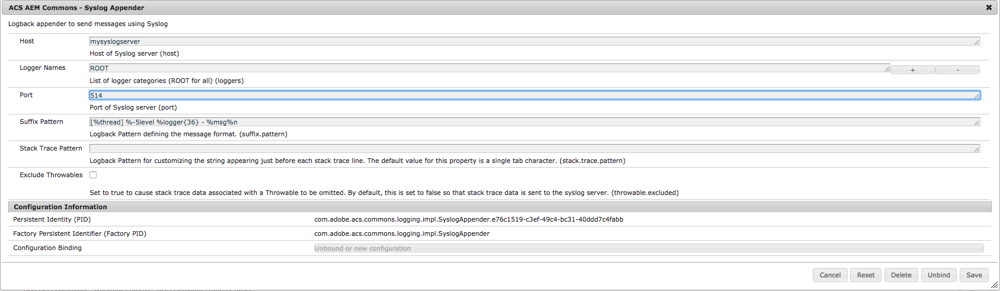

# Purpose

Using this OSGi configured Logback appender, you can easily send log messages to a syslog server, either one internally hosted or hosted on a SaaS syslog service.

> This appender only supports syslog over UDP.

# How to Use

Configure a new instance of the `com.adobe.acs.commons.logging.impl.SyslogAppender` with the host and port of your syslog server. To log all messages, leave the logger names field as `ROOT`; otherwise specify the specific logger names you want to send to the server.

When testing this configuration, you should verify that the remote syslog daemon accepts requests from an external source. Experience shows that, by default, syslog daemons usually deny requests coming via a network connection.
