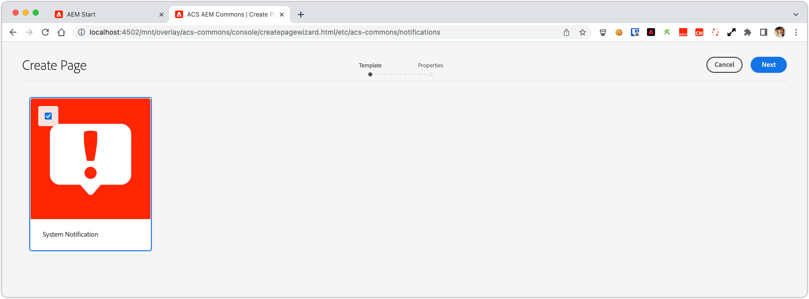
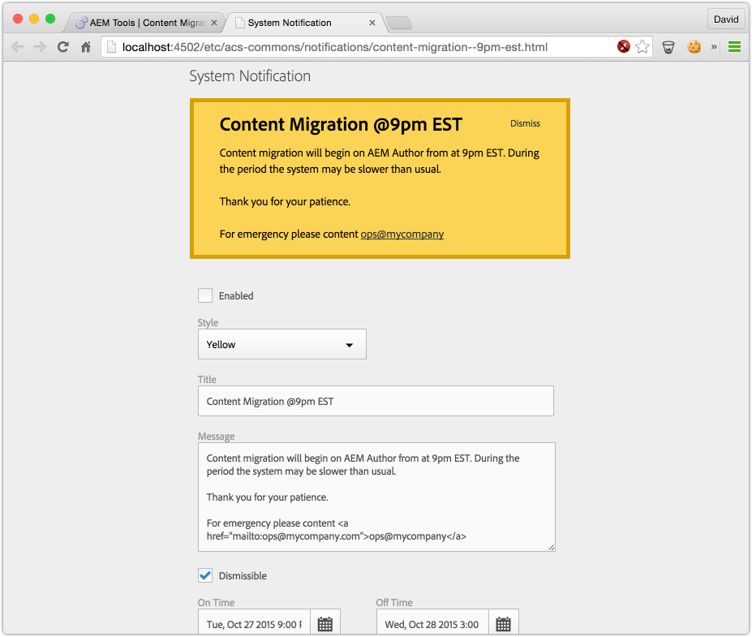
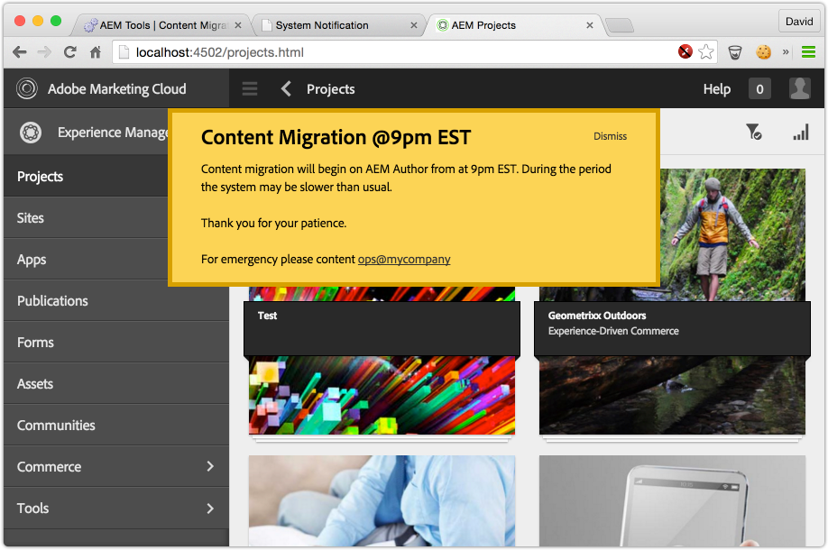
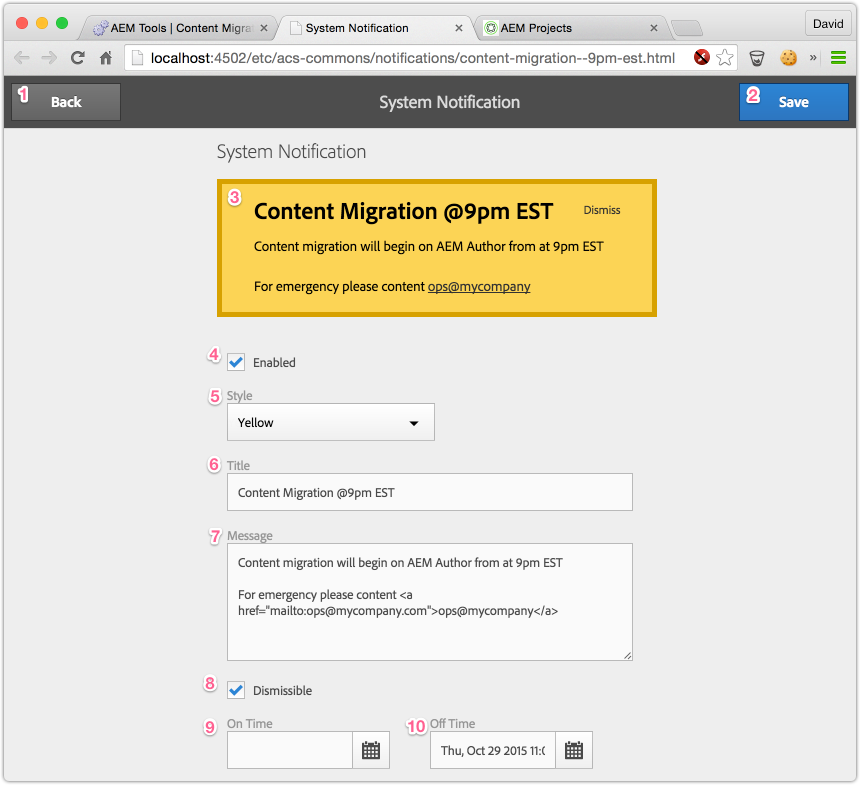

> Use of System Notifications should target v2.2.0 as issues existed in v2.1.x.

## Purpose

ACS AEM Commons System Notifications provide a means to deliver on-platform notifications to Authors using the system.

This is a great way to communicate when system activities will occur, are occurring and have ended.

## How to Use

* Navigate to /miscadmin > acs-commons > Notifications
* Create a new System Notification page

* Complete the Notification form and click Save when complete

* Visit any page on AEM Author to see the notification

### Notification Fields

1. **Back Button:** Takes user back to /miscadmin losing all unsaved changes
2. **Save Button:** Saves changes to form
3. **Notification Preview:** Displays preview of what notification will look like
4. **Enabled:** Toggles if the notification is enabled or disabled; leave disabled and Save to get up to date preview.
5. **Style:** Defines the color of the notification. Options: Green, Blue, Yellow, Red
6. **Title:** The notification title
7. **Message:** The notification message.
  * Supports HTML (so be careful!)
  * `{{"{{ onTime "}}}}` will act as placeholder for a specified On Time value (see 9)
  * `{{"{{ offTime "}}}}` will act as placeholder for a specified Off Time value (see 9)
  * Unless prefixed with `html:`, all CRLF are transformed into ` `

8. **Dismissible:**
   * If CHECKED, the notification can be dismissed for the duration of the user's Session.
      * Typically used for notifications informing something will happen or has happened.
   * If UNCHECKED, the notification will display on every page load regardless if "Dismiss" is clicked.
      * Typically used for notifications of occurring activities; especially ones where AEM Authors should NOT be using the site (ex. large content migrations, etc.)
9. **On Time:** Notification will display only AFTER this time and if Enabled (see 4)
  * Can be referenced in the Message (see 7) with `{{"{{ onTime "}}}}`
10. **Off Time:** Notification will display only BEFORE this time and if is Enabled (see 4)
  * Can be referenced in the Message (see 7) with `{{"{{ offTime "}}}}`

## Service User

On AEM 6.2 or above, this service uses a Service User for repository access. This user is configured with
the expected permissions required, but additional permissions may be required if your repository design
deviates from the expected structure.

User name: `acs-commons-system-notifications-service`

ACLs:

* `jcr:read` on `/etc/acs-commons/notifications`
