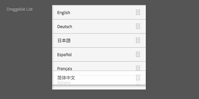

<a href="/acs-aem-commons/pages/releases/4-0-0.html" target="_blank">As of ACS AEM Commons 4.0.0 all UI Widgets must be explicitly enabled</a>

## Purpose
The Draggable List component lets you create an ordered list of elements that are generated by a datasource. The [ACS Commons Query Autocomplete Datasource](/acs-aem-commons/features/queryautocomplete-datasource.html) can be used with it.

## How to Use

* Set up your component and its Touch UI dialog as usual.
* Add a new widget node with `sling:resourceType = acs-commons/components/authoring/draggablelist`
* If using the [ACS Commons Query Autocomplete Datasource](/acs-aem-commons/features/queryautocomplete-datasource.html), set the `predicates` and the `displayProperty` properties
* Create a new `datasource` node under the draggablelist widget node.
* If using the [ACS Commons Query Autocomplete Datasource](/acs-aem-commons/features/queryautocomplete-datasource.html), set `sling:resourceType = acs-commons/granite/ui/components/form/queryautocomplete/datasource`
* If using your own datasource, set the `sling:resourceType` accordingly.



## Sample Datasource


<%@include file="/libs/granite/ui/global.jsp" %>
<%@page session="false"
        import="com.adobe.cq.commerce.common.ValueMapDecorator,
                com.adobe.granite.ui.components.ds.DataSource,
                com.adobe.granite.ui.components.ds.SimpleDataSource,
                com.adobe.granite.ui.components.ds.ValueMapResource,
                org.apache.sling.api.resource.ResourceMetadata,
                java.util.ArrayList,
                java.util.HashMap,
                java.util.List" %>
<%
    List<Resource> resourceList = new ArrayList();

    for (int i = 0; i <= 3; i ++) {
        ValueMap vm = new ValueMapDecorator(new HashMap<String, Object>());
        vm.put("value", i);
        vm.put("text", i);
        resourceList.add(new ValueMapResource(resourceResolver, new ResourceMetadata(), "nt:unstructured", vm));
    }

    DataSource ds = new SimpleDataSource(resourceList.iterator());
    request.setAttribute(DataSource.class.getName(), ds);
%>


## Example Dialog


<?xml version="1.0" encoding="UTF-8"?>
   <jcr:root xmlns:jcr="http://www.jcp.org/jcr/1.0" xmlns:cq="http://www.day.com/jcr/cq/1.0" xmlns:nt="http://www.jcp.org/jcr/nt/1.0" xmlns:sling="http://sling.apache.org/jcr/sling/1.0" jcr:primaryType="nt:unstructured" jcr:title="List" sling:resourceType="cq/gui/components/authoring/dialog" helpPath="en/cq/current/wcm/default_components.html#List">
      <content
          jcr:primaryType="nt:unstructured"
          sling:resourceType="granite/ui/components/foundation/container">
          <layout
              jcr:primaryType="nt:unstructured"
              margin="false"
              sling:resourceType="granite/ui/components/foundation/layouts/fixedcolumns"/>
          <items
              jcr:primaryType="nt:unstructured">
              <column
                  jcr:primaryType="nt:unstructured" sling:resourceType="granite/ui/components/foundation/container">
                  <items
                      jcr:primaryType="nt:unstructured">
                      <list
                          jcr:primaryType="nt:unstructured"
                          displayProperty="jcr:content/jcr:title"
                          fieldLabel="Draggable List"
                          name="./list"
                          sling:resourceType="acs-commons/components/authoring/draggablelist">
                          <datasource
                              jcr:primaryType="nt:unstructured"
                              sling:resourceType="mytestcomponents/datasources/draggablelist"/>
                      </list>
                  </items>
              </column>
          </items>
      </content>
   </jcr:root>

