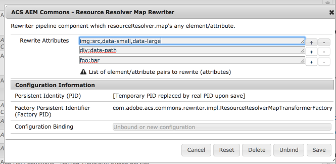

## Purpose

The OOTB AEM LinkChecker rewriter only supports a limited set of HTML element/attribute combinations for re-writing. 

Often other attributes may need to have their values mapped to ensure the URL is exposed properly, such as: img src, or data-* attributes used to expose AEM end points to JavaScript applications. 

## How to use

### OSGi Component configuration

First, you must configure the rewriter pipeline component. This is done using OSGi configuration. It is a factory component using the PID `com.adobe.acs.commons.rewriter.impl.StaticReferenceRewriteTransformerFactory`. This allows you to specify multiple configurations to handle multi-site deployments and/or deployments where a different domain is used for different path segments (i.e. `/etc/designs/site` on one domain and `/content/dam/site` on a different domain).

    /apps/myapp/config/com.adobe.acs.commons.rewriter.impl.ResourceResolverMapTransformerFactory-SomeFriendlyName


<?xml version="1.0" encoding="UTF-8"?>
<jcr:root xmlns:sling="http://sling.apache.org/jcr/sling/1.0" xmlns:cq="http://www.day.com/jcr/cq/1.0"
    xmlns:jcr="http://www.jcp.org/jcr/1.0" xmlns:nt="http://www.jcp.org/jcr/nt/1.0"
    jcr:primaryType="sling:OsgiConfig"
    pipeline.type="resourceresolver-map"
    attributes="[div:data-resource-path\,data-path,img:src\,data-small\,data-large,iframe:src]"/>


* `pipeline.type` - This is the pipeline component name which will be referenced from the rewriter configuration below.
* `attributes` - The list of HTML element/attribute pairs which will be rewritten. element and attributes are `:` delimited. Each attribute **MUST** be unique in the list, but can have multiple attributes specified as comma delimited values.

### Rewriter Pipeline configuration

The easiest way to configure the rewriter pipeline is just to copy `/libs/cq/config/rewriter/default` to a path inside your application, e.g. `/apps/myapp/config/rewriter/mysite. Note that the configuration node *must* be inside a four-level path that ends in `config/rewriter`.

To validate that your configuration was successful, look at the Sling Rewriter tab in the OSGi Web Console.

    /apps/myapp/config/rewriter/mysite.xml


<?xml version="1.0" encoding="UTF-8"?>
<jcr:root xmlns:sling="http://sling.apache.org/jcr/sling/1.0" xmlns:jcr="http://www.jcp.org/jcr/1.0"
    jcr:primaryType="sling:Folder"
    contentTypes="[text/html]"
    enabled="{Boolean}true"
    generatorType="htmlparser"
    order="{Long}1"
    serializerType="htmlwriter"
    transformerTypes="[linkchecker,resourceresolver-map]"/>
        

> Other transformers may or may not be necessary. Please refer to the default configuration at `/libs/cq/config/rewriter/default` to see the default set of transformers. Note that if you are using the [Versioned ClientLibs Rewriter]({{ site.data.acs-aem-commons.baseurl }}/features/versioned-clientlibs.html), that pipeline component must come *before* the Static Reference Rewriter.