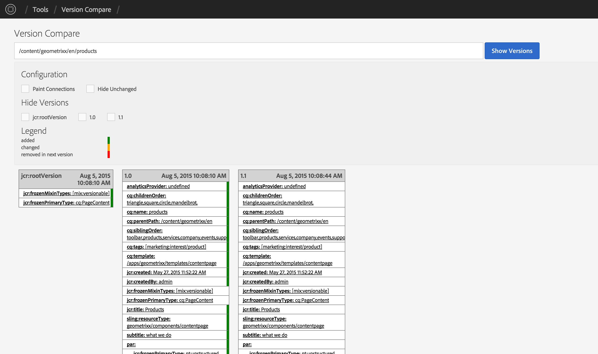

## Purpose

While AEM has the ability to compare two version of a single resource, sometimes it can be useful to
compare several versions at the same time.

## How to Use

In AEM, navigate to the Tools > ACS AEM Commons > Version Compare

In the path field, enter the the path of the page or asset for which you want to view versions and click the **Show Versions** button.

Each property for the page or asset (and its children) will be displayed with a visual indicator of whether the property was added, changed, or removed.

### Display Options

* Paint Connections - adds visual connections between properties
* Hide Unchanged - removes the unchanged properties from being displayed
* Hide Versions - removes individual versions from the version list

### Configuration Options

You can configure the tool to exclude properties and/or nodes from the comparison. This can be especially useful for system properties/nodes such as MSM related functionality.

* OSGi config PID `com.adobe.acs.commons.version.impl.EvolutionAnalyserImpl`
* supports regex
* `(.*/)?jcr:uuid` excludes the property `jcr:uuid` of all subnodes
* `(.*/)?cq:LiveSyncConfig` excludes all subnodes named `cq:LiveSyncConfig`

> Note: Version Comparison Tool requires `Apache Sling Models API (org.apache.sling.models.api)` and `Apache Sling Models Implementation (org.apache.sling.models.impl)` to be at least at version 1.1.0. Get the latest version from  [Sling Downloads](https://sling.apache.org/downloads.cgi).
