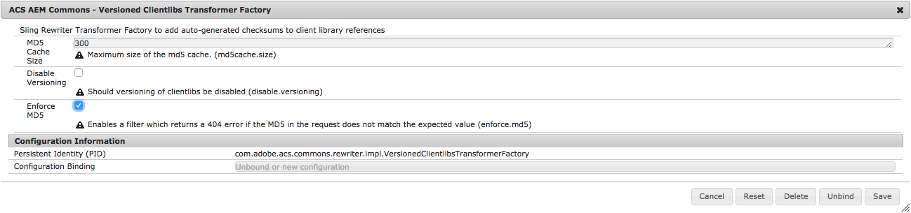

## AEM as a Cloud Service notice!

AEM ClientLibraryManager now supports [versioning client library URLs](https://experienceleague.adobe.com/docs/experience-manager-cloud-service/implementing/content-delivery/caching.html?lang=en#content-consistency). 

Only use the ACS AEM Commons versioned client libraries if your version of AEM does not support versioned client library URLs.

## Purpose

Allow CSS and JavaScript served via AEM ClientLibs to be cached client-side with long TTLs.

## How to Use

Add a Sling rewriter configuration node (example below) that includes the `versioned-clientlibs` transformer type to you project. 

The URIs to clientlibs will be rewritten in the format `/path/to/clientlib.md5hash.js`

> Prior to version 1.5, the last modified timestamp was used instead of a hash.

### Note

This re-writer does **NOT** support

* URIs embedded in CSS or JavaScript, including: background-images, web fonts, etc. 
* Relative URIs, e.g. `etc/clientlibs/mysite/styles.css`
* URIs including a scheme, e.g. `http://example.com/etc/clientlibs/mysite/styles.css` and `//example.com/etc/clientlibs/mysite/styles.css`
* URIs to non-AEM HtmlClientLibrary resources, e.g. `/etc/designs/mysite.css`
* Tags contained in conditional comments.
* ClientLibs included by Javascript (e.g. when leveraging the property channels)

## Rewriter Configuration Node

The easiest way to configure the rewriter pipline is just to copy `/libs/cq/config/rewriter/default` to a path inside your application, e.g. `/apps/myapp/config/rewriter/versioned-clientlibs`. Note that the configuration node *must* be inside a four-level path that ends in `config/rewriter`.

To validate that your configuration was successful, look at the Sling Rewriter tab in the OSGi Web Console.

	/apps/myapp/config/rewriter/versioned-clientlibs.xml


<?xml version="1.0" encoding="UTF-8"?>
<jcr:root xmlns:sling="http://sling.apache.org/jcr/sling/1.0" xmlns:jcr="http://www.jcp.org/jcr/1.0"
    jcr:primaryType="sling:Folder"
    contentTypes="[text/html]"
    enabled="{Boolean}true"
    generatorType="htmlparser"
    order="{Long}1"
    serializerType="htmlwriter"
    transformerTypes="[linkchecker,versioned-clientlibs]"/>
        

> Other transformers may or may not be necessary. Please refer to the default configuration at `/libs/cq/config/rewriter/default` to see the default set of transformers.

## Apache Configuration

To configure Apache to send the right header to set a long TTL:


SetEnvIf Request_URI "(\.min)?\.[a-f0-9]+\.js" long_expires=true
SetEnvIf Request_URI "(\.min)?\.[a-f0-9]+\.css" long_expires=true
Header set Cache-Control max-age=2592000 env=long_expires 


## MD5 Enforcement (Since 2.11.0/3.8.0)

Optionally, a filter can registered which checks incoming requests for client libraries and ensures that the hash in the path is the correct value. To enable this, set the property `enforce.md5` to `true` on the PID `com.adobe.acs.commons.rewriter.impl.VersionedClientlibsTransformerFactory`

> If you enable this option, the hash will be prefixed with `ACSHASH` to ensure that only rewritten paths are validated. Be sure to incorporate this into any web server or CDN rules.

## Log Warnings under AEM 6.3+

When using this feature on AEM 6.3, you may see log messages like this for proxied client libraries:

    15.12.2017 17:34:40.249 WARN [10.45.0.1 [1513355680163] GET /aem/start.html HTTP/1.1] com.adobe.granite.ui.clientlibs.impl.HtmlLibraryManagerImpl No library configured at /apps/granite/ui/components/coral/foundation/clientlibs/foundation

The only solution at present for this is to set the log level for `com.adobe.granite.ui.clientlibs.impl.HtmlLibraryManagerImpl` to `ERROR`.
