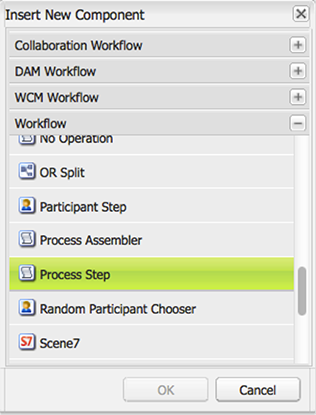
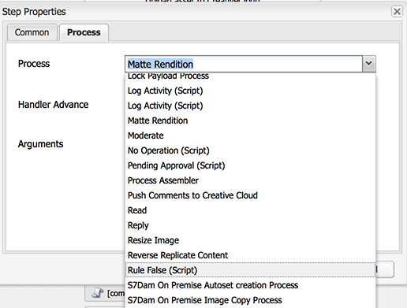
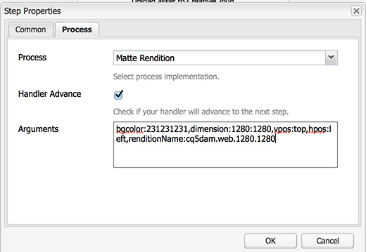

## Purpose
This process ensures that an rendition *exactly* matches a set of dimensions by applying a matte. This  is sometimes referred to as letterboxing (when the matte is applied on the top and bottom of the image) or windowboxing (when the matte is applied on the left and right of the Both the horizontal and the vertical position along with the dimensions can be configured via parameters.

## How to Use
Update the DAM Update Asset workflow (`/etc/workflow/models/dam/update_asset`) and add a custom process step at any point after the rendition you want to matte has been generated.

1. Open the DAM Update Asset workflow
2. At the end insert a new Process step, Workflow/Process Step 
3. Edit the Process Step
    1. Title: Matte Rendition
    2. On the Process tab, select “Matte Rendition” from the Process drop down 
    3. Check the Handler Advance option
    4. Five arguments are required 
        1. `bgcolor`: The background color (in hex notation) you want to apply to the rendition
        2. `dimension`: dimensions of the image size
        3. `vpos`: starting vertical position, the options are "top", "bottom", and "middle"
        4. `hpos`: horizontal start position , the options are "left", "right", "center"
        5. `renditionName`: The name of the rendition to modify like "cq5dam.web.1280.1280"
4. Click OK and then “Save” the workflow.

A full configuration example might have all the following:  
> bgcolor:000000,dimension:1280:1280,vpos:top,hpos:left,renditionName:cq5dam.web.1280.1280

This will ensure that the rendition "cq5dam.web.1280.1280" is 1280x1280 pixels, adding black (#000000) pixels to the bottom right where necessary.
