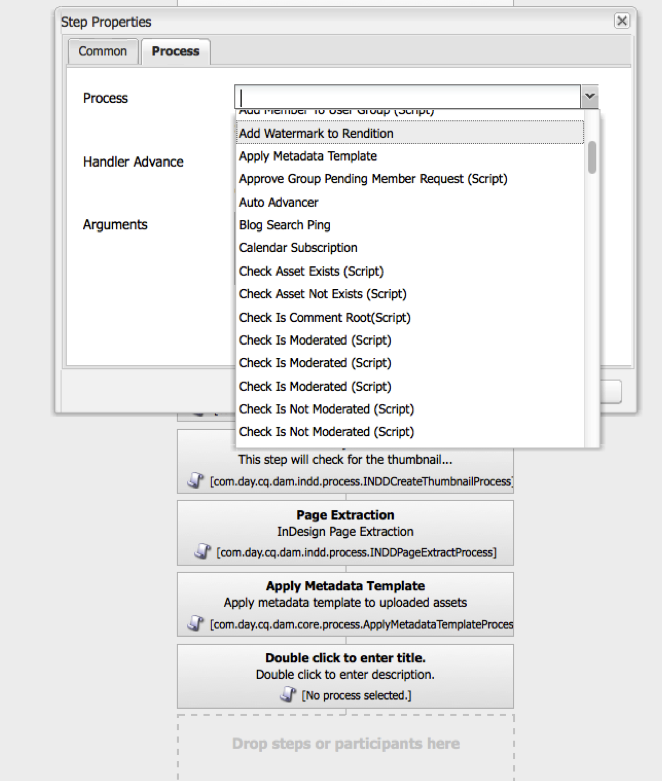
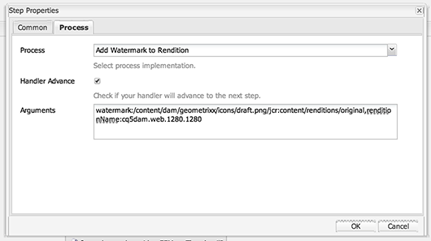

### Purpose
This process overlays the named watermark image onto the named rendition in the lower left corner.  Currently, only one position is supported (lower left).  Future enhancements may include the ability to add custom text (e.g. "Private"), text/image rotation, opacity, flexible image placement (i.e. top-left, bottom-right, top-right, center) and exact placement.

### How to Use
1. Store your watermark file in CQ. This can either be a DAM asset or just an `nt:file` node.
2. Update the DAM Update Asset workflow (`/etc/workflow/models/dam/update_asset`) and add a custom process step at any point after the rendition you want to watermark has been generated.
    1. Open the DAM Update Asset workflow
    2. Insert a new Process step, Workflow/Process Step 
    3. Edit the Process Step
        1. Title: Add watermark to image
        2. On the Process tab, select “Add Watermark to Rendition” from the Process drop down. 
        3. Check the Handler Advance option
        4. Two arguments are required
            1. `renditionName`: The name of the rendition to modify, e.g. "cq5dam.web.1280.1280"
            2. `watermark`: The repository path of the watermark. If this is a simple `nt:file` node, it is just the path to the node. If it is a DAM asset, it is the path to the original rendition, e.g. `/content/dam/geometrixx/icons/target.png/jcr:content/renditions/original`. 
    4. Click OK and then “Save” the workflow.

A full configuration example might have all the following:  
> watermark:/content/dam/geometrixx/icons/draft.png/jcr:content/renditions/original,renditionName:cq5dam.web.1280.1280

This places the `draft.png` image in the lower left of the 1280x1280 rendition of any image file loaded into the DAM.
