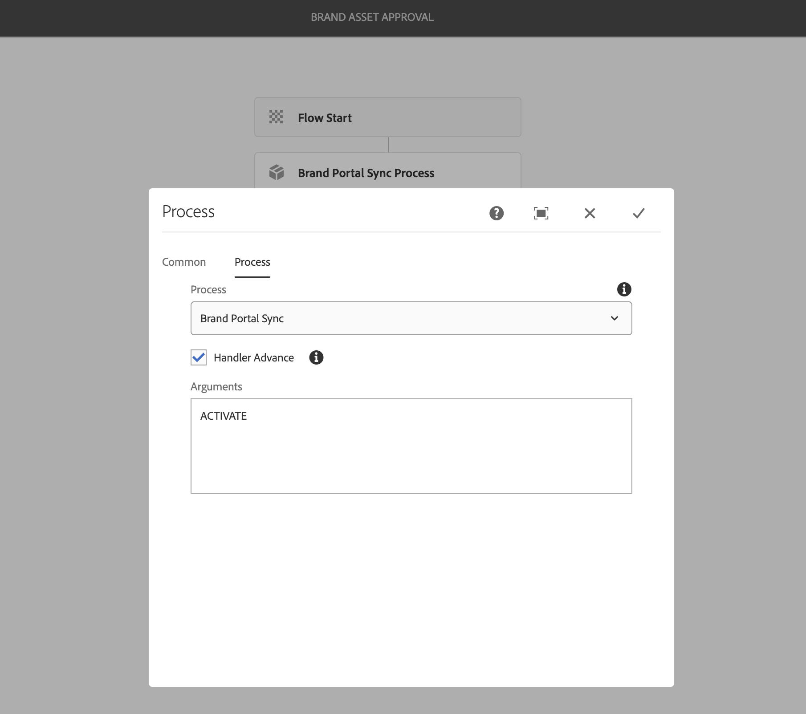

## Purpose

As of the introduction of this feature, AEM can only un/publish to/from AEM Assets Brand Portal using the buttons in the AEM Assets Web UI.

This workflow process facilitates un/publishing assets to/from Brand Portal from AEM Workflow. 

This is useful when assets should only be published to Brand Portal after a review process; the final step of the review workflow can now be "Publish to Brand Portal".

## How to Use

### Create a Workflow process step

Create a new Workflow Process step that points to this workflow process implementation. 

### Process Args Options

The Process Args are to be set to either `ACTIVATE` or `DEACTVIATE` based on the desired replication action.

If left blank, defaults to `ACTIVATE`;

## Setting `mpConfig` on the Asset Folder

In order to publish to Brand Portal, the asset to be un/published must be a descendant of an Assets Folder that has an `mpConfig` property set, pointing to the Brand Portal cloud service configuration.
    
    `/content/dam/.../[sling:OrderedFolder]/jcr:content/mpConfig=/etc/cloudservices/mediaportal/brand-portal`
    
Set the the `mpConfig` property on the Asset Folder (or Asset Folder hierarchy) using one if the following options...

* Use [Asset Folder Metadata Schemas](https://helpx.adobe.com/experience-manager/6-3/assets/using/folder-metadata-schema.html) to add an author-able `mpConfig` property to Assets Folder properties.
* Select the top-level folder from the AEM Assets Web UI and click `Publish to Brand Portal` to set this property. Note that doing this will ALSO publish any descendant assets to Brand Portal.
* Set manually by development/operations via node manipulation (ideally part of the application project)
