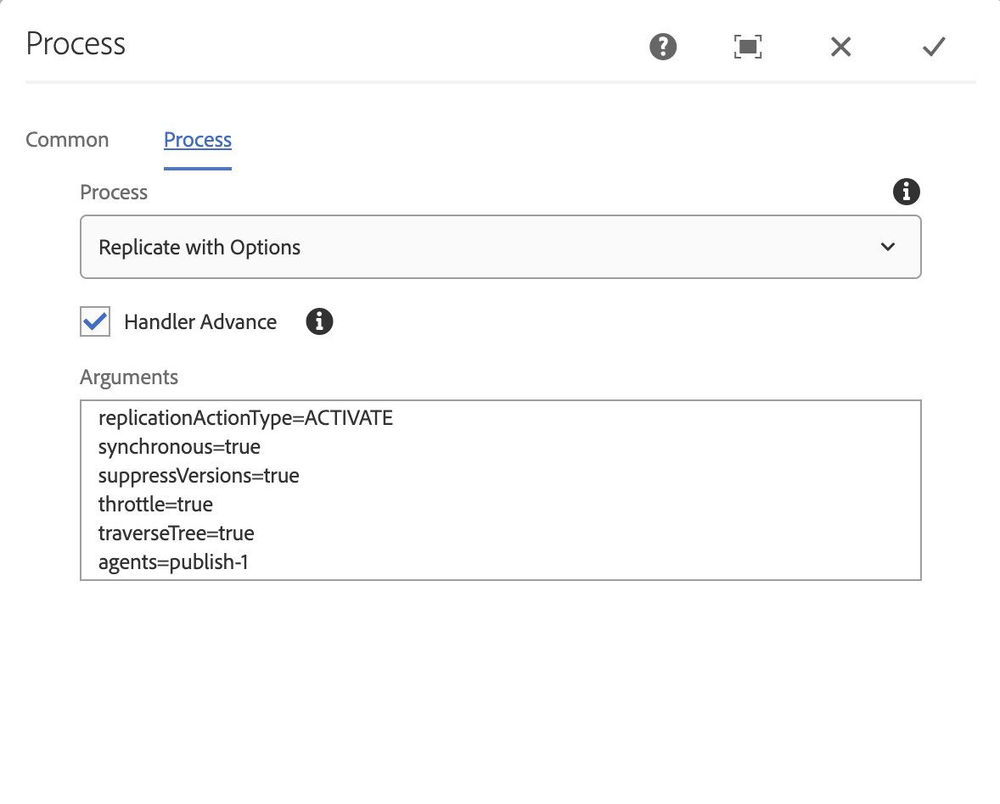

## Purpose

**Replication with Options** is a Process steps that will traverse the entire content tree, and process the each `dam:Asset`, `cq:Page` or `cq:Tag` (cq:Tag since version 4.0.0) replicating each node based on the Process Args.

## How to Use

Processing the tree in a serial fashion allows for a more controlled workflow execution decreasing the chances of overloading AEM. Setting `throttle` to `true` decreases the chances further.

### Process Args Options

* `replicationActionType`
  * Options include [ReplicationActionType's](/acs-aem-commons/aem/6-0/develop/ref/javadoc/com/day/cq/replication/ReplicationActionType.html): ACTIVATE or DEACTIVATE or DELETE
* `throttle`
  * `true` or `false`
  * Defaults to `false`
  * If `true`, throttles the execution using ACS Commons Throttled Task Runner (part of ACS Commons Fast Action Manager)
* `traverseTree`
  * `true` or `false`
  * Defaults to `false`
  * If `true`, walks the entire content tree under the payload looking for the first `dam:Asset` nodes to process (does not process sub-Assets)
* `synchronous`
  * `true` or `false`
  * Defaults to `false`
  * Typically best to set to `true` to ensure the replication queue does not build up.
* `suppressVersions`
  * `true` or `false`
  * Defaults to `false`
  * Typically best to set to `false` if version are not required (as their creation is work to be done)
* `agents`
   * The node name of the agent to target for replication. For example, to target /etc/replication/agents.author/publish-1, provide the agentId of `publish-1`.
   * Defaults to `empty`
   * This is a required field
     * Due to a bug, this requires atleast 1 agent to be provided. When this bug is resolved, the documentation will be updated.
  
  replicationActionType=ACTIVATE|DEACTIVATE|DELETE
  synchronous=true|false
  suppressVersions=true|false
  throttle=true|false
  traverseTree=true|false
  agents=<agent-node-name>,<agent-node-name>
  
