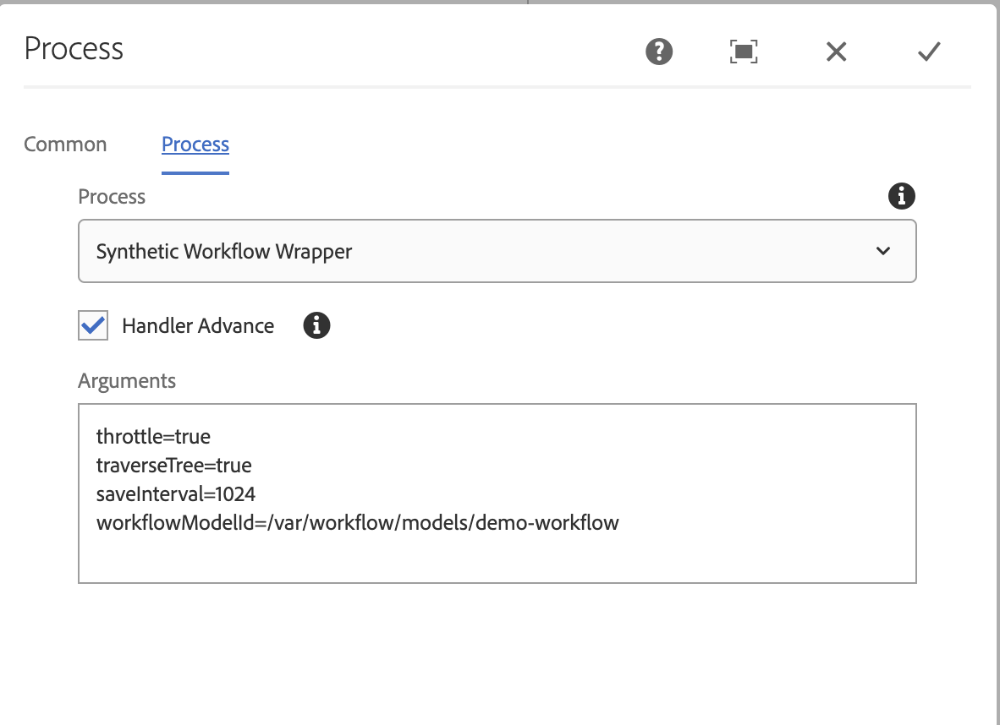

## Purpose

Synthetic Workflow Wrapper is a Process steps that will traverse the entire content tree, and process the each `dam:Asset` or `cq:Page` using the provided workflow model as ACS Commons synthetic workflow.

## How to Use

Processing the tree in a serial fashion allows for a more controlled workflow execution decreasing the chances of overloading AEM. Setting `throttle` to `true` decreases the chances further.

### Process Args options

* `throttle`
  * `true` or `false`
  * Defaults to `false`
  * If `true`, throttles the execution using ACS Commons Throttled Task Runner (part of ACS Commons Fast Action Manager)
* `traverseTree`
  * `true` or `false`
  * Defaults to `false`
  * If `true`, walks the entire content tree under the payload looking for the first `dam:Asset` nodes to process (does not process sub-Assets)
* `saveInterval`
  * The number of sub-payloads to process before saving.
* `workflowModelId`
  * The absolute path to the `cq:Workflow` to execute as Synthetic Workflow.
  * Note this workflow must be ACS Commons Synthetic Workflow compatible.


throttle=true|false
traverseTree=true|false
saveInterval=1024
workflowModelId=/etc/workflow/models/dam/update_asset


