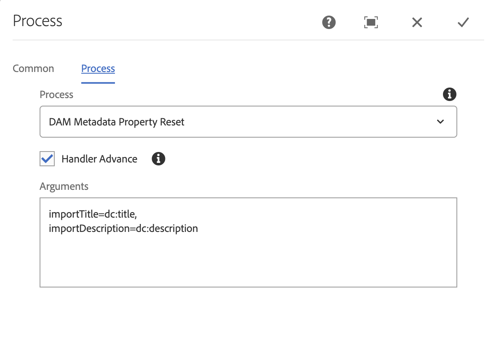

### Purpose

During the automated ingest of assets and metadata, XMP metadata extraction can overwrite common metadata properties, like `dc:title` or `dc:description` that are better provided via the migration mechanism.

This Workflow Process allows migrated data to be stored in properties known to NOT conflict with XMP data (ie. lacking a namespace), and then copied into the target properties after XMP extraction is complete.

### How to Use

Typically this Workflow Process step is added as the last step in AEM's DAM Update Asset Workflow Model when used in conjunction with ACS AEM Tools CSV Asset Importer or similar import mechanisms that also provide Metadata.

* Any existing destination property will be overwritten
* The source property will be removed after it is copied to the destination property

### Process Args Options

Set the Workflow Process Steps' PROCESS_ARGS to a comma-delimited list of property pairs, which are in turn delimited by `=`, mapping the src property and the destination property on the `[dam:Asset]/jcr:content/metadata` node.

Example:


importTitle=dc:title,
importDescription=dc:description

