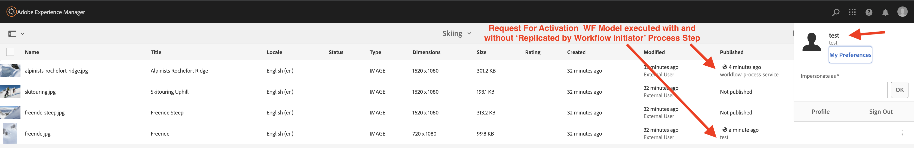
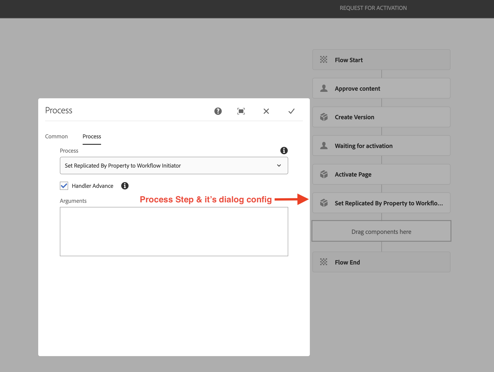

> Note: This does not work for Transient Workflow.

## Purpose

Mark content as replicated by the Workflow Initiator. This Workflow Process is essential when leveraging AEM's built-in Request for Activation and Request for Deactivation Workflow models.

## How to Use

A new Workflow Process step that executed Replicated By Workflow Initiator can be added to the end of this model, and content will be marked as being Activated/Deactived by the user that initiated the replication request.

