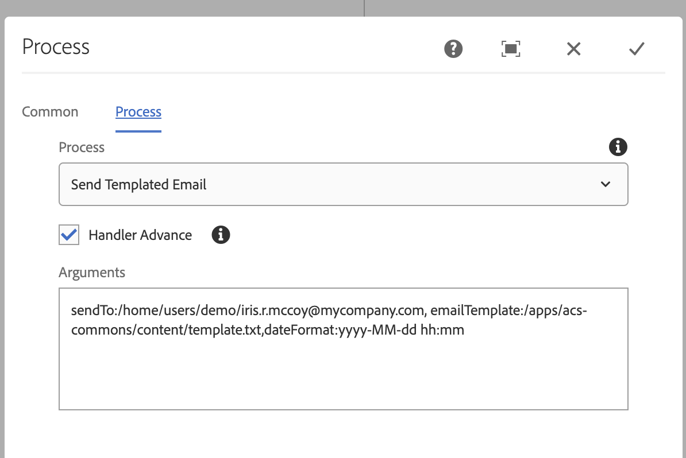
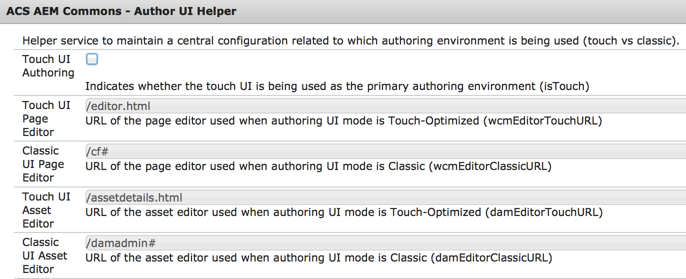

## Purpose

This workflow process step allows for sending of templated emails from Workflow model execution. This is greate for sending custom notifications as the Workflow progresses.

## How to Use

Based on the payload the email parameters are pre-populate with JCR properties:

* If payload is a **DAM asset** then the param map is populated with `[dam:Asset]/jcr:content/metadata` node properties
* If the payload is **cq:Page** then the param map is populated with `[cq:Page]/jcr:content` properties
* The param map keys are the Node's property names and the values the `String` representations of the property value. For `String[]` properties the value is one comma separated String.
  * Currently `String[]` are checked for multiple properties.

Include additional parameters added to E-mail params

* **wfStepTitle**: Title of workflow step
* **wfModelTitle**: Name of workflow model
* **authorLink**: Uses AuthorUIHelper service to create a link to the payload on author
* **publishLink**: Uses AEM Externalizer service to create a link to the payload on Publish

WF Process is configured using the OOTB Process Step with the following workflow arguments:

* **sendTo**: Path to a CQ user or group. An E-mail will be sent to the user. In the case of a group, an E-mail  is sent to all members.
* **emailTemplate**: Absolute path to the E-mail template to use in the JCR repository.
* **dateFormat**: (optional) SimpleDateFormat string for converting Calendar properties to a String to be used in the email (i.e: yyyy-MM-dd hh:mm)

To support the **authorLink** mentioned above the ACS AEM Commons Author UI Helper can be configured.

Define a @sling:OsgiConfig@ to customize the Author UI Helper Service `/apps/mysite/config.author/com.adobe.acs.commons.wcm.impl.AuthorUIHelperImpl.xml`


<?xml version="1.0" encoding="UTF-8"?>
<jcr:root xmlns:sling="http://sling.apache.org/jcr/sling/1.0" xmlns:cq="http://www.day.com/jcr/cq/1.0" xmlns:jcr="http://www.jcp.org/jcr/1.0" xmlns:nt="http://www.jcp.org/jcr/nt/1.0"
	jcr:primaryType="sling:OsgiConfig"
	isTouch="{Boolean}true"
	wcmEditorTouchURL="/editor.html"
	wcmEditorClassicURL="/cf#"
	damEditorTouchURL="/assetdetails.html"
	damEditorClassicURL="/damadmin#"/>


The default settings are as follows. If the defaults are applicable to your use case there is no need to create an OSGi Configuration. Typically the only property changed is `isTouch` to `{Boolean}false` is the ClassicUI is used for Page editting.
