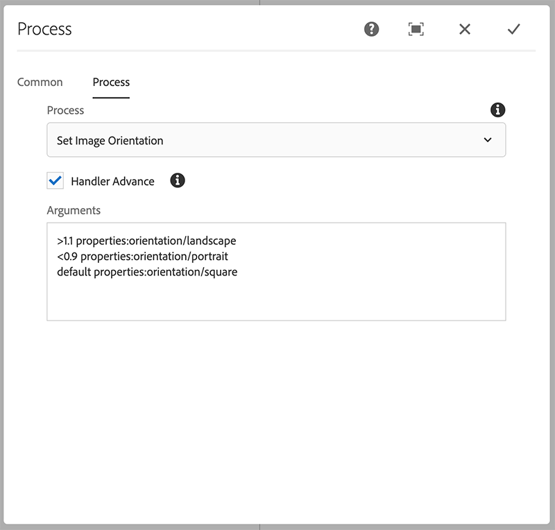

## Purpose

AEM Omnisearch has filter for image orientation which requires images to be tagged with correct 
orientation tag. Tagging isn't done automatically when images are uploaded so searching by orientation doesn't 
return any results.  

Using this workflow step orientation tags can be added automatically when images are uploaded.  

## How to Use

Add custom process step to "DAM Update Asset" workflow model 
    
1. Open the DAM Update Asset workflow
2. Insert a new Process Step after "Metadata Processor" step
3. Edit the Process Step
   1. Title: "Process Image Orientation"
   2. On the Process tab, select “Set Image Orientation” from the Process drop down.
   3. Check the Handler Advance option
   4. Add custom arguments if desired (see below)
4. Close dialog and click “Sync” to update workflow runtime model.

### Process Args Options

Default behaviour is to tag images with width/height ratio above 1.1 as landscape and those with ratio below 0.9 as portrait. 
Anything between these ratios will be tagged as square. 

If you want to change these ratios or use alternative taxonomy you can specify that with process arguments.
First matching criteria is used when selecting tag so correct order is important. 

Example (default configuration):


>1.1 properties:orientation/landscape
<0.9 properties:orientation/portrait
default properties:orientation/square


### Known issues

1. SVG images are not supported
2. Configuration parser could be improved to validate arguments 
