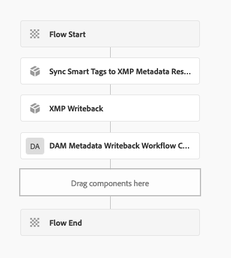

## Purpose

Synchronize AEM Asset Smart Tags data to XMP Metadata JCR nodes, that in turn can be written back into the asset binary as XMP Metadata using the OOTB AEM XMP Metadata Writeback workflow step.

This allows Smart Tag data to be embedded in the image binary itself and be useful outside of AEM, such as in creative applications.

## How to Use

1. In a Workflow Model, add a new Process Step
  * This Process Step should come after Smart Tags have been applied to the asset.
2. Select the `Synchronize Smart Tags to XMP Metadata Node` Process.
3. Check `Handler Advance`

   

When this Workflow Process Step runs on an asset with Smart Tags, it generates the JCR Node structure shown below under the asset's metadata node.
This JCR Node structure is defined in such a way the OOTB XMP Writeback and read and write it back into the binary's XMP metadata.


In order to get the Smart Tag data into the binary's XMP, the OOTB AEM XMP Writeback Process Step must be executed on the asset AFTER **Synchronize Smart Tags to XMP Metadata Node** is run.

How and when the OOTB XMP Writeback is invoked is up to you. This can be done as a Process Step directly after the **Synchronize Smart Tags to XMP Metadata Node** Process Step, or it can be in an entirely different Workflow Model that is triggered via Launchers or other means.

For the XMP Writeback step to properly process the Smart Tag XMP Metadata, the following Arguments must be passed:

```
createversion:true,rendition:original
```


## Download example Workflow Model

The following is an example Workflow model that executes the **Synchronize Smart Tags to XMP Metadata Node** Process Step and then immediately invokes the OOTB AEM XMP Writeback Process Step.

* [Example Workflow Model (Titled: Synchronize Smart Tags to XMP Metadata)](smart-tags-to-metadata-wf-model-3.0.0.zip)




