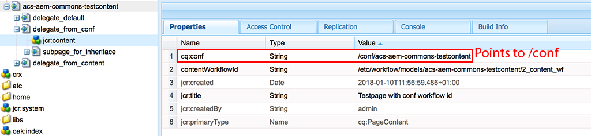
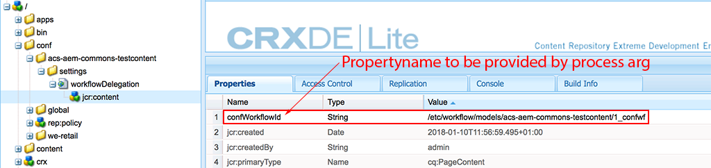

## Purpose

Allow to execute a different workflow model on the same payload.

Taking the "Request for activation" workflow as example, when the Workflow is executed on a pages under `/content/en/pages` an approval workflow is required, however pages under `/content/en/pages/faq` do not require the approval workflow, and on `/content/dam/products` a more rigorous approval workflow is required. Using the Workflow Delegation step you can define the exact workflow model to start as part of the content tree. You don't need to hardcode the information which workflow to start at which location in the workflow model; also you don't need to modify any workflow launchers. 

## How to Use

Arguments should be provided as PROCESS_ARGS to the workflow Process Step:

    confWorkflowModelProperty=<confPropName>
    workflowModelProperty=<propName>    
    defaultWorkflowModel=<absolutePathToDefaultWorkflowModel>
    terminateWorkflowOnDelegation=true|false
    
### PROCESS_ARGS descriptions
* `confWorkflowModelProperty` is the name of the conf property which contains the paths of the workflow models. Optional.
    * By using /conf for configuration the content must not be changed
    * The current content path must contain at least one configuration (cq:conf) pointing to any path under /conf
    
    
    
    * The /conf path must contain a setting page with the name  `workflowDelegation`. This page can have multiple delegations defined. This process arg defines the name of the property used
    
    
    
    * The value of this property much be a valid, Workflow model path for example: `/etc/workflow/models/my-workflow-model` OR  `/etc/workflow/models/my-workflow-model/jcr:content/model`

* `propName` is the name of the property which contains the paths of the workflow models. Optional.
    * A property of this name must exist on the node hierarchy (`[cq:Page]/jcr:content` or `[sling:Folder]/jcr:content` or `[sling:OrderedFolder]/jcr:content`)
    * The value of this property much be a valid, Workflow model path for example: `/etc/workflow/models/my-workflow-model` OR  `/etc/workflow/models/my-workflow-model/jcr:content/model`
* `defaultWorkflowModel` the path to the default Workflow Model, which is used as fallback. Optional.
    * Example: `/etc/workflow/models/request_for_activation` OR  `/etc/workflow/models/request_for_activation/jcr:content/model`
* `terminateWorkflowOnDelegation` is true or false and dictates if the current workflow will continue executing after delegation. Optional, defaults to false
    *  This can be useful to avoid having a single workflow under multiple workflows (depending on how the workflows are setup).
    *  If a configured Workflow Model Id can be resolved, via the content hierarchy (directly) or the the default Workflow Model Id param (fallback) but that Workflow Model cannot be resolved, then a WorkflowException is thrown.
