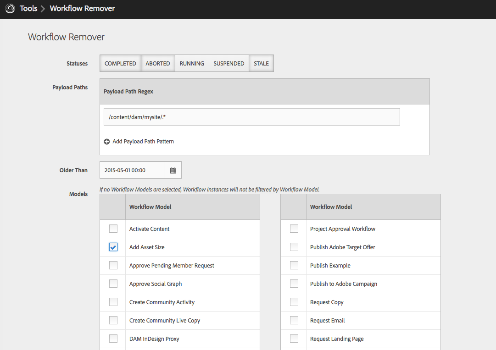
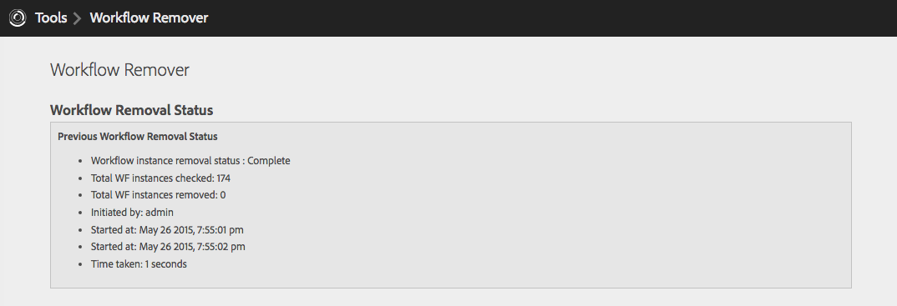

## Purpose

During content migration, bulk ingest, development, or just unanticipated situations, large volumes of Workflow instances can amass.

AEM has OOTB support for Workflow clean-up via Granite Console and JMX however may not satisfy all use cases. ACS AEM Commons' Workflow Remover helps bridge the gap and provide power-tooling to remove unwanted Workflow instances.

## How to Use

### Web UI

In AEM, navigate to the Tools > ACS AEM Commons > Workflow Remover

* Status: [Required] Select the statuses for the Workflows to be removed.
 * If no status is selected, no Workflow instances will be removed.
* Payload Paths: [Optional] Workflow payload paths must match at least one regex to be removed.
* Older Than: [Optional] Workflow instances must be created older than this time.
* Models: [Optional] Workflow models that are eligible for removal.
  * If no models are selected, all models are eligible for removal.
* Duration: [Optional] Only allow the workflow removal process to run for this many minutes. Leave blank for no limit.

The Workflow Remover Web UI will show status from the last successful Workflow Removal execution.

### Scheduled Service

ACS AEM Commons' Workflow Remover can also be used to schedule removal of workflow instances sing the same criteria as the Web UI.

#### OSGi Configuration

Define a `sling:OsgiConfig` with the following attributes.

	/apps/mysite/config.author/com.adobe.acs.commons.workflow.bulk.removal.impl.WorkflowInstanceRemoverScheduler-pdfs.xml


<?xml version="1.0" encoding="UTF-8"?>
<jcr:root xmlns:sling="http://sling.apache.ortg/jcr/sling/1.0" xmlns:cq="http://www.day.com/jcr/cq/1.0" xmlns:jcr="http://www.jcp.org/jcr/1.0" xmlns:nt="http://www.jcp.org/jcr/nt/1.0"
    jcr:primaryType="sling:OsgiConfig"

    scheduler.expression="0 1 0 ? * *"
    workflow.statuses="[ABORTED,COMPLETED,RUNNING,SUSPENDED,STALE]"
    workflow.models="[/etc/workflow/models/dam/adddamsize/jcr:content/modelm/etc/workflow/models/my-app/my-workflow-model/jcr:content/model]"
    workflow.payloads="[/content/dam/.+/.*\.pdf(/.*)?]"
    workflow.older-than="1234567890"
    max-duration="60"

    />


* scheduler.expression: The usual Sling Scheduler expression (see www.cronmaker.com)
* workflow.statuses: Only remove Workflow Instances that have one of these statuses
	* ABORTED,COMPLETE,RUNNING,SUSPENDED,STALE
* workflow.models: Only remove Workflow Instances that belong to one of these WF Models.
	* Example: /etc/workflow/models/dam/adddamsize/jcr:content/model
* workflow.payloads: Only remove Workflow Instances whose payloads match one of these regex patterns.
* worlflow.older-than: Only remove Workflow Instances whose payloads are older than this UTC Time in milliseconds.
* max-duration: Max number of minutes to run. 0 for no limit.

## Service User

On AEM 6.2 or above, this service uses a Service User for repository access. This user is configured with
the expected permissions required, but additional permissions may be required if your repository design
deviates from the expected structure.

User name: `acs-commons-workflow-remover-service`

ACLs:

* `jcr:read`, `jcr:write` on `/etc/workflow/instances`