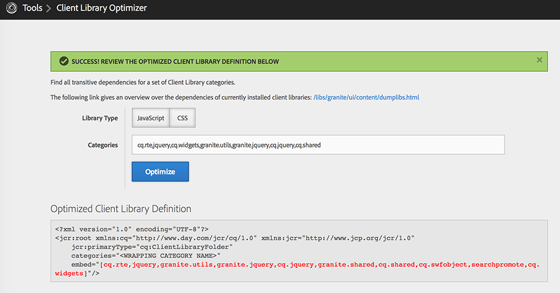

## Getting Started

Install the ACS AEM Tools package via the AEM Package Manager and then open Client Library Optimizer from the AEM Tools console, or directly at [/etc/acs-tools/clientlibs-optimizer.html](http://localhost:4502/etc/acs-tools/clientlibs-optimizer.html)

To get to the AEM Tools console from the Touch UI, from the left rail navigation, select Tools > ACS AEM Tools > Client Library Optimizer.

## Overview

Client Library Optimizer is a tool that accepts a list of client library categories and derives the embed rule so they can all be compacted into a single include, reducing the # of HTTP requests required (ideally, to one).

## Technical Background

Client libraries can have *dependencies* and *embeds*. The difference between those two concepts is that dependencies lead to additional includes/requests, while embeds are contained in the original client library's response (i.e. are concatenated with the JS/CSS of the client library itself). However, transitive embeds are not considered by AEM (tracked in GRANITE-2288), e.g. if client library `a` embeds client library `b` and `b` embeds client library `c`, `c` is not contained in the response for `a`. Dependencies of embedded libraries are not considered by AEM either (tracked in GRANITE-1416).
Transitive dependencies are properly supported, though.

The Client Library Optimizer calculates the embeds from the given categories's dependencies and embeds (both in a transitive way) in the right order. The tool should also be used to **recalculate the embed categories**, whenever some (transitive) embed/dependency was added/removed. Otherwise you might end up with unwanted additional request's for not yet embedded (transitive) dependencies, or in the worst case with a non-working JavaScript/CSS in case an additional (transitive) embed has been added.