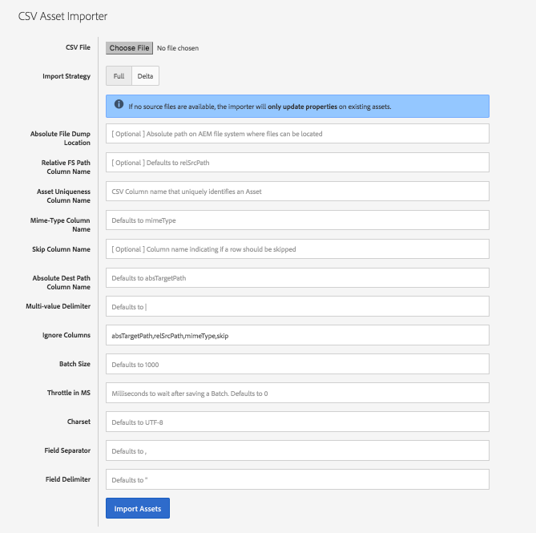
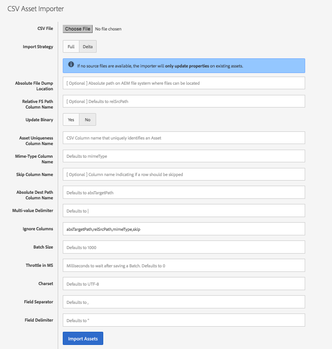
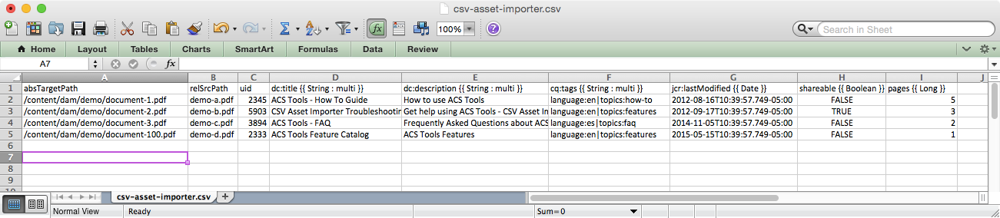
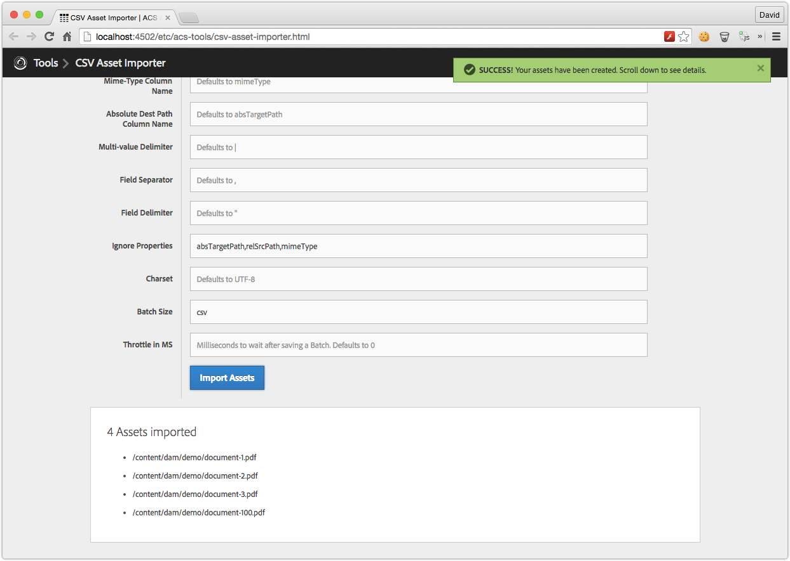
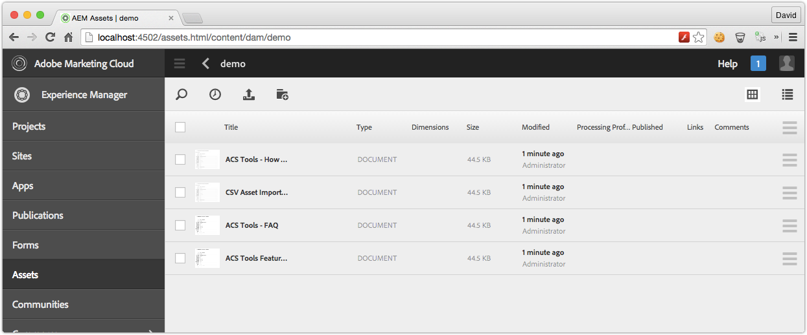
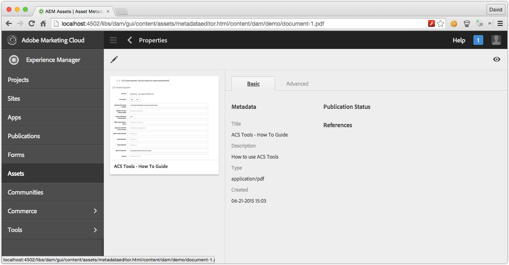
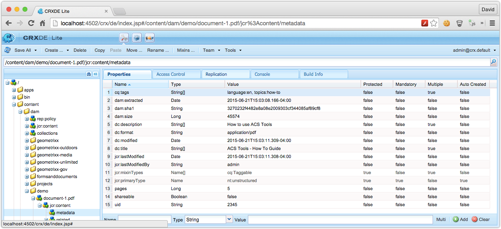

    This feature is mostly replaced by <a href="https://adobe-consulting-services.github.io/acs-aem-commons/features/mcp-tools/data-importer/index.html">ACS AEM Commons Data Importer</a>.
     
     
    Note there is not exact feature parity, so please review both to ensure you make the optimal choice. All things being equal, please prefer <a href="https://adobe-consulting-services.github.io/acs-aem-commons/features/mcp-tools/data-importer/index.html">ACS AEM Commons Data Importer</a>. 

   

## Getting Started

Install the ACS AEM Tools package via the AEM Package Manager and then open CSV Asset Importer from the AEM Tools console, or directly at [/etc/acs-tools/csv-asset-importer.html](http://localhost:4502/etc/acs-tools/csv-asset-importer.html)

To get to the AEM Tools console from the Touch UI, select Tools > ACS AEM Tools > CSV Asset Importer.

<iframe width="853" height="480" src="https://www.youtube.com/embed/23m8xA5xHH0" frameborder="0" allowfullscreen></iframe>

## Overview

CSV Asset Importer is a tool that accepts a CSV file whose rows represent an Asset to import.

## Important Considerations

Before importing...

* http://localhost:4502/system/console/configMgr > Day CQ Tagging Service by default removes references to non-existing Tags from the `cq:tags` property. Ensure this is properly configured before importing.
* When using AEM6/Oak and specifying the `Asset Uniqueness Column Name` ensure that you have a Oak Index for this property else long traversal queries may execute.
* When importing Assets OOTB Launchers will kick off many Asset related workflows. Ensure all the appropriate launchers are enabled/disabled and that your system is tuned to handle the volume of Workflows that will be invoked.
	* If needed leverage the `Batch Size` and `Throttle in MS` to provide pauses in ingestion to allow AEM to catch up.
* Setup a INFO (or DEBUG) Sling Logger for `com.adobe.acs.tools.csv_asset_importer` to monitor import progress at http://localhost:4502/system/console/slinglog

## How to Use

[Download an example CSV file](import.csv)

CSV Asset Importer has 2 import strategies:

### Full

When selecting `Full` import strategy, the CSV Asset Importer will complete remove any matching existing assets (via the optional `Asset Uniqueness Column` or mandatory `absTargetPath`).

### Delta

When selecting `Delta` import strategy, the CSV Asset Importer will attempt to update (and/or re-adjust) any existing asset before creating a net net asset. For example, if an existing asset is found w/ a `Asset Uniqueness Column name` value, it will attempt to move the existing asset to the `absTargetPath` and update the metadata rather than deleting the existing Asset with the matching `Asset Uniqueness Column name` and re-creating it from scratch.

#### Update Binary Yes/No

When selecting the `Delta` import strategy you can select to only update Metadata by setting `Update Binary` to `No`. This prevent the `original` rendition from being touched. From v2.6.0/3.2.0+, the `relSrcPath` is not required for this import style, allowing for a wholly **Update Properties** import method.

Once an import strategy is selected, an import CSV file must be created:

[Download an example CSV file](import.csv)

Unless you are doing a `Delta` import without Binary updates, ensure that the files to import are available from the AEM instance executing the import are `<Absolute File Dump Location>/<relSrcPath>`. The AEM process must have read access to these files.

Execute the importer; Please see the Important Considerations section above! This may take some time to process. An `INFO` logger can be setup for `com.adobe.acs.tools.csv_asset_importer` to monitor progress.

When the import is complete, review the Logs for errors. Wait for any Workflow to full complete, then verify the results.

* It is often best to ensure any Workflow triggered by asset import- usually DAM Asset Update or Metadata WriteBack is either marked as Transient (6.1+) or disabled, and DAM Asset Update Workflow is processed in a controlled manner later (ex. via ACS Commons Bulk Workflow Manager).

### Column Definition Row

The first row which defined the Columns in the CSV. Each Column corresponds to a property on the Asset's metadata node which to write the corresponding values.

Column definitions are in the format:

* `propertyName` the property will be persisted as a single value String
* `propertyName {{"{{ Type "}}}}` the property will be persisted as a single value of type Type
	* Valid Types are:
		* `String`
		* `Long``
			* `Int` or `Integer` can also be used, but are persisted as `Long` in JCR
		* `Double`
		* `Boolean`
			* Values can be `TRUE` or `FALSE`
		* `Date`
			* This expects the ISO Date format
			* `Calendar` can also be used, but is persisted as `Date` in JCR
* `propertyName {{ "{{ Type : multi "}}}}` the property will be persisted as multi-value of type Type in the JCR

Note that there are 2 required Column definitions

* `absTargetPath` this is the absolute path in the JCR where the Asset will be imported to
* `relSrcPath` this is the relative (from a provided root path) path to the file to ingest for the asset. This file must be available from the AEM instance executing the importer.
	* Since v0.0.28 this column is optional to allow for Property Update executions.

### Multi-values

If a row is marked as multi via `propertyName {{"{{ Type : multi "}}}}`, multi-values are delimited by default via `|`. The multi-value delimiter is configurable via the Web UI.

* Since v0.0.28 CSV Asset Importer supports changing property types from Single to Multi (and vice versa). Note that the data in the CSV will replace any existing data at the defined property (This is not a Patch operation)

* Since v0.0.28 CSV Asset Importer handles changing existing Multi properties to single value, and vice-versa. Any prior values will be removed (this is not a Patch operation, rather a remove and add).

### Empty Values

If a column has an empty value, that property will be not exist on the Asset's metadata node. Existing values at the property will be removed.

### Asset Definition Rows

Rows 2..N each represent an Asset to import.

### event-user-data (Since v0.0.30)

`event-user-data` of `acs-aem-tools.csv-asset-importer` is set for modifications invoked by this feature.

For example, in the AEM launcher exclude list, `event-user-data:acs-aem-tools.csv-asset-importer` can be added to ignore events that result from the CSV Asset Importer tool.

----------

*Credits: Thanks to Elise H. for helping define and refine the scope and behavior of this tool.*