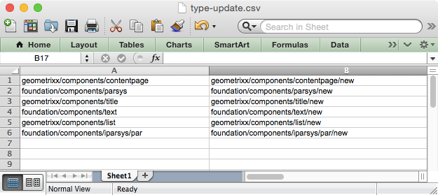
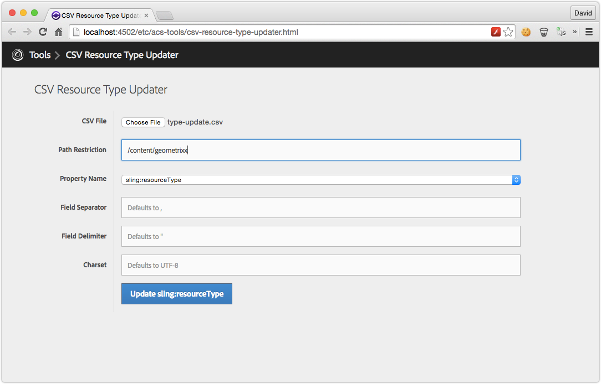
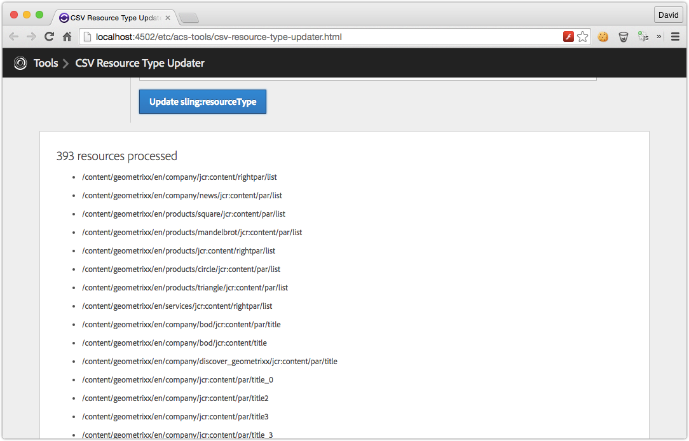

## Getting Started

Install the ACS AEM Tools package via the AEM Package Manager and then open CSV Resource Type (and cq:Template) Updater from the AEM Tools console, or directly at [/etc/acs-tools/tag-maker.html](http://localhost:4502/etc/acs-tools/csv-resource-type-updater.html)

To get to the AEM Tools console from the Touch UI, from the left rail navigation, select Tools > ACS AEM Tools > CSV Resource Type Updater.

## Overview

Resource Type Updater is a tool aimed at updating `sling:resourceType` and `cq:Template` properties in bulk; bulk meaning multiple nodes and multiple mappings.

Resource Type Updater takes a CSV file of 2 columns:

* Column 1: FROM value
* Column 2: TO value

Example CSV entry: `foundation/components/title,myapp/components/content/heading`

This tool supports updating `sling:resourceType` and `cq:template` properties as specified by in the WebUI at run time.

> If a resource to update is locked, this tools will report that resource as a failure and continue to the next candidate resource.

### event-user-data (Since v0.0.30)

`event-user-data` of `acs-aem-tools.csv-resource-type-updater` is set for modifications invoked by this feature.